# Go-LocalSync Comprehensive Execution Plan

**Created:** 2026-04-08 05:02\
**Status:** Active\
**Scope:** Full project audit, prioritization, and execution\
**Baseline:** Build passes, all tests pass, 0 lint errors, git clean

---

## Executive Summary

Go-LocalSync is a generic synchronization SDK with a GitHub provider, SQLite storage, and conflict-aware sync using go-localfirst primitives. The project recently completed a major refactoring (provider-based architecture) and 5 critical bug fixes. This plan addresses all remaining technical debt, documentation staleness, and quality improvements.

**Current State:**

- Build: PASSING
- Tests: 3 test suites passing (github, storage, sync)
- Lint: 0 errors from golangci-lint (but gopls reports 5 errors from go.mod replace directives)
- CI/CD: GitHub Actions configured but will FAIL due to local replace directives

---

## 80/20 Analysis: Pareto Prioritization

### The 1% That Delivers 51% of the Result

These 3 tasks make the project **buildable by anyone other than the owner** and **CI/CD functional**:

| # | Task                                                                                      | Why 51%                                                                                    |
| - | ----------------------------------------------------------------------------------------- | ------------------------------------------------------------------------------------------ |
| 1 | Remove `go.mod` replace directives — publish go-localfirst + go-composable-business-types | Without this: CI fails, no collaboration, no go module proxy. BLOCKS EVERYTHING.           |
| 2 | Update stale docs (ROADMAP.md, TODO_LIST.md, CHANGELOG.md, AGENTS.md)                     | Without this: any contributor is working from wrong information. Trust is zero.            |
| 3 | Fix `just lint` to use golangci-lint instead of `go vet` + `go fmt`                       | Without this: the lint command gives false confidence. 90+ configured linters are ignored. |

### The 4% That Delivers 64% of the Result

Add 2 more tasks for stability and correctness:

| # | Task                                                              | Why 64%                                                                                                           |
| - | ----------------------------------------------------------------- | ----------------------------------------------------------------------------------------------------------------- |
| 4 | Add database migration system (existing DBs crash on new columns) | Without this: any existing user's database is destroyed on upgrade. Data loss.                                    |
| 5 | Fix `toDBParams` — missing `UpdatedAt` in upsert params           | The `updated_at` column always gets `CURRENT_TIMESTAMP` instead of the provider's value. LWW is partially broken. |

### The 20% That Delivers 80% of the Result

Add 4 more tasks for quality and developer experience:

| # | Task                                                                      | Why 80%                                                                                  |
| - | ------------------------------------------------------------------------- | ---------------------------------------------------------------------------------------- |
| 6 | Add `ErrDatabase` sentinel error and proper DB error wrapping             | Storage errors are raw SQLite errors — no way to distinguish DB failures from not-found. |
| 7 | Add index on `source` column and composite index on `(source, github_id)` | Multi-provider queries will be full table scans without it.                              |
| 8 | Add integration test skeleton (build + smoke test)                        | Zero E2E coverage means regressions are invisible.                                       |
| 9 | Clean up `internal/db/db.go` — replace `interface{}` with `any`           | 20+ gopls hints, looks unprofessional, trivial to fix.                                   |

---

## 27-Task Comprehensive Plan

Sorted by importance/impact/effort/customer-value. Each task is 30-100 minutes.

### Phase 1: Foundation (Unblock CI/CD + Fix Data Integrity)

| #  | Task                                                                | Impact   | Effort | Files                                                |
| -- | ------------------------------------------------------------------- | -------- | ------ | ---------------------------------------------------- |
| T1 | Remove go.mod replace directives (publish deps or use Go workspace) | CRITICAL | 45min  | `go.mod`, `go.sum`                                   |
| T2 | Fix `just lint` to use golangci-lint                                | HIGH     | 15min  | `justfile`                                           |
| T3 | Fix `toDBParams` missing `UpdatedAt` field                          | HIGH     | 15min  | `pkg/storage/interface.go`, `sql/queries/events.sql` |
| T4 | Add database migration system                                       | HIGH     | 90min  | `internal/database/` new files                       |
| T5 | Update CHANGELOG.md with all session 1-3 changes                    | MEDIUM   | 30min  | `CHANGELOG.md`                                       |
| T6 | Update ROADMAP.md — remove stale references                         | MEDIUM   | 20min  | `ROADMAP.md`                                         |
| T7 | Update TODO_LIST.md — reflect current state                         | MEDIUM   | 20min  | `TODO_LIST.md`                                       |
| T8 | Update AGENTS.md — remove PaginationMixin, fix regeneration warning | MEDIUM   | 15min  | `AGENTS.md`                                          |

### Phase 2: Code Quality & Correctness

| #   | Task                                                          | Impact | Effort | Files                                                 |
| --- | ------------------------------------------------------------- | ------ | ------ | ----------------------------------------------------- |
| T9  | Fix `internal/db/db.go` — `interface{}` to `any`              | LOW    | 10min  | `internal/db/db.go`                                   |
| T10 | Add `ErrDatabase` sentinel + proper error wrapping in storage | MEDIUM | 30min  | `pkg/errors/errors.go`, `pkg/storage/sqlite.go`       |
| T11 | Add `source` column index + composite index                   | MEDIUM | 15min  | `sql/schema/`, `internal/database/connection.go`      |
| T12 | Rename `github_id` column to `source_id`                      | MEDIUM | 60min  | SQL, sqlc, storage, all references                    |
| T13 | Add `UpdatedAt` to `UpsertEventParams` and SQL query          | HIGH   | 20min  | `sql/queries/events.sql`, `internal/db/events.sql.go` |
| T14 | Remove unused `PaginationMixin` from `internal/db/mixins.go`  | LOW    | 5min   | `internal/db/mixins.go`                               |
| T15 | Remove unused `EventCoreMixin` if not referenced              | LOW    | 5min   | `internal/db/mixins.go`                               |

### Phase 3: Testing & Verification

| #   | Task                                                              | Impact | Effort | Files                             |
| --- | ----------------------------------------------------------------- | ------ | ------ | --------------------------------- |
| T16 | Add integration test skeleton (build + DB round-trip)             | HIGH   | 60min  | `tests/integration/` new          |
| T17 | Add test for `GetByID` not-found returns `nil, nil`               | MEDIUM | 15min  | `pkg/storage/sqlite_test.go`      |
| T18 | Add test for conflict resolution with different `UpdatedAt`       | MEDIUM | 30min  | `pkg/sync/conflict_aware_test.go` |
| T19 | Add test for incremental sync edge cases (clock skew, duplicates) | MEDIUM | 30min  | `pkg/sync/sync_test.go`           |
| T20 | Verify CI/CD pipeline passes end-to-end                           | HIGH   | 30min  | `.github/workflows/ci.yml`        |

### Phase 4: Developer Experience & Polish

| #   | Task                                                                         | Impact | Effort | Files                                 |
| --- | ---------------------------------------------------------------------------- | ------ | ------ | ------------------------------------- |
| T21 | Add `Makefile` or update justfile with `lint-full`, `ci-local` targets       | LOW    | 15min  | `justfile`                            |
| T22 | Add README.md section for provider development guide                         | LOW    | 30min  | `README.md` or new doc                |
| T23 | Clean up `.gitignore` for generated files                                    | LOW    | 10min  | `.gitignore`                          |
| T24 | Add Go workspace (`go.work`) for local development                           | MEDIUM | 20min  | `go.work`                             |
| T25 | Fix CI to use `CGO_ENABLED=1` for modernc.org/sqlite (or verify CGO=0 works) | HIGH   | 30min  | `.github/workflows/ci.yml`            |
| T26 | Add pre-commit hook that runs `just lint` properly                           | LOW    | 15min  | `.pre-commit-config.yaml` or justfile |
| T27 | Final verification: build, test, lint, docs consistency check                | HIGH   | 30min  | All                                   |

---

## 150 Micro-Task Breakdown

Each task max 15 minutes. Sorted by importance/impact/effort.

### Phase 1A: go.mod Replace Directives (T1 breakdown) — CRITICAL

| µ# | Micro-Task                                                                      | Est   | Priority |
| -- | ------------------------------------------------------------------------------- | ----- | -------- |
| M1 | Tag go-localfirst `pkg/sync/` as v0.1.0 and push to GitHub                      | 10min | P0       |
| M2 | Tag go-composable-business-types as v0.1.0 and push to GitHub                   | 10min | P0       |
| M3 | Remove replace directives from go.mod, add proper versioned requires            | 10min | P0       |
| M4 | Run `go mod tidy` and verify build                                              | 5min  | P0       |
| M5 | Run `go test ./...` and verify all tests pass                                   | 5min  | P0       |
| M6 | Verify gopls no longer reports "not in go.mod" errors                           | 2min  | P0       |
| M7 | Commit and push: "fix: remove local replace directives for CI/CD compatibility" | 3min  | P0       |

### Phase 1B: justfile Lint Fix (T2 breakdown) — HIGH

| µ#  | Micro-Task                                                                 | Est  | Priority |
| --- | -------------------------------------------------------------------------- | ---- | -------- |
| M8  | Update `just lint` recipe to run `golangci-lint run ./... --timeout=5m`    | 5min | P1       |
| M9  | Add `just lint-fix` recipe: `golangci-lint fmt ./...`                      | 5min | P1       |
| M10 | Verify `just lint` passes with 0 issues                                    | 5min | P1       |
| M11 | Commit: "fix: update just lint to use golangci-lint instead of go vet/fmt" | 2min | P1       |

### Phase 1C: Fix toDBParams Missing UpdatedAt (T3 + T13 breakdown) — HIGH

| µ#  | Micro-Task                                                                                     | Est  | Priority |
| --- | ---------------------------------------------------------------------------------------------- | ---- | -------- |
| M12 | Add `updated_at = excluded.updated_at` to SQL upsert query (remove CURRENT_TIMESTAMP override) | 5min | P0       |
| M13 | Add `UpdatedAt` field to `UpsertEventParams` in SQL query params                               | 5min | P0       |
| M14 | Run `sqlc generate` to regenerate `internal/db/events.sql.go`                                  | 3min | P0       |
| M15 | Update `toDBParams` in `pkg/storage/interface.go` to pass `item.UpdatedAt`                     | 5min | P0       |
| M16 | Run `go build ./...` to verify                                                                 | 2min | P0       |
| M17 | Run `go test ./...` to verify                                                                  | 3min | P0       |
| M18 | Commit: "fix: pass UpdatedAt from provider.Item through to SQL upsert"                         | 2min | P0       |

### Phase 1D: Database Migration System (T4 breakdown) — HIGH

| µ#  | Micro-Task                                                                | Est   | Priority |
| --- | ------------------------------------------------------------------------- | ----- | -------- |
| M19 | Create `internal/database/migration.go` with migration registry struct    | 10min | P1       |
| M20 | Implement `RunMigrations(db *sql.DB) error` with version tracking table   | 10min | P1       |
| M21 | Create migration 001: initial schema (extract from connection.go)         | 10min | P1       |
| M22 | Create migration 002: add `source` and `updated_at` columns               | 10min | P1       |
| M23 | Update `database.Open()` to call `RunMigrations` instead of inline schema | 10min | P1       |
| M24 | Add test for fresh DB creation                                            | 10min | P1       |
| M25 | Add test for migration from old schema (no source/updated_at columns)     | 15min | P1       |
| M26 | Run all tests                                                             | 3min  | P1       |
| M27 | Commit: "feat: add database migration system with version tracking"       | 2min  | P1       |

### Phase 1E: Update CHANGELOG.md (T5 breakdown) — MEDIUM

| µ#  | Micro-Task                                                                                | Est   | Priority |
| --- | ----------------------------------------------------------------------------------------- | ----- | -------- |
| M28 | Add "Added" section: conflict-aware sync, GetByID, UpdatedAt, source column, test helpers | 10min | P2       |
| M29 | Add "Changed" section: upsert DO UPDATE SET, branded IDs, provider architecture           | 5min  | P2       |
| M30 | Add "Fixed" section: 5 critical bug fixes                                                 | 5min  | P2       |
| M31 | Commit: "docs: update CHANGELOG.md with v0.3.0 changes"                                   | 2min  | P2       |

### Phase 1F: Update ROADMAP.md (T6 breakdown) — MEDIUM

| µ#  | Micro-Task                                                                    | Est  | Priority |
| --- | ----------------------------------------------------------------------------- | ---- | -------- |
| M32 | Remove reference to `DO NOTHING` in question #5 — already fixed               | 2min | P2       |
| M33 | Update file paths: `cmd/gh-sync/main.go` → `cmd/examples/github-sync/main.go` | 3min | P2       |
| M34 | Update file paths: `pkg/github/client.go` → `pkg/providers/github/client.go`  | 2min | P2       |
| M35 | Add conflict-aware sync to completed items                                    | 3min | P2       |
| M36 | Update "Last Updated" date                                                    | 1min | P2       |
| M37 | Commit: "docs: update ROADMAP.md with correct paths and completed items"      | 2min | P2       |

### Phase 1G: Update TODO_LIST.md (T7 breakdown) — MEDIUM

| µ#  | Micro-Task                                                                 | Est  | Priority |
| --- | -------------------------------------------------------------------------- | ---- | -------- |
| M38 | Update file paths throughout (gh-sync → examples/github-sync)              | 5min | P2       |
| M39 | Mark rate limit handling as DONE (already implemented in github/client.go) | 2min | P2       |
| M40 | Mark retry logic as DONE (already implemented with withRetry)              | 2min | P2       |
| M41 | Add conflict-aware sync testing to HIGH priority                           | 3min | P2       |
| M42 | Add migration system to HIGH priority                                      | 2min | P2       |
| M43 | Update completion checklist                                                | 3min | P2       |
| M44 | Commit: "docs: update TODO_LIST.md with current project state"             | 2min | P2       |

### Phase 1H: Update AGENTS.md (T8 breakdown) — MEDIUM

| µ#  | Micro-Task                                                                     | Est  | Priority |
| --- | ------------------------------------------------------------------------------ | ---- | -------- |
| M45 | Remove PaginationMixin from Mixin Types table (removed in commit ca33e6e)      | 3min | P2       |
| M46 | Update regeneration warning to reflect current state (no more mixin embedding) | 5min | P2       |
| M47 | Add source/updated_at columns to schema documentation                          | 3min | P2       |
| M48 | Update database schema description                                             | 3min | P2       |
| M49 | Commit: "docs: update AGENTS.md to reflect current architecture"               | 2min | P2       |

### Phase 2A: Fix internal/db/db.go (T9 breakdown) — LOW

| µ#  | Micro-Task                                                         | Est  | Priority |
| --- | ------------------------------------------------------------------ | ---- | -------- |
| M50 | Replace all `interface{}` with `any` in internal/db/db.go          | 5min | P3       |
| M51 | Run `go build ./...` and `go test ./...`                           | 3min | P3       |
| M52 | Commit: "style: replace interface{} with any in internal/db/db.go" | 2min | P3       |

### Phase 2B: ErrDatabase + Error Wrapping (T10 breakdown) — MEDIUM

| µ#  | Micro-Task                                                                    | Est   | Priority |
| --- | ----------------------------------------------------------------------------- | ----- | -------- |
| M53 | Add `ErrDatabase` and `ErrConflict` to `pkg/errors/errors.go`                 | 5min  | P2       |
| M54 | Wrap all storage errors in `sqlite.go` with `ErrDatabase` using errors.Wrap   | 10min | P2       |
| M55 | Add `WithStorageDetail` convenience function                                  | 3min  | P2       |
| M56 | Run tests                                                                     | 3min  | P2       |
| M57 | Commit: "feat: add ErrDatabase sentinel and proper error wrapping in storage" | 2min  | P2       |

### Phase 2C: Add Database Indexes (T11 breakdown) — MEDIUM

| µ#  | Micro-Task                                                                     | Est  | Priority |
| --- | ------------------------------------------------------------------------------ | ---- | -------- |
| M58 | Add `CREATE INDEX IF NOT EXISTS idx_events_source ON events(source)` to schema | 5min | P2       |
| M59 | Add composite index `idx_events_source_github_id ON events(source, github_id)` | 5min | P2       |
| M60 | Update inline schema in `internal/database/connection.go`                      | 3min | P2       |
| M61 | Run tests                                                                      | 3min | P2       |
| M62 | Commit: "perf: add source and composite indexes for multi-provider queries"    | 2min | P2       |

### Phase 2D: Clean Up Mixins (T14-T15 breakdown) — LOW

| µ#  | Micro-Task                                                            | Est  | Priority |
| --- | --------------------------------------------------------------------- | ---- | -------- |
| M63 | Check if `PaginationMixin` is referenced anywhere besides `mixins.go` | 3min | P3       |
| M64 | Remove `PaginationMixin` if unreferenced (was removed in ca33e6e)     | 3min | P3       |
| M65 | Check if `EventCoreMixin` is referenced anywhere                      | 3min | P3       |
| M66 | Remove `EventCoreMixin` if unreferenced, or document its purpose      | 3min | P3       |
| M67 | Commit: "chore: remove unused mixin types from internal/db/mixins.go" | 2min | P3       |

### Phase 2E: Rename github_id to source_id (T12 breakdown) — MEDIUM (SKIPPABLE)

| µ#  | Micro-Task                                                                            | Est   | Priority |
| --- | ------------------------------------------------------------------------------------- | ----- | -------- |
| M68 | Update `sql/schema/001_events.sql`: rename column + unique constraint                 | 5min  | P3       |
| M69 | Update `sql/queries/events.sql`: all references to github_id → source_id              | 5min  | P3       |
| M70 | Run `sqlc generate` to regenerate Go code                                             | 3min  | P3       |
| M71 | Update `internal/database/connection.go` inline schema                                | 3min  | P3       |
| M72 | Update `pkg/storage/interface.go`: remove "github_id" comments, fix toItem/toDBParams | 5min  | P3       |
| M73 | Update `pkg/storage/sqlite.go`: GetByID uses renamed query                            | 3min  | P3       |
| M74 | Update `pkg/types/ids.go`: rename `GithubEventID` → `SourceEventID`                   | 5min  | P3       |
| M75 | Update all references across codebase                                                 | 10min | P3       |
| M76 | Run `go build ./...` and `go test ./...`                                              | 3min  | P3       |
| M77 | Update migration to handle column rename for existing DBs                             | 10min | P3       |
| M78 | Commit: "refactor: rename github_id to source_id for multi-provider support"          | 2min  | P3       |

### Phase 3A: Integration Test Skeleton (T16 breakdown) — HIGH

| µ#  | Micro-Task                                                                    | Est   | Priority |
| --- | ----------------------------------------------------------------------------- | ----- | -------- |
| M79 | Create `tests/integration/integration_test.go` with build tag                 | 5min  | P1       |
| M80 | Add test: open SQLite, insert item, read it back, verify all fields           | 10min | P1       |
| M81 | Add test: upsert same item twice, verify UPDATE behavior                      | 10min | P1       |
| M82 | Add test: GetByID for existing and non-existing items                         | 5min  | P1       |
| M83 | Add test: full sync cycle with mock provider → storage → verify               | 10min | P1       |
| M84 | Run integration tests                                                         | 3min  | P1       |
| M85 | Commit: "test: add integration test skeleton with DB round-trip verification" | 2min  | P1       |

### Phase 3B: Storage Test Coverage (T17 breakdown) — MEDIUM

| µ#  | Micro-Task                                                     | Est  | Priority |
| --- | -------------------------------------------------------------- | ---- | -------- |
| M86 | Add test: `GetByID` returns `nil, nil` for non-existent item   | 5min | P2       |
| M87 | Add test: `GetByID` returns correct item for existing ID       | 5min | P2       |
| M88 | Add test: `GetByID` returns error on DB failure                | 5min | P2       |
| M89 | Commit: "test: add GetByID edge case tests for SQLite storage" | 2min | P2       |

### Phase 3C: Conflict Resolution Tests (T18 breakdown) — MEDIUM

| µ#  | Micro-Task                                                            | Est  | Priority |
| --- | --------------------------------------------------------------------- | ---- | -------- |
| M90 | Add test: LWW with different UpdatedAt (remote newer → remote wins)   | 5min | P2       |
| M91 | Add test: LWW with different UpdatedAt (local newer → local wins)     | 5min | P2       |
| M92 | Add test: conflict detection triggers on Type change                  | 5min | P2       |
| M93 | Add test: conflict detection triggers on ActorLogin change            | 5min | P2       |
| M94 | Add test: no conflict when only RawJSON differs                       | 5min | P2       |
| M95 | Commit: "test: add conflict resolution tests for UpdatedAt-based LWW" | 2min | P2       |

### Phase 3D: Incremental Sync Edge Cases (T19 breakdown) — MEDIUM

| µ#  | Micro-Task                                                       | Est  | Priority |
| --- | ---------------------------------------------------------------- | ---- | -------- |
| M96 | Add test: incremental with identical timestamps (boundary)       | 5min | P2       |
| M97 | Add test: incremental falls back to full sync when storage empty | 5min | P2       |
| M98 | Add test: incremental handles clock skew (future timestamps)     | 5min | P2       |
| M99 | Commit: "test: add incremental sync edge case tests"             | 2min | P2       |

### Phase 3E: CI/CD Verification (T20 breakdown) — HIGH

| µ#   | Micro-Task                                                       | Est   | Priority |
| ---- | ---------------------------------------------------------------- | ----- | -------- |
| M100 | Verify CI YAML references correct Go version (1.26)              | 2min  | P1       |
| M101 | Check if `CGO_ENABLED=0` works with modernc.org/sqlite (pure Go) | 5min  | P1       |
| M102 | Add `go mod download` step verification                          | 2min  | P1       |
| M103 | Verify golangci-lint action version compatibility                | 3min  | P1       |
| M104 | Push branch and verify CI triggers                               | 10min | P1       |
| M105 | Fix any CI failures found                                        | 10min | P1       |

### Phase 4A: Justfile Improvements (T21 breakdown) — LOW

| µ#   | Micro-Task                                                                            | Est  | Priority |
| ---- | ------------------------------------------------------------------------------------- | ---- | -------- |
| M106 | Add `just lint-full` recipe: `golangci-lint run ./... --timeout=5m`                   | 3min | P3       |
| M107 | Add `just ci-local` recipe: runs test + lint + build sequentially                     | 5min | P3       |
| M108 | Add `just sqlc-generate` recipe (rename from `sqlc`)                                  | 2min | P3       |
| M109 | Add `just check` recipe: `golangci-lint run ./... && go test ./... && go build ./...` | 3min | P3       |
| M110 | Commit: "chore: add ci-local and check recipes to justfile"                           | 2min | P3       |

### Phase 4B: Documentation (T22 breakdown) — LOW

| µ#   | Micro-Task                                                    | Est   | Priority |
| ---- | ------------------------------------------------------------- | ----- | -------- |
| M111 | Create `docs/provider-development.md` with step-by-step guide | 10min | P3       |
| M112 | Add provider interface contract documentation                 | 5min  | P3       |
| M113 | Add example of adding a new provider (e.g., GitLab skeleton)  | 5min  | P3       |
| M114 | Commit: "docs: add provider development guide"                | 2min  | P3       |

### Phase 4C: .gitignore Cleanup (T23 breakdown) — LOW

| µ#   | Micro-Task                                                            | Est  | Priority |
| ---- | --------------------------------------------------------------------- | ---- | -------- |
| M115 | Add `*.db` and `*.db-journal` to .gitignore (prevent DB check-ins)    | 2min | P3       |
| M116 | Add `coverage.out` and `coverage.html`                                | 2min | P3       |
| M117 | Add `.DS_Store`                                                       | 1min | P3       |
| M118 | Remove tracked .DS_Store files: `git rm --cached`                     | 2min | P3       |
| M119 | Commit: "chore: update .gitignore and remove .DS_Store from tracking" | 2min | P3       |

### Phase 4D: Go Workspace (T24 breakdown) — MEDIUM

| µ#   | Micro-Task                                                      | Est  | Priority |
| ---- | --------------------------------------------------------------- | ---- | -------- |
| M120 | Create `go.work` file with all 3 projects                       | 5min | P2       |
| M121 | Create `go.work.sum`                                            | 2min | P2       |
| M122 | Add `go.work` to `.gitignore` (local-only)                      | 2min | P2       |
| M123 | Verify build works with workspace                               | 5min | P2       |
| M124 | Commit: "chore: add go.work for local multi-module development" | 2min | P2       |

### Phase 4E: Pre-commit Hook (T26 breakdown) — LOW

| µ#   | Micro-Task                                                | Est  | Priority |
| ---- | --------------------------------------------------------- | ---- | -------- |
| M125 | Create `.pre-commit-config.yaml` with golangci-lint hook  | 5min | P3       |
| M126 | Add go fmt, go vet, go test hooks                         | 5min | P3       |
| M127 | Test pre-commit hook runs correctly                       | 5min | P3       |
| M128 | Commit: "chore: add pre-commit config with golangci-lint" | 2min | P3       |

### Phase 4F: Final Verification (T27 breakdown) — HIGH

| µ#   | Micro-Task                                                                            | Est  | Priority |
| ---- | ------------------------------------------------------------------------------------- | ---- | -------- |
| M129 | Run `go build ./...` — must pass                                                      | 2min | P0       |
| M130 | Run `go test ./... -count=1` — must pass                                              | 3min | P0       |
| M131 | Run `golangci-lint run ./... --timeout=5m` — must pass                                | 5min | P0       |
| M132 | Verify CHANGELOG.md has all changes documented                                        | 3min | P0       |
| M133 | Verify ROADMAP.md has no stale paths                                                  | 2min | P0       |
| M134 | Verify TODO_LIST.md reflects current state                                            | 2min | P0       |
| M135 | Verify AGENTS.md is accurate                                                          | 2min | P0       |
| M136 | Run `go mod tidy` and verify go.mod is clean                                          | 3min | P0       |
| M137 | Check git status — ensure no uncommitted changes                                      | 2min | P0       |
| M138 | Final push to remote                                                                  | 2min | P0       |
| M139 | Create summary commit: "chore: comprehensive project cleanup and quality improvement" | 2min | P0       |

---

## Execution Graph (Mermaid.js)

```mermaid
graph TD
    subgraph "Phase 1: Foundation — CRITICAL PATH"
        T1["T1: Remove go.mod replace directives<br/>(M1-M7)"] --> T5["T5: Update CHANGELOG.md (M28-M31)"]
        T2["T2: Fix just lint (M8-M11)"]
        T3["T3: Fix toDBParams UpdatedAt (M12-M18)"] --> T4["T4: Add migration system (M19-M27)"]
        T3 --> T10["T10: ErrDatabase sentinel (M53-M57)"]
        T6["T6: Update ROADMAP.md (M32-M37)"]
        T7["T7: Update TODO_LIST.md (M38-M44)"]
        T8["T8: Update AGENTS.md (M45-M49)"]
    end

    subgraph "Phase 2: Code Quality"
        T9["T9: Fix interface{} → any (M50-M52)"]
        T4 --> T11["T11: Add DB indexes (M58-M62)"]
        T14["T14: Clean up mixins (M63-M67)"]
        T12["T12: Rename github_id → source_id (M68-M78)<br/>OPTIONAL - defer if risky"]
    end

    subgraph "Phase 3: Testing"
        T3 --> T16["T16: Integration tests (M79-M85)"]
        T16 --> T17["T17: GetByID tests (M86-M89)"]
        T16 --> T18["T18: Conflict resolution tests (M90-M95)"]
        T16 --> T19["T19: Incremental sync tests (M96-M99)"]
        T1 --> T20["T20: Verify CI/CD (M100-M105)"]
    end

    subgraph "Phase 4: Polish"
        T21["T21: Justfile improvements (M106-M110)"]
        T22["T22: Provider dev docs (M111-M114)"]
        T23["T23: .gitignore cleanup (M115-M119)"]
        T24["T24: Go workspace (M120-M124)"]
        T26["T26: Pre-commit hook (M125-M128)"]
    end

    subgraph "Final Gate"
        T27["T27: Final verification (M129-M139)"]
    end

    T1 --> T20
    T1 --> T24
    T2 --> T27
    T5 --> T27
    T6 --> T27
    T7 --> T27
    T8 --> T27
    T10 --> T27
    T11 --> T27
    T16 --> T27
    T20 --> T27
    T21 --> T27
    T26 --> T27

    style T1 fill:#ff4444,color:#fff
    style T3 fill:#ff4444,color:#fff
    style T27 fill:#44ff44,color:#000
    style T12 fill:#888,color:#fff
```

---

## Risk Assessment

| Risk                                               | Likelihood | Impact    | Mitigation                                    |
| -------------------------------------------------- | ---------- | --------- | --------------------------------------------- |
| go-localfirst not yet published to GitHub          | HIGH       | BLOCKS T1 | Use Go workspace (`go.work`) as alternative   |
| sqlc generate breaks manual mixin embedding        | LOW        | MEDIUM    | Mixins already removed; regeneration is clean |
| Rename github_id → source_id breaks existing DBs   | MEDIUM     | HIGH      | Migration handles ALTER TABLE; DEFER if risky |
| CI fails due to modernc.org/sqlite + CGO_ENABLED=0 | LOW        | MEDIUM    | modernc.org/sqlite is pure Go — should work   |
| golangci-lint finds new issues after full run      | MEDIUM     | LOW       | Fix iteratively; existing code already passes |

---

## Decision Log

| Decision                                  | Rationale                                                                                                     |
| ----------------------------------------- | ------------------------------------------------------------------------------------------------------------- |
| **Defer T12 (rename github_id)**          | High risk for existing DBs, low immediate value. Can do in next iteration with proper migration.              |
| **Skip go.work if deps published**        | go.work is a local dev convenience. If we can publish proper versions, replace directives become unnecessary. |
| **Use migration system over ALTER TABLE** | Version-tracked migrations are the industry standard. Enables future schema changes without fear.             |
| **Keep `nil, nil` pattern for GetByID**   | "Not found" is not an error — it's a valid state. The `//nolint:nilnil` is appropriate.                       |

---

## Summary Statistics

| Metric               | Value                        |
| -------------------- | ---------------------------- |
| Total macro tasks    | 27                           |
| Total micro tasks    | 139                          |
| Estimated total time | ~14 hours                    |
| Critical path items  | 5 (T1, T3, T4, T16, T27)     |
| P0 tasks             | 7 micro-tasks + verification |
| Files to modify      | ~20                          |
| New files to create  | ~8                           |
