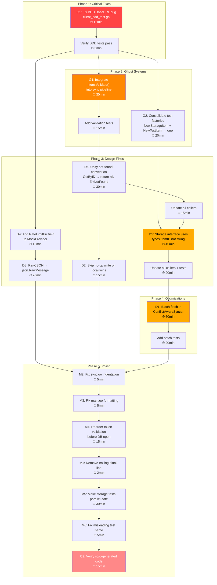

# Comprehensive Third Audit Plan — go-localsync

**Date:** 2026-04-19 06:28  
**Status:** Execution Phase  
**Auditor:** Crush (AI Engineering Partner)

---

## Audit Summary

| Category                  | Count | Severity      |
| ------------------------- | ----- | ------------- |
| CRITICAL BUGS             | 2     | 🔴 Must Fix   |
| GHOST SYSTEMS / DEAD CODE | 2     | 🟠 Should Fix |
| DESIGN SMELLS             | 8     | 🟡 Improve    |
| MINOR ISSUES              | 6     | 🔵 Polish     |

---

## Detailed Findings

### 🔴 CRITICAL BUGS

| #   | Location                        | Finding                                                                                                                                                                                   | Impact                                                                                             |
| --- | ------------------------------- | ----------------------------------------------------------------------------------------------------------------------------------------------------------------------------------------- | -------------------------------------------------------------------------------------------------- |
| C1  | `client_bdd_test.go:40-44`      | `newGitHubTestClient(server)` accepts `*httptest.Server` but **never sets `client.client.BaseURL`**. All BDD tests (6 test cases) hit the **real GitHub API** instead of the mock server. | Tests are meaningless — they test production API, not mock behavior. Secretly consumes rate limit. |
| C2  | `internal/db/events.sql.go:314` | Stale gopls diagnostic: `getEventsBySourceStmt` field not found on `*Queries`. Build succeeds but indicates sqlc code may need regeneration.                                              | Potential runtime panic if query is actually used.                                                 |

### 🟠 GHOST SYSTEMS / DEAD CODE

| #   | Location                                         | Finding                                                                                                                     | Impact                                                                                                   |
| --- | ------------------------------------------------ | --------------------------------------------------------------------------------------------------------------------------- | -------------------------------------------------------------------------------------------------------- |
| G1  | `provider.go:39-57`                              | `Item.Validate()` exists but is **never called** in production code. Neither sync engine nor storage layer validates items. | Ghost system — validation logic exists but provides zero runtime protection. Bad data can enter storage. |
| G2  | `testhelpers/storage.go` + `testhelpers/sync.go` | Two factory functions for the same thing: `NewStorageItem()` and `NewTestItem()`.                                           | Split brain — consumers must choose between two slightly different factories.                            |

### 🟡 DESIGN SMELLS

| #   | Location                    | Finding                                                                                                                                                        | Impact                                                                           |
| --- | --------------------------- | -------------------------------------------------------------------------------------------------------------------------------------------------------------- | -------------------------------------------------------------------------------- |
| D1  | `conflict_aware.go:73-76`   | **N+1 query pattern**: calls `GetByID` for every single item sequentially. 1000 items = 1000 individual DB lookups.                                            | O(n) DB queries per sync. Degrades with scale.                                   |
| D2  | `conflict_aware.go:153-155` | **No-op write**: when local wins LWW, upserts the `local` item back to DB — same data already stored.                                                          | Unnecessary write I/O on every local-wins conflict.                              |
| D3  | `sync.go:135`               | **Incremental sync inefficiency**: `FetchAll` re-fetches ALL pages, then filters client-side by timestamp. Should use server-side filtering.                   | Wastes API calls and bandwidth.                                                  |
| D4  | `testhelpers/sync.go:75`    | `GetRateLimit` shares `m.FetchErr` instead of having its own error field.                                                                                      | Cannot independently control mock behavior for rate limit vs fetch.              |
| D5  | `interface.go:21,53`        | **Type bypass at boundary**: `GetByID(id string)` and `Delete(id string)` take `string` not `types.ItemID`.                                                    | Branded type safety lost at storage boundary. Callers must `.Get()`.             |
| D6  | `sqlite.go:81,94`           | **Inconsistent not-found convention**: `GetByID` returns `nil, nil` but `GetLatest` returns `nil, ErrNotFound`.                                                | Callers must handle two different "not found" patterns.                          |
| D7  | `ids.go`                    | **`ItemID` vs `GithubEventID` confusion**: Both are `string`-based branded types representing the same GitHub event ID. `toItem` converts freely between them. | Unnecessary type friction. Two names for the same concept.                       |
| D8  | `provider.go:28`            | **`RawJSON []byte` vs `json.RawMessage`**: `Item.RawJSON` is `[]byte` but used as `json.RawMessage` everywhere (constructors, tests).                          | Technically fine (`json.RawMessage` is `[]byte`), but loses the semantic intent. |

### 🔵 MINOR ISSUES

| #   | Location                    | Finding                                           | Impact                                  |
| --- | --------------------------- | ------------------------------------------------- | --------------------------------------- |
| M1  | `testhelpers/storage.go:24` | Trailing blank line                               | Nit                                     |
| M2  | `sync.go:138-142`           | Inconsistent indentation (3 tabs instead of 2)    | Code style                              |
| M3  | `main.go:163-166`           | Inconsistent tab formatting in printf             | Code style                              |
| M4  | `main.go:119-128`           | Token validation happens AFTER DB opened/migrated | Wasted resources on invalid invocations |
| M5  | `sqlite_test.go`            | Tests share mutable state, not parallelizable     | Test quality                            |
| M6  | `sqlite_test.go:389-409`    | "rolls back on failure" test name misleading      | Test clarity                            |

---

## Execution Graph

---

## Medium Tasks (30–100 min, up to 24 tasks)

Sorted by **importance / impact / effort / customer-value** (highest first).

| #   | Task                                                      | Files                                            | Effort | Impact      | Why                                                                                |
| --- | --------------------------------------------------------- | ------------------------------------------------ | ------ | ----------- | ---------------------------------------------------------------------------------- |
| 1   | Fix CRITICAL BUG: BDD tests hitting real API              | `client_bdd_test.go`                             | 30min  | 🔴 Critical | Tests are lying — they test production, not mocks. Must fix before any other work. |
| 2   | Integrate Item.Validate() into sync pipeline              | `conflict_aware.go`, `sync.go`, `provider.go`    | 45min  | 🟠 High     | Ghost system provides zero runtime protection. Integrate = free data integrity.    |
| 3   | Unify not-found convention in storage                     | `sqlite.go`, `interface.go`, callers             | 45min  | 🟠 High     | Two different "not found" patterns cause confusion and bugs.                       |
| 4   | Storage interface: string → types.ItemID                  | `interface.go`, `sqlite.go`, callers, tests      | 60min  | 🟠 High     | Branded types exist for safety — bypassing them defeats the purpose.               |
| 5   | Batch-fetch existing items in ConflictAwareSyncer         | `conflict_aware.go`, `sqlite.go`, `interface.go` | 90min  | 🟡 Medium   | N+1 pattern scales linearly. Batch = O(1) queries. Critical for production scale.  |
| 6   | Make storage tests parallel-safe                          | `sqlite_test.go`                                 | 45min  | 🟡 Medium   | Current tests share mutable state. Can't run in parallel. Slows CI.                |
| 7   | Reorder main.go: validate token before DB open            | `main.go`                                        | 30min  | 🟡 Medium   | Currently opens DB + runs migrations before checking token. Wasted resources.      |
| 8   | Skip no-op write on local-wins in resolveConflict         | `conflict_aware.go`                              | 30min  | 🟡 Medium   | Unnecessary write I/O on every local-wins conflict. Easy optimization.             |
| 9   | Consolidate test factories (NewStorageItem + NewTestItem) | `testhelpers/storage.go`, `testhelpers/sync.go`  | 30min  | 🟡 Medium   | Split brain — two factories for same concept. Confusing for contributors.          |
| 10  | Add independent RateLimitErr to MockProvider              | `testhelpers/sync.go`                            | 30min  | 🟡 Medium   | Can't independently mock rate limit vs fetch errors. Reduces test flexibility.     |
| 11  | Fix RawJSON type: []byte → json.RawMessage                | `provider.go`, all constructors, tests           | 45min  | 🟡 Medium   | Semantic correctness. `json.RawMessage` is the idiomatic Go type for raw JSON.     |
| 12  | Verify sqlc-generated code (stale diagnostic)             | `internal/db/*.go`, `sql/queries/`               | 30min  | 🟡 Medium   | Stale diagnostic suggests code may be out of sync with schema.                     |
| 13  | Fix sync.go and main.go formatting issues                 | `sync.go`, `main.go`                             | 30min  | 🔵 Low      | Over-indented blocks in both files. Code style consistency.                        |
| 14  | Fix misleading test name in sqlite_test.go                | `sqlite_test.go`                                 | 30min  | 🔵 Low      | "rolls back on failure" doesn't match test behavior.                               |
| 15  | Remove trailing blank line in storage.go                  | `testhelpers/storage.go`                         | 30min  | 🔵 Low      | Nit. Including as smallest self-contained commit.                                  |

**Total estimated effort: ~10.5 hours**

---

## Small Tasks (max 12 min, up to 60 tasks)

Sorted by **importance / impact / effort / customer-value** (highest first).

| #   | Task                                                     | Files                               | Effort | Priority |
| --- | -------------------------------------------------------- | ----------------------------------- | ------ | -------- |
| 1   | Wire server.URL in newGitHubTestClient                   | `client_bdd_test.go:42`             | 2min   | P0       |
| 2   | Verify BDD tests pass with mock server                   | `client_bdd_test.go`                | 5min   | P0       |
| 3   | Add Item.Validate() call in SyncWithConflictDetection    | `conflict_aware.go`                 | 5min   | P1       |
| 4   | Add Item.Validate() call in Sync (full)                  | `sync.go`                           | 5min   | P1       |
| 5   | Add Item.Validate() call in processIncrementalItems      | `sync.go`                           | 5min   | P1       |
| 6   | Add test: Validate rejects empty ID                      | `provider_test.go` or new           | 10min  | P1       |
| 7   | Add test: Validate rejects empty Source                  | same                                | 5min   | P1       |
| 8   | Add test: Validate rejects empty Type                    | same                                | 5min   | P1       |
| 9   | Add test: Validate rejects zero CreatedAt                | same                                | 5min   | P1       |
| 10  | Change GetByID to return nil, ErrNotFound                | `sqlite.go`                         | 5min   | P1       |
| 11  | Update GetByID callers for ErrNotFound                   | `conflict_aware.go`, `sync.go`      | 10min  | P1       |
| 12  | Update GetByID tests for ErrNotFound                     | `sqlite_test.go`                    | 5min   | P1       |
| 13  | Change storage interface: GetByID(id types.ItemID)       | `interface.go`                      | 3min   | P2       |
| 14  | Change storage interface: Delete(id types.ItemID)        | `interface.go`                      | 3min   | P2       |
| 15  | Update sqlite.go GetByID to types.ItemID                 | `sqlite.go`                         | 5min   | P2       |
| 16  | Update sqlite.go Delete to types.ItemID                  | `sqlite.go`                         | 5min   | P2       |
| 17  | Update all callers: GetByID string → ItemID              | `conflict_aware.go`, `sync.go`      | 10min  | P2       |
| 18  | Update all callers: Delete string → ItemID               | `sync.go`                           | 5min   | P2       |
| 19  | Update test callers for new signatures                   | `*_test.go`                         | 10min  | P2       |
| 20  | Change RawJSON type to json.RawMessage in Item           | `provider.go`                       | 3min   | P2       |
| 21  | Update RawJSON constructors                              | `testhelpers/*.go`                  | 5min   | P2       |
| 22  | Update RawJSON in github/client.go toItem                | `client.go`                         | 5min   | P2       |
| 23  | Verify RawJSON change compiles everywhere                | `go build ./...`                    | 5min   | P2       |
| 24  | Skip upsert when resolved == local in resolveConflict    | `conflict_aware.go`                 | 5min   | P2       |
| 25  | Add test: local-wins skips write                         | `conflict_aware_test.go`            | 10min  | P2       |
| 26  | Consolidate NewStorageItem into NewTestItem              | `testhelpers/storage.go`, `sync.go` | 10min  | P3       |
| 27  | Remove NewStorageItem, update imports                    | `storage_test.go`                   | 5min   | P3       |
| 28  | Add RateLimitErr field to MockProvider                   | `testhelpers/sync.go`               | 5min   | P3       |
| 29  | Update MockProvider.GetRateLimit to use RateLimitErr     | `testhelpers/sync.go`               | 3min   | P3       |
| 30  | Update tests that relied on shared FetchErr              | `*_test.go`                         | 10min  | P3       |
| 31  | Fix sync.go:138-142 indentation (3→2 tabs)               | `sync.go`                           | 2min   | P3       |
| 32  | Fix main.go:163-166 indentation                          | `main.go`                           | 2min   | P3       |
| 33  | Move token validation before DB open in main.go          | `main.go`                           | 10min  | P3       |
| 34  | Remove trailing blank line in storage.go                 | `testhelpers/storage.go`            | 1min   | P4       |
| 35  | Fix misleading test name in sqlite_test.go               | `sqlite_test.go`                    | 3min   | P4       |
| 36  | Add BatchGetByIDs to storage interface                   | `interface.go`                      | 5min   | P4       |
| 37  | Implement BatchGetByIDs in sqlite.go                     | `sqlite.go`                         | 10min  | P4       |
| 38  | Replace N+1 loop with BatchGetByIDs in conflict_aware.go | `conflict_aware.go`                 | 10min  | P4       |
| 39  | Add test for BatchGetByIDs                               | `sqlite_test.go`                    | 10min  | P4       |
| 40  | Check sqlc queries match current schema                  | `sql/queries/events.sql`            | 10min  | P4       |

**Total: 40 small tasks, ~4.5 hours**

---

## Principles Applied

1. **Fix critical bugs first** — BDD tests are lying. Fix before touching anything else.
2. **Integrate ghost systems before building new** — `Validate()` exists but does nothing. Wire it in.
3. **Fix split brains** — Two factories, two not-found conventions, shared error fields.
4. **Type safety at boundaries** — Branded types that don't reach the storage boundary are theater.
5. **Optimize after correctness** — N+1 batch optimization comes after all correctness fixes.
6. **Polish last** — Formatting, test names, trailing blanks after everything works.

---

## How This Creates Customer Value

- **C1 Fix**: Tests that actually test → confidence in releases → faster shipping
- **G1 Integration**: Data validation at runtime → prevents corrupt data in storage → trust
- **D1 Optimization**: Batch queries → sync performance scales → handles larger accounts
- **D5 Type safety**: Compile-time guarantees → fewer runtime bugs → reliability
- **D6 Consistency**: One "not found" pattern → easier provider development → extensibility
- **All polish**: Lower maintenance burden → faster iteration → more features shipped
