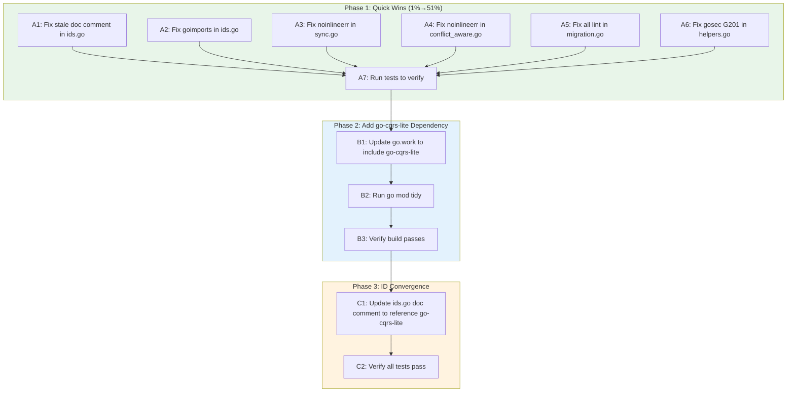

# CQRS-Lite Integration Plan: Immediate Quality + ID Convergence

**Date:** 2026-04-30
**Status:** Execution Plan
**Scope:** Fix stale docs, fix lint warnings, add go-cqrs-lite dependency, converge ID systems

---

## Pareto Breakdown

| Level         | What                                    | Impact                               | Effort          |
| ------------- | --------------------------------------- | ------------------------------------ | --------------- |
| **1% → 51%**  | Fix stale docs + all 22 lint warnings   | Clean codebase, zero regressions     | ~30min          |
| **4% → 64%**  | Add go-cqrs-lite dep, converge IDs      | Type-safe interop, shared foundation | ~2hr            |
| **20% → 80%** | Wire event.Store + projection into sync | Event sourcing, audit trail          | ~4hr (deferred) |

---

## Execution Graph

---

## Phase 1: Quick Wins — Fix All Lint Warnings

### A1: Fix stale doc comment in pkg/types/ids.go

- **File:** `pkg/types/ids.go:1-2`
- **Problem:** Doc comment says "go-composable-business-types/id" but we use go-branded-id
- **Fix:** Update to reference go-branded-id
- **Time:** 2min

### A2: Fix goimports warning in pkg/types/ids.go

- **File:** `pkg/types/ids.go:18`
- **Problem:** goimports reports file is not properly formatted
- **Fix:** Run goimports formatting
- **Time:** 1min

### A3: Fix noinlineerr warnings in pkg/sync/sync.go

- **File:** `pkg/sync/sync.go:76, 120`
- **Problem:** Inline error handling `if err := ...; err != nil`
- **Fix:** Split into plain assignment + separate if
- **Time:** 3min

### A4: Fix noinlineerr warning in pkg/sync/conflict_aware.go

- **File:** `pkg/sync/conflict_aware.go:55`
- **Problem:** Inline error handling
- **Fix:** Split into plain assignment + separate if
- **Time:** 2min

### A5: Fix all lint warnings in internal/database/migration.go

- **File:** `internal/database/migration.go`
- **Problems:**
  - Line 23: `gochecknoglobals` — global `migrations` slice
  - Line 25: `gochecknoinits` — `init()` function
  - Line 66: `mnd` — magic number 2
  - Line 101, 137, 150: `varnamelen` — short variable names
  - Line 132: `errcheck` — unchecked `rows.Close()`
  - Line 155: `errcheck` — unchecked `tx.Rollback()`
  - Line 157, 161: `noinlineerr` — inline error handling
- **Fix:** Refactor to use `sync.Once`, fix variable names, check errors, split inline errors
- **Time:** 15min

### A6: Fix gosec G201 in pkg/storage/helpers.go

- **File:** `pkg/storage/helpers.go:36`
- **Problem:** SQL string formatting with `fmt.Sprintf`
- **Fix:** Add `#nosec G201` comment with justification (placeholders are all `?`, not user input)
- **Time:** 2min

### A7: Run tests to verify

- **Command:** `go test ./... -count=1`
- **Time:** 3min

---

## Phase 2: Add go-cqrs-lite Dependency

### B1: Update go.work to include go-cqrs-lite

- **File:** Create `go.work` with entries for go-localsync, go-branded-id, go-cqrs-lite
- **Time:** 3min

### B2: Run go mod tidy

- **Time:** 2min

### B3: Verify build passes

- **Command:** `go build ./...`
- **Time:** 2min

---

## Phase 3: ID Convergence Preparation

### C1: Update ids.go doc comment to reference go-cqrs-lite

- **File:** `pkg/types/ids.go`
- **Fix:** Update package doc to acknowledge both go-branded-id and go-cqrs-lite relationship
- **Time:** 2min

### C2: Verify all tests pass

- **Command:** `go test ./... -count=1`
- **Time:** 3min

---

## Detailed 15-Minute Task Breakdown

| #   | Task                                                                     | File(s)                          | Est  | Phase |
| --- | ------------------------------------------------------------------------ | -------------------------------- | ---- | ----- |
| 1   | Fix stale doc comment "go-composable-business-types" → correct reference | `pkg/types/ids.go:2`             | 2min | 1     |
| 2   | Fix goimports formatting                                                 | `pkg/types/ids.go`               | 1min | 1     |
| 3   | Fix noinlineerr at line 76                                               | `pkg/sync/sync.go`               | 2min | 1     |
| 4   | Fix noinlineerr at line 120                                              | `pkg/sync/sync.go`               | 2min | 1     |
| 5   | Fix noinlineerr at line 55                                               | `pkg/sync/conflict_aware.go`     | 2min | 1     |
| 6   | Refactor migration.go: replace init() with sync.Once                     | `internal/database/migration.go` | 5min | 1     |
| 7   | Fix varnamelen: m → migration in for loop                                | `internal/database/migration.go` | 1min | 1     |
| 8   | Fix varnamelen: v → version in scan loop                                 | `internal/database/migration.go` | 1min | 1     |
| 9   | Fix varnamelen: m → mig in applyMigration param                          | `internal/database/migration.go` | 1min | 1     |
| 10  | Fix errcheck: check rows.Close() error                                   | `internal/database/migration.go` | 1min | 1     |
| 11  | Fix errcheck: handle tx.Rollback error properly                          | `internal/database/migration.go` | 1min | 1     |
| 12  | Fix noinlineerr at line 157                                              | `internal/database/migration.go` | 1min | 1     |
| 13  | Fix noinlineerr at line 161                                              | `internal/database/migration.go` | 1min | 1     |
| 14  | Fix mnd: extract magic number 2 to named const                           | `internal/database/migration.go` | 1min | 1     |
| 15  | Fix gosec G201: add #nosec with justification                            | `pkg/storage/helpers.go:36`      | 2min | 1     |
| 16  | Run tests after Phase 1 fixes                                            | all                              | 3min | 1     |
| 17  | Create go.work with go-cqrs-lite                                         | `go.work`                        | 3min | 2     |
| 18  | Run go build ./... to verify                                             | all                              | 2min | 2     |
| 19  | Update ids.go doc to reference go-cqrs-lite relationship                 | `pkg/types/ids.go`               | 2min | 3     |
| 20  | Final test run                                                           | all                              | 3min | 3     |
| 21  | Update AGENTS.md with new findings                                       | `AGENTS.md`                      | 5min | 3     |

**Total estimated time: ~45min**

---

## Out of Scope (Deferred)

These items from the audit are explicitly deferred to avoid Verschlimmbesserung:

1. **Full CQRS migration** (CQRS_MIGRATION_PLAN.md) — ~4hr effort, architectural change
2. **Replace withRetry with go-cqrs-lite middleware** — retry operates at different levels (HTTP vs dispatcher)
3. **Replace MockStorage/FailingStorage** — interface is too wide, requires CQRS migration first
4. **Replace LWW with generic LWWResolver** — requires extracting from go-localfirst first
5. **Delete SQLite/Turso backends** — requires CQRS migration first
6. **go.work is in .gitignore** — CI uses pseudo-versions, not go.work
