# CQRS Integration Execution Plan: go-localsync on go-cqrs-lite

**Date:** 2026-05-03
**Status:** Ready to Execute
**Principle:** DO NOT VERSCHLIMMBESSER. Every step must improve the system.

---

## Pareto Analysis

### 1% → 51% (Foundation — makes everything else possible)

Add go-cqrs-lite dependency. Define the Decider state + fold function for SyncItem. Wire MemoryStore + MemoryBus. Run one sync through the decider path. **No existing code deleted. New code runs alongside old code.**

### 4% → 64% (Read Model + Queries)

Build in-memory read model projection. Wire query dispatcher. Prove queries work against projected state. **Replaces the 16-method Storage interface conceptually — but old code still runs.**

### 20% → 80% (Full Sync via CQRS)

Refactor Syncer + ConflictAwareSyncer to use CQRS internally. Update CLI. All tests pass. Old storage code still exists but is deprecated. **The system works end-to-end through CQRS.**

### Remaining 80% (Cleanup)

Delete internal/database/, internal/db/, sql/, pkg/storage/\*. Remove SQLite/Turso/sqlc deps. Update docs. This is pure deletion — zero risk.

---

## Architecture Decision: Decider over Aggregate

go-cqrs-lite recommends `Decider[State]` (pure functions) over `aggregate.Root` (OO interface). SyncItem is a perfect fit:

- **State is small** — a single provider.Item's fields
- **No complex lifecycle** — create, update, delete
- **Pure fold** — apply event → new state, no side effects
- **No mutable state** — decider.Repository handles load→fold→decide→save→publish

```go
type SyncItemState struct {
    Source         string
    SourceID       string
    Type           string
    ActorLogin     string
    ActorAvatarURL string
    RepoName       string
    RepoURL        string
    CreatedAt      time.Time
    UpdatedAt      time.Time
    RawJSON        json.RawMessage
    Deleted        bool
}
```

---

## Architecture Decision: No ID Conversion Layer

go-cqrs-lite's `id.Of[T]` is a type alias to `cbid.ID[T, ulid.ULID]`. go-localsync uses `cbid.ID[B, ulid.ULID]` directly. Same memory layout. Instead of bridge functions, we **adopt go-cqrs-lite's ID types directly** where they overlap:

| localsync type      | Becomes                         | Rationale                               |
| ------------------- | ------------------------------- | --------------------------------------- |
| `types.ItemID`      | `id.AggregateID` from cqrs-lite | Sync items ARE aggregates               |
| `types.EventID`     | `id.EventID` from cqrs-lite     | Same concept                            |
| `types.ExternalID`  | Stays as localsync type         | No cqrs-lite equivalent (string-backed) |
| `types.ProviderID`  | Stays as localsync type         | Domain-specific                         |
| `types.ActorID`     | Stays as localsync type         | Domain-specific                         |
| `types.RepoID`      | Stays as localsync type         | Domain-specific                         |
| `types.EventTypeID` | Stays as localsync type         | Domain-specific                         |

This eliminates the conversion layer entirely for the critical path.

---

## Execution Graph

```mermaid
graph TD
    subgraph P1["Phase 1: 1% → 51% — Foundation"]
        T1[T1: Add go-cqrs-lite dep to go.mod]
        T2[T2: Define SyncItemState + fold]
        T3[T3: Define event type constants + payloads]
        T4[T4: Wire decider.Repository with MemoryStore+MemoryBus]
        T5[T5: Unit test: create→fold→decide→save→publish]
        T6[T6: Build and verify no regressions]
    end

    subgraph P2["Phase 2: 4% → 64% — Read Model"]
        T7[T7: Define ReadModel interface]
        T8[T8: Build MemoryReadModel]
        T9[T9: Build projection handler: events → read model]
        T10[T10: Define query types + handlers]
        T11[T11: Unit test: project event → query read model]
        T12[T12: Build and verify no regressions]
    end

    subgraph P3["Phase 3: 20% → 80% — Full Sync"]
        T13[T13: Define SyncItemCommand + handler]
        T14[T14: Define DeleteItemCommand + handler]
        T15[T15: Refactor Syncer to use command dispatcher]
        T16[T16: Move conflict detection into decide function]
        T17[T17: Update CLI wiring: CQRS stack]
        T18[T18: Migrate existing sync tests to CQRS wiring]
        T19[T19: Verify all existing tests still pass]
    end

    subgraph P4["Phase 4: Cleanup"]
        T20[T20: Delete internal/database/ internal/db/ sql/]
        T21[T21: Delete pkg/storage/ SQLite Turso backends]
        T22[T22: Remove SQLite Turso sqlc dependencies]
        T23[T23: Update AGENTS.md with new architecture]
        T24[T24: Final build + test + lint verification]
    end

    T1 --> T2 --> T3 --> T4 --> T5 --> T6
    T6 --> T7 --> T8 --> T9 --> T10 --> T11 --> T12
    T12 --> T13 --> T14 --> T15 --> T16 --> T17 --> T18 --> T19
    T19 --> T20 --> T21 --> T22 --> T23 --> T24

    style P1 fill:#e8f5e9
    style P2 fill:#e3f2fd
    style P3 fill:#fff3e0
    style P4 fill:#fce4ec
```



---

## Task Breakdown: 30min Tasks (27 total)

Sorted by impact/dependency order.

| #   | Task                                                                      | Files                            | Lines | Est   | Phase |
| --- | ------------------------------------------------------------------------- | -------------------------------- | ----- | ----- | ----- |
| 1   | Add go-cqrs-lite/core + memory deps to go.mod, create go.work             | go.mod, go.work                  | ~10   | 10min | 1     |
| 2   | Create pkg/cqrs/events.go: event type constants + payload structs         | pkg/cqrs/events.go               | ~80   | 25min | 1     |
| 3   | Create pkg/cqrs/state.go: SyncItemState + initial + toItem                | pkg/cqrs/state.go                | ~60   | 20min | 1     |
| 4   | Create pkg/cqrs/fold.go: fold function (apply events → state)             | pkg/cqrs/fold.go                 | ~80   | 25min | 1     |
| 5   | Create pkg/cqrs/decide.go: decide functions (sync, delete)                | pkg/cqrs/decide.go               | ~100  | 25min | 1     |
| 6   | Create pkg/cqrs/decider_test.go: unit tests for fold + decide             | pkg/cqrs/decider_test.go         | ~200  | 30min | 1     |
| 7   | Build + verify no regressions                                             | —                                | —     | 10min | 1     |
| 8   | Create pkg/cqrs/readmodel.go: ReadModel interface + ItemFilter            | pkg/cqrs/readmodel.go            | ~40   | 15min | 2     |
| 9   | Create pkg/cqrs/memory_readmodel.go: in-memory implementation             | pkg/cqrs/memory_readmodel.go     | ~150  | 30min | 2     |
| 10  | Create pkg/cqrs/projection.go: subscribe to bus → update read model       | pkg/cqrs/projection.go           | ~80   | 25min | 2     |
| 11  | Create pkg/cqrs/queries.go: query types (Get, List, Count, GetTypes)      | pkg/cqrs/queries.go              | ~100  | 25min | 2     |
| 12  | Create pkg/cqrs/query_handlers.go: handlers that read from ReadModel      | pkg/cqrs/query_handlers.go       | ~120  | 25min | 2     |
| 13  | Create pkg/cqrs/readmodel_test.go: test memory read model + projection    | pkg/cqrs/readmodel_test.go       | ~200  | 30min | 2     |
| 14  | Build + verify no regressions                                             | —                                | —     | 10min | 2     |
| 15  | Create pkg/cqrs/commands.go: SyncItemCommand, DeleteItemCommand           | pkg/cqrs/commands.go             | ~80   | 20min | 3     |
| 16  | Create pkg/cqrs/command_handlers.go: handlers using decider.Repository    | pkg/cqrs/command_handlers.go     | ~120  | 30min | 3     |
| 17  | Create pkg/cqrs/wire.go: WireCQRS factory function                        | pkg/cqrs/wire.go                 | ~80   | 25min | 3     |
| 18  | Refactor pkg/sync/syncer.go: accept command+query dispatchers             | pkg/sync/syncer.go               | ~200  | 30min | 3     |
| 19  | Refactor pkg/sync/conflict_aware.go: conflict via decide function         | pkg/sync/conflict_aware.go       | ~150  | 30min | 3     |
| 20  | Update cmd/examples/github-sync/main.go: CQRS wiring                      | cmd/examples/github-sync/main.go | ~200  | 25min | 3     |
| 21  | Migrate pkg/sync tests to CQRS wiring                                     | pkg/sync/\*\_test.go             | ~300  | 30min | 3     |
| 22  | Verify all tests pass (go test ./... -count=1)                            | —                                | —     | 10min | 3     |
| 23  | Delete internal/database/, internal/db/, sql/                             | rm dirs                          | -835  | 15min | 4     |
| 24  | Delete pkg/storage/ SQLite+Turso backends, keep only interface for compat | pkg/storage/\*.go                | -600  | 15min | 4     |
| 25  | Remove modernc.org/sqlite, turso, sqlc deps from go.mod                   | go.mod                           | ~20   | 10min | 4     |
| 26  | Update AGENTS.md with new architecture                                    | AGENTS.md                        | ~50   | 15min | 4     |
| 27  | Final: build + test + lint + push                                         | —                                | —     | 15min | 4     |

**Total estimated: ~8.5 hours**

---

## Task Breakdown: 15min Tasks (up to 150)

| #   | Task                                                                               | Files                                 | Est   | Depends    | Phase |
| --- | ---------------------------------------------------------------------------------- | ------------------------------------- | ----- | ---------- | ----- |
| 1   | go get go-cqrs-lite/core + memory, create go.work                                  | go.mod, go.work                       | 5min  | —          | 1     |
| 2   | go mod tidy, verify build                                                          | go.sum                                | 5min  | 1          | 1     |
| 3   | Create pkg/cqrs/ package directory                                                 | pkg/cqrs/                             | 1min  | 1          | 1     |
| 4   | Define event type constants: ItemSynced, ItemConflictFound, ItemDeleted            | pkg/cqrs/events.go                    | 10min | 3          | 1     |
| 5   | Define ItemSyncedPayload struct                                                    | pkg/cqrs/events.go                    | 5min  | 4          | 1     |
| 6   | Define ItemConflictFoundPayload struct                                             | pkg/cqrs/events.go                    | 5min  | 4          | 1     |
| 7   | Define ItemDeletedPayload struct                                                   | pkg/cqrs/events.go                    | 5min  | 4          | 1     |
| 8   | Define SyncItemState struct with all fields                                        | pkg/cqrs/state.go                     | 5min  | 3          | 1     |
| 9   | Define initialSyncItemState (zero value)                                           | pkg/cqrs/state.go                     | 3min  | 8          | 1     |
| 10  | Define SyncItemState.ToItem() conversion                                           | pkg/cqrs/state.go                     | 10min | 8          | 1     |
| 11  | Define SyncItemState.FromItem() conversion                                         | pkg/cqrs/state.go                     | 10min | 8          | 1     |
| 12  | Write fold function: switch on event type, apply payload to state                  | pkg/cqrs/fold.go                      | 15min | 5-7, 9     | 1     |
| 13  | Write decideSync: new item → produce ItemSynced                                    | pkg/cqrs/decide.go                    | 10min | 8, 10      | 1     |
| 14  | Write decideSync: existing item, no changes → empty events                         | pkg/cqrs/decide.go                    | 10min | 13         | 1     |
| 15  | Write decideSync: existing item, conflict → produce ItemConflictFound + ItemSynced | pkg/cqrs/decide.go                    | 15min | 14         | 1     |
| 16  | Write decideDelete: produce ItemDeleted event                                      | pkg/cqrs/decide.go                    | 5min  | 8          | 1     |
| 17  | Test: fold ItemSynced on empty state → full state                                  | pkg/cqrs/decider_test.go              | 10min | 12         | 1     |
| 18  | Test: fold ItemSynced on existing state → updated state                            | pkg/cqrs/decider_test.go              | 10min | 17         | 1     |
| 19  | Test: fold ItemDeleted → deleted state                                             | pkg/cqrs/decider_test.go              | 5min  | 17         | 1     |
| 20  | Test: decide new item → 1 ItemSynced event                                         | pkg/cqrs/decider_test.go              | 10min | 13         | 1     |
| 21  | Test: decide unchanged item → 0 events                                             | pkg/cqrs/decider_test.go              | 10min | 14         | 1     |
| 22  | Test: decide conflict → ItemConflictFound + ItemSynced                             | pkg/cqrs/decider_test.go              | 10min | 15         | 1     |
| 23  | Test: decide delete → ItemDeleted                                                  | pkg/cqrs/decider_test.go              | 5min  | 16         | 1     |
| 24  | Wire decider.Repository with MemoryStore + MemoryBus in test                       | pkg/cqrs/decider_test.go              | 10min | 1, 12      | 1     |
| 25  | Integration test: full Execute cycle (decide → save → publish)                     | pkg/cqrs/decider_test.go              | 15min | 24         | 1     |
| 26  | go build ./... — verify no regressions                                             | —                                     | 5min  | 25         | 1     |
| 27  | go test ./... -count=1 — verify no regressions                                     | —                                     | 5min  | 26         | 1     |
| 28  | Define ReadModel interface (Get, List, Count, GetTypes, Upsert, Delete, Close)     | pkg/cqrs/readmodel.go                 | 10min | 3          | 2     |
| 29  | Define ItemFilter struct                                                           | pkg/cqrs/readmodel.go                 | 5min  | 28         | 2     |
| 30  | Create MemoryReadModel struct with sync.RWMutex + map                              | pkg/cqrs/memory_readmodel.go          | 5min  | 28         | 2     |
| 31  | Implement MemoryReadModel.Get                                                      | pkg/cqrs/memory_readmodel.go          | 10min | 30         | 2     |
| 32  | Implement MemoryReadModel.List with filter support                                 | pkg/cqrs/memory_readmodel.go          | 15min | 30         | 2     |
| 33  | Implement MemoryReadModel.Count                                                    | pkg/cqrs/memory_readmodel.go          | 5min  | 30         | 2     |
| 34  | Implement MemoryReadModel.GetTypes                                                 | pkg/cqrs/memory_readmodel.go          | 5min  | 30         | 2     |
| 35  | Implement MemoryReadModel.Upsert                                                   | pkg/cqrs/memory_readmodel.go          | 10min | 30         | 2     |
| 36  | Implement MemoryReadModel.Delete                                                   | pkg/cqrs/memory_readmodel.go          | 5min  | 30         | 2     |
| 37  | Implement MemoryReadModel.Close                                                    | pkg/cqrs/memory_readmodel.go          | 2min  | 30         | 2     |
| 38  | Create projection handler: ItemSynced → Upsert on ReadModel                        | pkg/cqrs/projection.go                | 10min | 28, 35     | 2     |
| 39  | Create projection handler: ItemDeleted → Delete on ReadModel                       | pkg/cqrs/projection.go                | 5min  | 28, 36     | 2     |
| 40  | Create projection handler: ItemConflictFound → Upsert on ReadModel                 | pkg/cqrs/projection.go                | 5min  | 28, 35     | 2     |
| 41  | Wire projection: Register handlers on event.Bus                                    | pkg/cqrs/projection.go                | 5min  | 38-40      | 2     |
| 42  | Define GetItemQuery + handler (reads from ReadModel)                               | pkg/cqrs/queries.go                   | 10min | 28         | 2     |
| 43  | Define ListItemsQuery + handler with filter support                                | pkg/cqrs/queries.go                   | 10min | 28, 29     | 2     |
| 44  | Define CountItemsQuery + handler                                                   | pkg/cqrs/queries.go                   | 5min  | 28         | 2     |
| 45  | Define GetItemTypesQuery + handler                                                 | pkg/cqrs/queries.go                   | 5min  | 28         | 2     |
| 46  | Test: MemoryReadModel Upsert → Get roundtrip                                       | pkg/cqrs/readmodel_test.go            | 10min | 31, 35     | 2     |
| 47  | Test: MemoryReadModel List with all filter types                                   | pkg/cqrs/readmodel_test.go            | 15min | 32         | 2     |
| 48  | Test: MemoryReadModel Count + GetTypes                                             | pkg/cqrs/readmodel_test.go            | 10min | 33, 34     | 2     |
| 49  | Test: MemoryReadModel Delete → Get returns not found                               | pkg/cqrs/readmodel_test.go            | 5min  | 31, 36     | 2     |
| 50  | Test: Projection: publish ItemSynced → read model has item                         | pkg/cqrs/readmodel_test.go            | 10min | 38         | 2     |
| 51  | Test: Projection: publish ItemDeleted → read model empty                           | pkg/cqrs/readmodel_test.go            | 5min  | 39         | 2     |
| 52  | Test: Query handlers: Get, List, Count, GetTypes all work                          | pkg/cqrs/readmodel_test.go            | 15min | 42-45      | 2     |
| 53  | go build ./... — verify no regressions                                             | —                                     | 5min  | 52         | 2     |
| 54  | go test ./... -count=1 — verify no regressions                                     | —                                     | 5min  | 53         | 2     |
| 55  | Define SyncItemCommand (embeds command.Core, carries provider.Item)                | pkg/cqrs/commands.go                  | 10min | 1          | 3     |
| 56  | Define DeleteItemCommand (embeds command.Core, carries source+sourceID)            | pkg/cqrs/commands.go                  | 5min  | 1          | 3     |
| 57  | Implement SyncItemCommand handler using decider.Repository                         | pkg/cqrs/command_handlers.go          | 15min | 55, 25     | 3     |
| 58  | Implement DeleteItemCommand handler using decider.Repository                       | pkg/cqrs/command_handlers.go          | 10min | 56, 25     | 3     |
| 59  | Create WireCQRS() factory: Store+Bus+Decider+Projection+Queries+Commands           | pkg/cqrs/wire.go                      | 15min | 41, 57, 58 | 3     |
| 60  | Refactor Syncer struct: accept command+query dispatchers instead of storage        | pkg/sync/syncer.go                    | 15min | 59         | 3     |
| 61  | Refactor Sync(): fetch → dispatch SyncItemCommand per item                         | pkg/sync/syncer.go                    | 10min | 60         | 3     |
| 62  | Refactor GetStats(): use query dispatcher instead of storage                       | pkg/sync/syncer.go                    | 10min | 60         | 3     |
| 63  | Refactor ConflictAwareSyncer: conflict logic moves to decide function              | pkg/sync/conflict_aware.go            | 15min | 15, 61     | 3     |
| 64  | Keep ConflictResult reporting working through event counting                       | pkg/sync/conflict_aware.go            | 10min | 63         | 3     |
| 65  | Update CLI: replace storage.NewStorage with cqrs.WireCQRS                          | cmd/examples/github-sync/main.go      | 15min | 59         | 3     |
| 66  | Update CLI: replace --backend flag with CQRS backend selection                     | cmd/examples/github-sync/main.go      | 5min  | 65         | 3     |
| 67  | Migrate sync_test.go: replace MockStorage with CQRS wiring                         | pkg/sync/sync_test.go                 | 15min | 59         | 3     |
| 68  | Migrate conflict_aware_test.go: replace storage assertions with event assertions   | pkg/sync/conflict_aware_test.go       | 15min | 59         | 3     |
| 69  | Migrate BDD tests: use CQRS wiring in sync_bdd_suite_test.go                       | pkg/sync/sync_bdd_suite_test.go       | 10min | 59         | 3     |
| 70  | go build ./... — verify no regressions                                             | —                                     | 5min  | 69         | 3     |
| 71  | go test ./... -count=1 — verify ALL tests pass                                     | —                                     | 10min | 70         | 3     |
| 72  | Delete internal/database/ directory                                                | internal/database/                    | 5min  | 71         | 4     |
| 73  | Delete internal/db/ directory                                                      | internal/db/                          | 5min  | 71         | 4     |
| 74  | Delete sql/ directory                                                              | sql/                                  | 5min  | 71         | 4     |
| 75  | Delete sqlc.yaml                                                                   | sqlc.yaml                             | 1min  | 71         | 4     |
| 76  | Delete pkg/storage/sql_storage.go                                                  | pkg/storage/sql_storage.go            | 5min  | 71         | 4     |
| 77  | Delete pkg/storage/sqlite.go                                                       | pkg/storage/sqlite.go                 | 1min  | 71         | 4     |
| 78  | Delete pkg/storage/turso.go                                                        | pkg/storage/turso.go                  | 1min  | 71         | 4     |
| 79  | Delete pkg/storage/helpers.go                                                      | pkg/storage/helpers.go                | 1min  | 71         | 4     |
| 80  | Delete pkg/storage/config.go + config_test.go                                      | pkg/storage/config\*.go               | 1min  | 71         | 4     |
| 81  | Delete pkg/storage/memory_storage.go                                               | pkg/storage/memory_storage.go         | 1min  | 71         | 4     |
| 82  | Delete pkg/storage/interface.go                                                    | pkg/storage/interface.go              | 1min  | 71         | 4     |
| 83  | Delete pkg/storage/sqlite_test.go + sqlite_bdd_test.go                             | pkg/storage/sqlite\*test.go           | 1min  | 71         | 4     |
| 84  | Delete pkg/storage/turso_test.go                                                   | pkg/storage/turso_test.go             | 1min  | 71         | 4     |
| 85  | Delete pkg/storage/memory_storage_test.go + bdd_test.go                            | pkg/storage/memory\*test.go           | 1min  | 71         | 4     |
| 86  | Delete pkg/storage/storage_bdd_suite_test.go                                       | pkg/storage/storage_bdd_suite_test.go | 1min  | 71         | 4     |
| 87  | Delete pkg/storage/compliance_test.go                                              | pkg/storage/compliance_test.go        | 1min  | 71         | 4     |
| 88  | Remove pkg/storage/ directory entirely (empty)                                     | pkg/storage/                          | 1min  | 82-87      | 4     |
| 89  | go mod tidy to remove unused deps                                                  | go.mod, go.sum                        | 5min  | 88         | 4     |
| 90  | Verify modernc.org/sqlite removed from go.mod                                      | go.mod                                | 2min  | 89         | 4     |
| 91  | Verify turso dep removed from go.mod                                               | go.mod                                | 2min  | 89         | 4     |
| 92  | Update testhelpers: remove storage.go (references deleted types)                   | pkg/testhelpers/storage.go            | 5min  | 88         | 4     |
| 93  | Update testhelpers: update sync.go if needed                                       | pkg/testhelpers/sync.go               | 10min | 88         | 4     |
| 94  | Update AGENTS.md: new architecture, packages, commands                             | AGENTS.md                             | 15min | 88         | 4     |
| 95  | Delete CQRS_MIGRATION_PLAN.md (executed, not a plan anymore)                       | CQRS_MIGRATION_PLAN.md                | 1min  | 94         | 4     |
| 96  | go build ./... — final build check                                                 | —                                     | 5min  | 89-95      | 4     |
| 97  | go test ./... -count=1 — final test check                                          | —                                     | 10min | 96         | 4     |
| 98  | golangci-lint run ./... — final lint check                                         | —                                     | 10min | 97         | 4     |
| 99  | git add + commit + push                                                            | —                                     | 5min  | 98         | 4     |

**Total: 99 tasks, ~8.5 hours**

---

## Risk Mitigation

1. **Phase 1-2 add code only** — zero risk of breaking existing tests. New pkg/cqrs/ is isolated.
2. **Phase 3 runs new code alongside old** — Syncer gets refactored but tests prove parity.
3. **Phase 4 is pure deletion** — only runs after Phase 3 proves CQRS path works.
4. **go.work for local dev** — CI uses pseudo-versions. Local dev uses go.work for cross-project changes.
5. **No Verschlimmbesserung** — every phase is independently verifiable. If any phase breaks, we stop.
