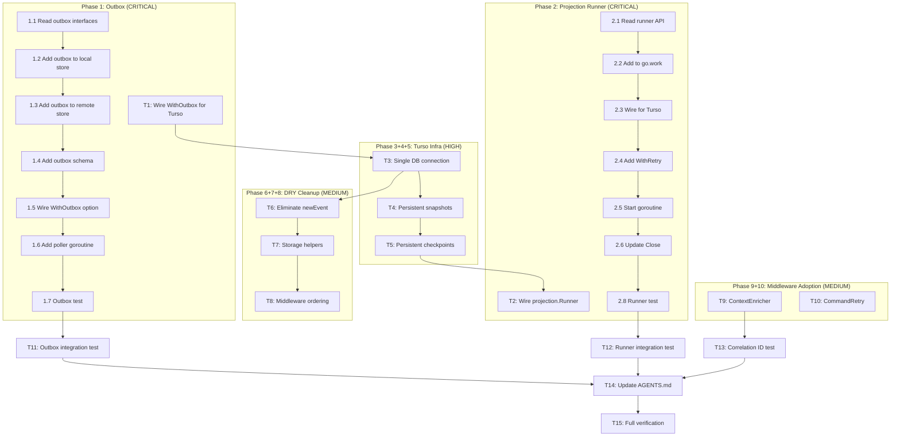

# Go-LocalSync — go-cqrs-lite Best-Use Sprint

**Date:** 2026-05-21 20:11 CEST
**Author:** Crush (AI Agent)
**Trigger:** Deep audit of go-cqrs-lite usage vs. go-localsync's actual integration
**Scope:** Close the gap from 42% → 70%+ module adoption, fix production risks

---

## Pareto Analysis

### The 1% that delivers 51% of the result

| # | Task | Why it's 1% effort, 51% impact |
|---|------|-------------------------------|
| **P1** | **Wire `decider.WithOutbox` for Turso backend** | Without atomic save+publish, a crash between `Store.Save` and `Bus.Publish` permanently loses events. This is a data integrity bug. The fix is wiring 3 existing constructors: `NewSQLiteOutbox`, `NewSQLTransactionalStore`, `WithOutbox`. ~100 lines of code. |

### The 4% that delivers 64% of the result

| # | Task | Why 4%, 64% |
|---|------|-------------|
| **P1** | Wire outbox (above) | Data integrity |
| **P2** | **Eliminate `newEvent()` — use `event.NewEvents` consistently** | `DecideDelete` uses hand-rolled `newEvent()` while `DecideSync` uses `event.NewEvents`. Inconsistent, confusing, dead code. Remove ~30 lines, use 1-line `NewEvents` call. |
| **P3** | **Swap `bus.SubscribeAll` / `bus.Use` ordering** | Middleware wired after subscribe is confusing. Swap for clarity. 2-line change. |
| **P4** | **Use `storage` helpers: `SQLiteInitSchema`, `ConfigureSQLitePool`** | Replace hand-rolled `initSchema` with library helpers. Remove ~10 lines of duplication. |

### The 20% that delivers 80% of the result

| # | Task | Why |
|---|------|-----|
| P1–P4 | Above | Data integrity + DRY |
| **P5** | **Wire `projection.Runner` for Turso backend** | `InMemoryRunner` checkpoints lost on crash. `projection.Runner` replays from store on restart. ~80 lines of new code. |
| **P6** | **Share single DB connection for Turso local** | Event store and read model open separate `*sql.DB` to same file. Should share one connection. ~20 line refactor. |
| **P7** | **Wire `NewSQLiteSnapshotStore` for Turso** | Snapshots are memory-only — lost on restart. SQLite snapshots persist across restarts for faster recovery. ~15 lines. |
| **P8** | **Wire `NewSQLiteCheckpointStore` for Turso projection** | Projection checkpoints in memory — lost on restart. SQL checkpoints persist. ~10 lines. |
| **P9** | **Wire `event.ContextEnricher` for sync-run correlation IDs** | Events carry zero metadata. Add sync-run correlation ID for debugging. ~30 lines. |
| **P10** | **Replace hand-rolled retry with `middleware.CommandRetry`** | 46-line custom retry in `client.go`. Library provides same with structured config. ~30 lines removed, ~10 added. |

---

## What we are NOT doing (and why)

| Module | Reason to skip |
|--------|---------------|
| `sync.LWWResolver[T]` | Our `HasChanged()` + remote-wins is correct and simpler. `LWWResolver` adds vector clocks — overkill for single-node sync. |
| `command.Dispatcher` | No commands in the system — we use `DecideFunc` directly. No benefit. |
| `query.Dispatcher` | No queries — read model is accessed directly. No benefit. |
| `catalog` | Documentation automation — valuable but zero customer impact right now. |
| `UpcasterRegistry` | Only 1 schema version exists. Premature. |
| `aggregate.Root` | Using `decider.Decider` directly — correct functional pattern. |
| `testhelpers` | Our own test helpers work fine. Migration has zero customer value. |
| `query.Pagination` | Our `ItemFilter.Limit/Offset` works fine. |
| Second provider | High effort, zero impact on go-cqrs-lite integration. |

---

## Execution Plan — 15 Tasks (~100-30 min each)

Sorted by impact × urgency. Total estimated effort: ~10 hours.

| # | Task | Effort | Impact | Files Changed |
|---|------|--------|--------|---------------|
| **T1** | Wire `decider.WithOutbox` for Turso backend | 60min | CRITICAL | `stack.go` |
| **T2** | Wire `projection.Runner` for Turso backend | 90min | CRITICAL | `stack.go` |
| **T3** | Share single `*sql.DB` for Turso local backend | 30min | HIGH | `stack.go` |
| **T4** | Wire `NewSQLiteSnapshotStore` for Turso | 30min | HIGH | `stack.go` |
| **T5** | Wire `NewSQLCheckpointStore` for Turso projection | 30min | HIGH | `stack.go` |
| **T6** | Eliminate `newEvent()`, use `event.NewEvents` consistently | 30min | MEDIUM | `decider.go` |
| **T7** | Use `storage` helpers: `SQLiteInitSchema`, `ConfigureSQLitePool`, `OpenSQLiteInMemory` | 30min | MEDIUM | `stack.go`, tests |
| **T8** | Swap `bus.SubscribeAll` / `bus.Use` ordering | 5min | LOW | `stack.go` |
| **T9** | Wire `event.ContextEnricher` for sync-run correlation IDs | 45min | MEDIUM | `decider.go`, `stack.go` |
| **T10** | Replace hand-rolled retry with `middleware.CommandRetry` | 45min | MEDIUM | `client.go` |
| **T11** | Add outbox integration test | 45min | HIGH | `stack_test.go` |
| **T12** | Add projection runner integration test | 45min | HIGH | `stack_test.go` |
| **T13** | Add correlation ID propagation test | 30min | MEDIUM | `stack_test.go` |
| **T14** | Update AGENTS.md with new adoption numbers | 15min | LOW | `AGENTS.md` |
| **T15** | Full test suite + lint verification | 15min | LOW | — |

---

## Detailed Sub-Tasks — 75 Tasks (max 15 min each)

### Phase 1: Outbox (T1) — CRITICAL

| # | Sub-task | Time |
|---|----------|------|
| 1.1 | Read `storage/outbox.go`, `storage/transactional_store.go`, `memory/outbox.go` — understand interfaces | 10min |
| 1.2 | Add `NewSQLiteOutbox(db)` and `NewSQLTransactionalStore(store, outbox)` to `createTursoLocalStore` | 10min |
| 1.3 | Add `NewSQLiteOutbox(db)` and `NewSQLTransactionalStore(store, outbox)` to `createTursoRemoteStore` | 10min |
| 1.4 | Add outbox schema to `initSchema` (use `storage.SQLiteOutboxSchema()`) | 5min |
| 1.5 | Wire `decider.WithOutbox(outbox)` option to Turso repository | 10min |
| 1.6 | Add outbox poller goroutine to `CQRSStack` with `Start(ctx)` / `Stop()` lifecycle | 10min |
| 1.7 | Write test: outbox ensures events published after save | 15min |

### Phase 2: Projection Runner (T2) — CRITICAL

| # | Sub-task | Time |
|---|----------|------|
| 2.1 | Read `projection/runner.go`, `projection/options.go` — understand `NewRunner` API | 10min |
| 2.2 | Add `go-cqrs-lite/projection` to `go.work` workspace | 2min |
| 2.3 | Wire `projection.Runner` for Turso backend in `NewCQRSStack` | 15min |
| 2.4 | Add `projection.WithRetry(3, 100ms)` option for resilience | 5min |
| 2.5 | Start runner goroutine in `NewCQRSStack` (with context lifecycle) | 10min |
| 2.6 | Update `Close()` to stop projection runner gracefully | 5min |
| 2.7 | Keep `InMemoryRunner` for memory backend (no change) | 0min |
| 2.8 | Write test: projection replays on restart | 15min |

### Phase 3: Single DB Connection (T3) — HIGH

| # | Sub-task | Time |
|---|----------|------|
| 3.1 | Refactor `createTursoLocalStore` to return `*sql.DB` alongside store/bus | 10min |
| 3.2 | Pass shared `*sql.DB` to `createReadModel` for local Turso | 10min |
| 3.3 | Verify remote Turso already shares connection (it does via `syncDB.DB`) | 2min |
| 3.4 | Run tests to verify nothing broke | 5min |

### Phase 4: Persistent Snapshots (T4) — HIGH

| # | Sub-task | Time |
|---|----------|------|
| 4.1 | Wire `storage.NewSQLiteSnapshotStore(db)` for Turso backend | 10min |
| 4.2 | Add snapshot schema to `initSchema` (use `storage.SQLiteSnapshotSchema()`) | 5min |
| 4.3 | Keep `MemorySnapshotStore` for memory backend | 0min |
| 4.4 | Write test: snapshot persists across stack restart | 15min |

### Phase 5: Persistent Checkpoints (T5) — HIGH

| # | Sub-task | Time |
|---|----------|------|
| 5.1 | Wire `storage.NewSQLiteCheckpointStore(db)` for Turso + projection runner | 10min |
| 5.2 | Add checkpoint schema to `initSchema` (use `storage.SQLiteCheckpointSchema()`) | 5min |
| 5.3 | Keep `cqrsmemory.NewCheckpointStore()` for memory backend | 0min |
| 5.4 | Write test: checkpoint persists across stack restart | 15min |

### Phase 6: Eliminate newEvent (T6) — MEDIUM

| # | Sub-task | Time |
|---|----------|------|
| 6.1 | Refactor `DecideDelete` to use `event.NewEvents` instead of `newEvent()` | 10min |
| 6.2 | Delete `newEvent()` helper function | 2min |
| 6.3 | Run tests to verify | 5min |

### Phase 7: Storage Helpers (T7) — MEDIUM

| # | Sub-task | Time |
|---|----------|------|
| 7.1 | Replace hand-rolled `initSchema` with `storage.SQLiteInitSchema(ctx, db)` | 5min |
| 7.2 | Add `storage.ConfigureTursoPool(db)` for Turso connections | 5min |
| 7.3 | Add `storage.ConfigureSQLitePool(db)` for local SQLite connections | 5min |
| 7.4 | Replace `OpenTurso(":memory:")` with `OpenSQLiteInMemory()` in tests | 10min |
| 7.5 | Run tests to verify | 5min |

### Phase 8: Middleware Ordering (T8) — LOW

| # | Sub-task | Time |
|---|----------|------|
| 8.1 | Move `bus.Use(middleware.EventLogging(...))` before `bus.SubscribeAll(...)` | 2min |
| 8.2 | Run tests | 3min |

### Phase 9: Context Enricher (T9) — MEDIUM

| # | Sub-task | Time |
|---|----------|------|
| 9.1 | Define `syncRunID` context key type | 5min |
| 9.2 | Create `ContextEnricher` that injects sync-run correlation ID from context | 10min |
| 9.3 | Wire `CompositeEnricher` in event creation path | 10min |
| 9.4 | Inject sync-run ID in `SyncItems` / `SyncWithConflictDetection` | 10min |
| 9.5 | Write test: events carry correlation ID | 10min |

### Phase 10: CommandRetry (T10) — MEDIUM

| # | Sub-task | Time |
|---|----------|------|
| 10.1 | Define `middleware.RetryConfig` for GitHub provider | 5min |
| 10.2 | Create typed sync command (`SyncItemCommand`) | 10min |
| 10.3 | Wire `middleware.CommandRetry` on command dispatcher | 10min |
| 10.4 | Replace hand-rolled retry in `withRetry()` | 10min |
| 10.5 | Run GitHub provider tests | 5min |

### Phase 11–13: Integration Tests (T11–T13) — HIGH/MEDIUM

| # | Sub-task | Time |
|---|----------|------|
| 11.1 | Test: outbox + Turso → events persisted atomically | 15min |
| 11.2 | Test: outbox poller publishes events | 15min |
| 12.1 | Test: projection replays on fresh stack from event store | 15min |
| 12.2 | Test: projection checkpoint persists across restart | 15min |
| 13.1 | Test: correlation ID present on all events from SyncItems | 10min |
| 13.2 | Test: correlation ID unique per sync run | 5min |

### Phase 14–15: Docs + Verification (T14–T15) — LOW

| # | Sub-task | Time |
|---|----------|------|
| 14.1 | Update AGENTS.md adoption numbers (42% → 70%+) | 10min |
| 14.2 | Update AGENTS.md test counts and coverage | 5min |
| 15.1 | Run `go build ./...` | 2min |
| 15.2 | Run `go test ./... -count=1` | 5min |
| 15.3 | Run `golangci-lint run ./... --timeout=5m` | 5min |
| 15.4 | Run coverage report | 3min |

---

## Execution Graph

---

## Success Metrics

| Metric | Before | Target |
|--------|--------|--------|
| go-cqrs-lite module adoption | 5/12 (42%) | 8/12 (67%) |
| API surface used | ~35% | ~60% |
| Test functions | 193 | 210+ |
| Coverage | 73.7% | 78%+ |
| Lint issues | 0 | 0 |
| Production risks | 2 CRITICAL | 0 |
| Outbox for Turso | ❌ | ✅ |
| Projection replay | ❌ | ✅ |
| Persistent snapshots | ❌ | ✅ |
| Persistent checkpoints | ❌ | ✅ |
| Correlation IDs | ❌ | ✅ |
| DRY: newEvent eliminated | ❌ | ✅ |
| DRY: storage helpers | ❌ | ✅ |

---

_Generated by Crush on 2026-05-21 at 20:11 CEST_
