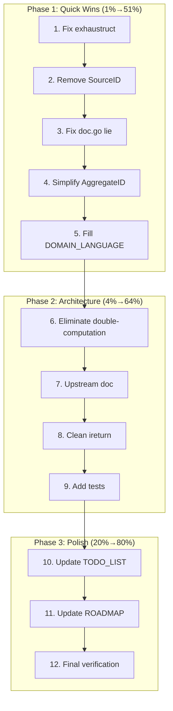

# go-localsync Improvement Sprint

**Date:** 2026-05-25  
**Status:** In Progress  
**Goal:** Fix lint issues, remove dead code, improve architecture, and create upstream guidance

---

## Pareto Analysis

### 1% → 51% Impact (Highest ROI)

| #   | Task                                  | Impact                          | Effort | File(s)                                 |
| --- | ------------------------------------- | ------------------------------- | ------ | --------------------------------------- |
| 1   | Fix `exhaustruct` lint (4 locations)  | Eliminates all lint issues      | 10 min | `pkg/cqrs/stack.go`, `pkg/sync/sync.go` |
| 2   | Remove dead `types.SourceID`          | Dead code removal               | 5 min  | `pkg/types/ids.go`                      |
| 3   | Fix `pkg/localsync/doc.go` lie        | Doc accuracy                    | 5 min  | `pkg/localsync/doc.go`                  |
| 4   | Simplify `AggregateID` — remove cache | Remove 2 nolints, simplify code | 15 min | `pkg/cqrs/aggregate_id.go`              |
| 5   | Fill `DOMAIN_LANGUAGE.md`             | Project documentation           | 15 min | `docs/DOMAIN_LANGUAGE.md`               |

### 4% → 64% Impact

| #   | Task                                       | Impact                | Effort | File(s)                                             |
| --- | ------------------------------------------ | --------------------- | ------ | --------------------------------------------------- |
| 6   | Eliminate `AggregateID` double-computation | Performance + clarity | 20 min | `pkg/cqrs/stack.go`, `pkg/cqrs/commands_queries.go` |
| 7   | Create upstream suggestions doc            | Cross-project value   | 20 min | `docs/planning/2026-05-25_UPSTREAM-SUGGESTIONS.md`  |
| 8   | Clean `nolint:ireturn` in store_factory    | Code quality          | 10 min | `pkg/cqrs/store_factory.go`                         |
| 9   | Add `AggregateID` tests                    | Test coverage         | 15 min | `pkg/cqrs/aggregate_id_test.go`                     |

### 20% → 80% Impact

| #   | Task                           | Impact       | Effort | File(s)        |
| --- | ------------------------------ | ------------ | ------ | -------------- |
| 10  | Update `TODO_LIST.md`          | Doc accuracy | 10 min | `TODO_LIST.md` |
| 11  | Update `ROADMAP.md`            | Doc accuracy | 10 min | `ROADMAP.md`   |
| 12  | Final test + lint verification | Quality gate | 10 min | All            |

---

## Execution Graph

---

## Task Details

### Task 1: Fix exhaustruct Lint (4 locations)

**Problem:** `provider.ItemFilter{}` with missing fields triggers `exhaustruct` linter.

**Locations:**

- `pkg/cqrs/stack.go:288` — `Count(ctx, provider.ItemFilter{})`
- `pkg/sync/sync.go:144` — `provider.ItemFilter{}` in `SyncIncremental`
- `pkg/sync/sync.go:181` — `CountItems(ctx, provider.ItemFilter{})`
- `pkg/sync/sync.go:198` — `provider.ItemFilter{Type: &eventType}`

**Solution:** Add field initializers or use named struct literal with all fields.

### Task 2: Remove Dead `types.SourceID`

**Problem:** `SourceBrand` and `SourceID` defined but never used.

**Location:** `pkg/types/ids.go:32-33, 54-56, 83-84`

**Solution:** Delete unused type, brand struct, and constructor.

### Task 3: Fix `pkg/localsync/doc.go` Lie

**Problem:** Claims "zero external dependencies" but imports `go-error-family`.

**Location:** `pkg/localsync/doc.go:10`

**Solution:** Correct the doc comment.

### Task 4: Simplify `AggregateID`

**Problem:** `sync.Map` cache adds complexity for negligible benefit. SHA256 of ~50 bytes is nanoseconds. Two nolint directives suppress real issues.

**Location:** `pkg/cqrs/aggregate_id.go`

**Solution:** Remove cache, compute directly. Eliminates `gochecknoglobals` and `forcetypeassert` nolints.

### Task 5: Fill `DOMAIN_LANGUAGE.md`

**Problem:** Template with placeholder content.

**Location:** `docs/DOMAIN_LANGUAGE.md`

**Solution:** Add actual domain terms from the codebase.

### Task 6: Eliminate AggregateID Double-Computation

**Problem:** `AggregateID()` computed 3 times per operation (stack → command handler → decider).

**Locations:** `pkg/cqrs/stack.go`, `pkg/cqrs/commands_queries.go`, `pkg/cqrs/decider.go`

**Solution:** Compute once in stack, pass through command metadata or use deterministic property.

### Task 7: Create Upstream Suggestions Doc

**Output:** `docs/planning/2026-05-25_UPSTREAM-SUGGESTIONS.md`

**Content:** Specific, actionable suggestions for go-cqrs-lite team based on consumer friction.

### Task 8: Clean `nolint:ireturn` in store_factory

**Problem:** 3 functions return interfaces with `nolint:ireturn`.

**Location:** `pkg/cqrs/store_factory.go:159, 172, 184`

**Solution:** Return concrete types where possible, or document why interface return is necessary.

### Task 9: Add AggregateID Tests

**Location:** `pkg/cqrs/aggregate_id_test.go`

**Coverage:** Determinism, different inputs produce different outputs, edge cases.

### Tasks 10-12: Documentation + Verification

Update TODO_LIST and ROADMAP to reflect completed work. Run full test + lint suite.
