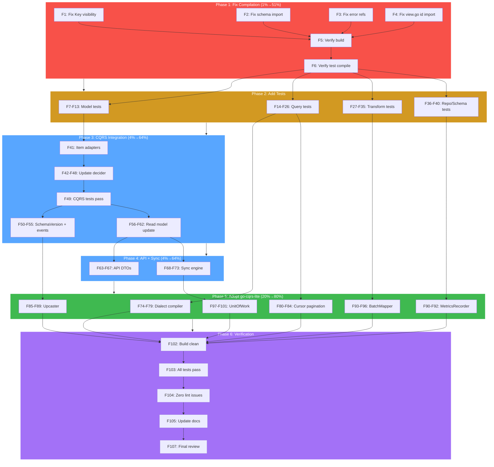

# SUPERB Data Module — Pareto Execution Plan

**Project:** go-localsync  
**Date:** 2026-06-05  
**Goal:** Transform `pkg/data/` from a "good first draft" into a superb, production-grade data layer.  
**Status:** pkg/data/ exists (11 files, ~800 lines) but has compilation errors, no tests, and doesn't integrate with CQRS.

---

## Executive Summary

The `pkg/data/` module was introduced to fix the architectural sin of `provider.Item` doing four jobs at once (DTO, domain entity, read model, API response). The module correctly identifies the problem and introduces layered types (`ProviderItem` → `Item` → `ItemView`), a generic query DSL (`Criterion[T]`, `Query[T]`, `Page[T]`), composable transformers (`Mapper[From,To]`, `Compose[A,B,C]`), and schema versioning. However, it currently:

1. **Does not compile** — `Key` type visibility issues, broken schema import, missing error references
2. **Has zero tests** — no validation that any of the generic abstractions actually work
3. **Does not integrate** — CQRS stack still uses `provider.Item`, API still returns it directly
4. **Reinvents go-cqrs-lite** — SQL string concat instead of `Dialect`, decorative schema constants instead of `Upcaster`, no-op `Observable` instead of `MetricsRecorder`

This plan applies the Pareto principle to deliver maximum impact in minimum time.

---

## Part 1: Pareto Breakdown

### The 1% → 51% (Critical Foundation)

Without these, nothing else matters. The module doesn't compile, so it can't be used.

| #   | Task                                       | Impact   | Why It's 1%                                                                                                                   |
| --- | ------------------------------------------ | -------- | ----------------------------------------------------------------------------------------------------------------------------- |
| 1   | **Fix pkg/data/model/ compilation errors** | BLOCKING | Key type not visible across files, schema package import fails, error references undefined. Module is literally broken.       |
| 2   | **Add comprehensive tests for pkg/data/**  | CRITICAL | Zero tests = zero confidence. Generics are easy to get wrong. Need tests for Criterion, Query, Mapper, Page, Key, Item, View. |

**Time estimate:** 90 minutes  
**Result:** Module compiles. Tests pass. We can iterate.

---

### The 4% → 64% (Core Integration)

These make the module actually usable within the system. Without integration, it's dead code.

| #   | Task                                         | Impact | Why It's in the 4%                                                                                                                              |
| --- | -------------------------------------------- | ------ | ----------------------------------------------------------------------------------------------------------------------------------------------- |
| 3   | **Wire data.Item into CQRS decider**         | HIGH   | Replace `provider.Item` with `data.Item` in `SyncItemState`, `Fold`, `DecideSync`, events. This is the single most important integration point. |
| 4   | **Update event payloads with SchemaVersion** | HIGH   | Add `SchemaVersion` field to `ItemSyncedPayload`. Enable forward-compatible event replay.                                                       |
| 5   | **Update read models to return data types**  | HIGH   | `MemoryReadModel` and `SQLiteReadModel` return `*data.ItemView` instead of `*provider.Item`.                                                    |
| 6   | **Update API to use data DTOs**              | MEDIUM | `api.Server` returns API-specific DTOs instead of exposing `*provider.Item` directly.                                                           |
| 7   | **Update sync engine to use data types**     | MEDIUM | `SyncStore` interface and `Syncer` work with `data.Item` and `data.ItemFilter` (or `data.Query`).                                               |

**Time estimate:** 180 minutes  
**Result:** Data module is fully wired. CQRS, API, sync engine all use it.

---

### The 20% → 80% (Adopt Upstream Patterns)

These elevate from "works" to "superb" by adopting proven patterns from go-cqrs-lite instead of reinventing them.

| #   | Task                                                  | Impact | Why It's in the 20%                                                                                              |
| --- | ----------------------------------------------------- | ------ | ---------------------------------------------------------------------------------------------------------------- |
| 8   | **Adopt go-cqrs-lite/sql.Dialect for queries**        | HIGH   | Replace SQL string concat with type-safe dialect-aware compilation. Enables PostgreSQL support.                  |
| 9   | **Adopt cursor-based pagination**                     | HIGH   | Replace limit/offset with `After` cursor + `uint` limit. Correct for append-only stores.                         |
| 10  | **Adopt go-cqrs-lite/schema.Upcaster**                | HIGH   | Wire upcasters into event replay pipeline. Forward-compatible event migration.                                   |
| 11  | **Replace Observable with MetricsRecorder decorator** | MEDIUM | Use go-cqrs-lite's `middleware.MetricsRecorder` interface. Real observability.                                   |
| 12  | **Add BatchMapper for sync performance**              | MEDIUM | Pre-allocated batch transformations. 10,000 items without 10,000 allocations.                                    |
| 13  | **Add UnitOfWork for atomic writes**                  | MEDIUM | Coordinate event store + read model writes atomically. Prevents inconsistency on crash.                          |
| 14  | **Eliminate getter methods with struct tags**         | LOW    | 14 accessor methods (`GetSource`, `GetType`, etc.) are pure boilerplate. Replace with struct tags + go:generate. |

**Time estimate:** 300 minutes  
**Result:** Module matches go-cqrs-lite quality standards. Production-ready.

---

### The Remaining 80% → 100% (Polish)

| #   | Task                                                            | Impact |
| --- | --------------------------------------------------------------- | ------ |
| 15  | **Performance benchmarks for query DSL**                        | LOW    |
| 16  | **Property-based tests (fuzzing) for Criterion combinators**    | LOW    |
| 17  | **Query plan optimization (reorder criteria by selectivity)**   | LOW    |
| 18  | **Soft-delete / tombstone support matching go-cqrs-lite/event** | LOW    |
| 19  | **Cache decorator with TTL**                                    | LOW    |
| 20  | **Multi-tenant query isolation**                                | LOW    |

---

## Part 2: Medium-Granularity Tasks (30–100 min each)

| #   | Task                                                                                    | Est.  | Priority | Pareto Tier | Dependencies |
| --- | --------------------------------------------------------------------------------------- | ----- | -------- | ----------- | ------------ |
| M1  | Fix model compilation: resolve Key visibility, schema import, error references          | 30min | P0       | 1%→51%      | —            |
| M2  | Write tests for model package (Item, Key, ItemView, ProviderItem validation)            | 60min | P0       | 1%→51%      | M1           |
| M3  | Write tests for query package (Criterion, Query, Page, combinators)                     | 60min | P0       | 1%→51%      | M1           |
| M4  | Write tests for transform package (Mapper, Compose, domain mappers)                     | 45min | P0       | 1%→51%      | M1           |
| M5  | Write tests for repo package (Reader/Writer interfaces, Observable)                     | 30min | P0       | 1%→51%      | M1           |
| M6  | Write tests for schema package (Version, Valid)                                         | 15min | P0       | 1%→51%      | M1           |
| M7  | Integrate data.Item into CQRS: update SyncItemState, Fold, events                       | 90min | P1       | 4%→64%      | M1–M6        |
| M8  | Add SchemaVersion to ItemSyncedPayload + update itemFromPayload                         | 45min | P1       | 4%→64%      | M7           |
| M9  | Update read models: return \*data.ItemView, adapt filter logic                          | 60min | P1       | 4%→64%      | M7           |
| M10 | Update API layer: create ItemResponse DTO, map from ItemView                            | 60min | P1       | 4%→64%      | M9           |
| M11 | Update sync engine: SyncStore uses data types, Syncer maps ProviderItem→Item            | 60min | P1       | 4%→64%      | M7, M10      |
| M12 | Adopt go-cqrs-lite/sql.Dialect: replace ToSQL string concat with dialect-aware compiler | 90min | P2       | 20%→80%     | M3, M9       |
| M13 | Adopt cursor pagination: replace limit/offset with After+uint, update Page[T]           | 60min | P2       | 20%→80%     | M3, M9       |
| M14 | Wire go-cqrs-lite/schema.Upcaster into projection replay pipeline                       | 90min | P2       | 20%→80%     | M8           |
| M15 | Replace Observable with real MetricsRecorder decorator                                  | 45min | P2       | 20%→80%     | M5           |
| M16 | Add BatchMapper for pre-allocated batch transformations                                 | 45min | P2       | 20%→80%     | M4           |
| M17 | Add UnitOfWork for atomic event store + read model writes                               | 90min | P2       | 20%→80%     | M11          |

**Total: 17 tasks, ~960 minutes (16 hours)**

---

## Part 3: Fine-Granularity Tasks (max 15 min each)

### Phase 1: Fix Compilation (Foundation)

| #   | Task                                                                                | Est.  | Parent |
| --- | ----------------------------------------------------------------------------------- | ----- | ------ |
| F1  | Move Key type definition before Item in item.go (or into key.go with proper export) | 10min | M1     |
| F2  | Fix schema.Version import in model/item.go — ensure pkg/data/schema compiles first  | 10min | M1     |
| F3  | Fix error reference in model/item.go (errMissingExternalID etc. from errors.go)     | 10min | M1     |
| F4  | Fix model/view.go id import and embedded field access                               | 10min | M1     |
| F5  | Verify `go build ./pkg/data/...` compiles cleanly                                   | 10min | M1     |
| F6  | Run `go test ./pkg/data/...` — should compile but have no test files yet            | 5min  | M1     |

### Phase 2: Model Tests (Validation)

| #   | Task                                                               | Est.  | Parent |
| --- | ------------------------------------------------------------------ | ----- | ------ |
| F7  | Test Key construction: zero key, valid key, Equals                 | 10min | M2     |
| F8  | Test Key.String() canonical format                                 | 5min  | M2     |
| F9  | Test Item.Key() returns correct composite key                      | 10min | M2     |
| F10 | Test Item.IsZero() for zero vs populated item                      | 10min | M2     |
| F11 | Test ProviderItem.Validate() — all 4 error cases + success         | 10min | M2     |
| F12 | Test ItemView embedded field delegation (GetSource, GetType, etc.) | 10min | M2     |
| F13 | Test StatsView.EmptyStatsView() initializes maps                   | 5min  | M2     |

### Phase 3: Query Tests (Generic DSL)

| #   | Task                                                        | Est.  | Parent |
| --- | ----------------------------------------------------------- | ----- | ------ |
| F14 | Test HasSource criterion: Match true, Match false, ToSQL    | 10min | M3     |
| F15 | Test HasType criterion: Match true, Match false, ToSQL      | 10min | M3     |
| F16 | Test HasActor criterion: Match true, Match false, ToSQL     | 10min | M3     |
| F17 | Test CreatedAfter criterion: Match true, Match false, ToSQL | 10min | M3     |
| F18 | Test And[T] with 2 criteria: both match, one fails, empty   | 10min | M3     |
| F19 | Test Or[T] with 2 criteria: one matches, none match, empty  | 10min | M3     |
| F20 | Test Not[T] inverts criterion                               | 10min | M3     |
| F21 | Test Query.Match() with multiple criteria                   | 10min | M3     |
| F22 | Test Query.Sort() with single and multiple OrderBy          | 10min | M3     |
| F23 | Test QueryBuilder chain: Where().OrderBy().Limit().Build()  | 10min | M3     |
| F24 | Test Page.NewPage computes HasMore correctly                | 10min | M3     |
| F25 | Test Page.MapPage preserves pagination metadata             | 10min | M3     |
| F26 | Test EmptyPage returns zero-value with initialized slice    | 5min  | M3     |

### Phase 4: Transform Tests (Pipelines)

| #   | Task                                                   | Est.  | Parent |
| --- | ------------------------------------------------------ | ----- | ------ |
| F27 | Test FromProviderItem with valid input                 | 10min | M4     |
| F28 | Test FromProviderItem with nil input returns error     | 5min  | M4     |
| F29 | Test FromProviderItem with invalid input returns error | 10min | M4     |
| F30 | Test ToItemView with valid input                       | 10min | M4     |
| F31 | Test ToItemView with nil input returns error           | 5min  | M4     |
| F32 | Test Compose chains two mappers A→B→C                  | 10min | M4     |
| F33 | Test Compose error propagation from first mapper       | 10min | M4     |
| F34 | Test Compose error propagation from second mapper      | 10min | M4     |
| F35 | Test ProviderToView composed pipeline end-to-end       | 10min | M4     |

### Phase 5: Repo & Schema Tests

| #   | Task                                                              | Est.  | Parent |
| --- | ----------------------------------------------------------------- | ----- | ------ |
| F36 | Test schema.Version.Valid() for known and unknown versions        | 5min  | M6     |
| F37 | Test schema.Version.String() format                               | 5min  | M6     |
| F38 | Test schema.CurrentVersion() returns V2                           | 5min  | M6     |
| F39 | Verify Repository interface satisfaction with mock implementation | 10min | M5     |
| F40 | Verify Observable[T] delegates correctly                          | 10min | M5     |

### Phase 6: CQRS Integration (The Big Move)

| #   | Task                                                             | Est.  | Parent |
| --- | ---------------------------------------------------------------- | ----- | ------ |
| F41 | Create data.Item to/from provider.Item adapter functions         | 10min | M7     |
| F42 | Update SyncItemState.Item type from *provider.Item to *data.Item | 10min | M7     |
| F43 | Update Fold to reconstruct data.Item from event payload          | 15min | M7     |
| F44 | Update itemToPayload to serialize data.Item fields               | 10min | M7     |
| F45 | Update itemFromPayload to deserialize into data.Item             | 15min | M7     |
| F46 | Update DecideSync to accept \*data.Item                          | 10min | M7     |
| F47 | Update HasChanged to compare data.Item fields                    | 10min | M7     |
| F48 | Update all decider tests to use data.Item                        | 15min | M7     |
| F49 | Run all CQRS tests — fix compilation errors                      | 15min | M7     |

### Phase 7: Schema Version + Events

| #   | Task                                                                | Est.  | Parent |
| --- | ------------------------------------------------------------------- | ----- | ------ |
| F50 | Add SchemaVersion field to ItemSyncedPayload struct                 | 5min  | M8     |
| F51 | Update itemToPayload to include SchemaVersion                       | 5min  | M8     |
| F52 | Update itemFromPayload to read SchemaVersion, default to V1         | 10min | M8     |
| F53 | Add migration function: V1 payload → V2 payload (add SchemaVersion) | 10min | M8     |
| F54 | Wire migration into Fold for replay path                            | 10min | M8     |
| F55 | Test event round-trip with SchemaVersion                            | 10min | M8     |

### Phase 8: Read Model Integration

| #   | Task                                                         | Est.  | Parent |
| --- | ------------------------------------------------------------ | ----- | ------ |
| F56 | Update MemoryReadModel to store \*data.ItemView              | 10min | M9     |
| F57 | Update MemoryReadModel.Get to return \*data.ItemView         | 10min | M9     |
| F58 | Update MemoryReadModel.List to filter/return \*data.ItemView | 10min | M9     |
| F59 | Update SQLiteReadModel.scanItem to build \*data.ItemView     | 15min | M9     |
| F60 | Update SQLiteReadModel.List to return []\*data.ItemView      | 10min | M9     |
| F61 | Update matchesFilter to work with data types                 | 10min | M9     |
| F62 | Run read model tests                                         | 10min | M9     |

### Phase 9: API Integration

| #   | Task                                                     | Est.  | Parent |
| --- | -------------------------------------------------------- | ----- | ------ |
| F63 | Define api.ItemResponse DTO with JSON tags               | 10min | M10    |
| F64 | Add transform.ToAPIItem mapper (ItemView → ItemResponse) | 10min | M10    |
| F65 | Update listItems handler to return ItemResponse          | 10min | M10    |
| F66 | Update getStats handler to use data.StatsView            | 10min | M10    |
| F67 | Run API tests — fix compilation errors                   | 15min | M10    |

### Phase 10: Sync Engine Integration

| #   | Task                                                         | Est.  | Parent |
| --- | ------------------------------------------------------------ | ----- | ------ |
| F68 | Update SyncStore interface to use data types                 | 10min | M11    |
| F69 | Update CQRSStack adapter methods for new SyncStore           | 10min | M11    |
| F70 | Update Syncer to map ProviderItem → data.Item before storing | 10min | M11    |
| F71 | Update ConflictAwareSyncer for data types                    | 10min | M11    |
| F72 | Update SyncSummary to reference data types                   | 5min  | M11    |
| F73 | Run sync tests — fix compilation errors                      | 15min | M11    |

### Phase 11: Adopt go-cqrs-lite Dialect

| #   | Task                                                          | Est.  | Parent |
| --- | ------------------------------------------------------------- | ----- | ------ |
| F74 | Import go-cqrs-lite/storage/sql                               | 5min  | M12    |
| F75 | Create QueryCompiler interface with Compile(Query[T]) method  | 10min | M12    |
| F76 | Implement SQLCompiler that uses sql.Dialect.Placeholder       | 15min | M12    |
| F77 | Update Criterion.ToSQL to return AST nodes instead of strings | 15min | M12    |
| F78 | Add SQLiteCompiler using sql.SQLiteDialect                    | 10min | M12    |
| F79 | Test compiler produces correct SQL for complex And/Or queries | 15min | M12    |

### Phase 12: Cursor Pagination

| #   | Task                                                             | Est.  | Parent |
| --- | ---------------------------------------------------------------- | ----- | ------ |
| F80 | Replace Page[T] Limit/Offset with After+Limit (uint)             | 10min | M13    |
| F81 | Update Query[T] to use After cursor + uint Limit                 | 10min | M13    |
| F82 | Update MemoryReadModel pagination to cursor-based                | 15min | M13    |
| F83 | Update SQLiteReadModel pagination to cursor-based                | 15min | M13    |
| F84 | Test cursor pagination edge cases (first page, last page, empty) | 10min | M13    |

### Phase 13: Upcaster Integration

| #   | Task                                                    | Est.  | Parent |
| --- | ------------------------------------------------------- | ----- | ------ |
| F85 | Import go-cqrs-lite/schema                              | 5min  | M14    |
| F86 | Define ItemSyncedUpcaster implementing schema.Upcaster  | 10min | M14    |
| F87 | Wire upcaster into projection runner replay path        | 15min | M14    |
| F88 | Test upcaster transforms V1 event to V2 on replay       | 15min | M14    |
| F89 | Test projection handles both V1 and V2 events correctly | 10min | M14    |

### Phase 14: Observability & Performance

| #   | Task                                                       | Est.  | Parent |
| --- | ---------------------------------------------------------- | ----- | ------ |
| F90 | Import go-cqrs-lite/middleware MetricsRecorder             | 5min  | M15    |
| F91 | Rewrite Observable[T] to record timing via MetricsRecorder | 15min | M15    |
| F92 | Test Observable decorator records correct metrics          | 10min | M15    |
| F93 | Define BatchMapper[From,To] interface                      | 5min  | M16    |
| F94 | Implement BatchMapper for ProviderItem→Item                | 10min | M16    |
| F95 | Test BatchMapper pre-allocates correct capacity            | 10min | M16    |
| F96 | Benchmark BatchMapper vs single Mapper (10k items)         | 10min | M16    |

### Phase 15: Transactions

| #    | Task                                                              | Est.  | Parent |
| ---- | ----------------------------------------------------------------- | ----- | ------ |
| F97  | Define UnitOfWork interface (Begin, Commit, Rollback)             | 10min | M17    |
| F98  | Implement SQLiteUnitOfWork using sql.Tx                           | 15min | M17    |
| F99  | Wire UnitOfWork into CQRSStack.SyncItems                          | 15min | M17    |
| F100 | Test UnitOfWork rollback on error preserves consistency           | 15min | M17    |
| F101 | Test UnitOfWork commit on success writes both events + read model | 10min | M17    |

### Phase 16: Cleanup & Verification

| #    | Task                                                                | Est.  | Parent |
| ---- | ------------------------------------------------------------------- | ----- | ------ |
| F102 | Run `go build ./...` — zero errors                                  | 5min  | —      |
| F103 | Run `go test ./...` — all tests pass                                | 10min | —      |
| F104 | Run `golangci-lint run ./...` — zero issues                         | 10min | —      |
| F105 | Update AGENTS.md with data module architecture                      | 15min | —      |
| F106 | Update FEATURES.md with new data module features                    | 10min | —      |
| F107 | Final review: verify all TODOs from brainstorming doc are addressed | 10min | —      |

**Total: 107 fine-granularity tasks**

---

## Part 4: Execution Graph (Mermaid)

**Color coding:**

- 🔴 Red = 1%→51% (Critical foundation)
- 🟡 Yellow = Test coverage
- 🔵 Blue = 4%→64% (Core integration)
- 🟢 Green = 20%→80% (Adopt upstream)
- 🟣 Purple = Verification

---

## Part 5: Key Decisions

### Decision 1: Keep Getter Methods for Now

The 14 `Get*()` methods on `Item`/`ItemView` are boilerplate but they work. Eliminating them with struct tags + `go:generate` is valuable but falls into the 80%→100% tier. We keep them for now and ticket the cleanup.

### Decision 2: Adopt go-cqrs-lite Dialect, Don't Reimplement

The `go-cqrs-lite/storage/sql.Dialect` interface already handles PostgreSQL vs SQLite differences. We adopt it directly rather than creating our own `Dialect` type. Our `QueryCompiler` wraps it.

### Decision 3: Cursor Pagination for Read Model Only

The API pagination changes to cursor-based. Internal sync operations (fetching all items from provider) still use limit/offset because they operate on the provider's API, not our event store.

### Decision 4: Upcaster Is Forward-Only

Like go-cqrs-lite, migrations are forward-only. Old events are transformed on replay but never rewritten in the store. This preserves the append-only invariant.

---

## Part 6: Risk Assessment

| Risk                                        | Probability | Impact | Mitigation                                                    |
| ------------------------------------------- | ----------- | ------ | ------------------------------------------------------------- |
| CQRS integration breaks existing tests      | High        | High   | Make changes incrementally; run tests after every file change |
| API DTO changes break Huma OpenAPI          | Medium      | Medium | Test API endpoints after DTO change                           |
| go-cqrs-lite Dialect import adds dependency | Low         | Low    | Already depends on go-cqrs-lite/storage                       |
| BatchMapper complexity                      | Low         | Medium | Start with simple pre-allocation; optimize later              |
| UnitOfWork deadlock                         | Low         | High   | Use context.WithTimeout; test error paths                     |

---

## Part 7: Definition of Done

- [ ] `go build ./...` — zero errors
- [ ] `go test ./...` — all tests pass (target: 300+ test functions)
- [ ] `golangci-lint run ./...` — zero issues
- [ ] `pkg/data/` has 80%+ test coverage
- [ ] CQRS stack uses `data.Item` instead of `provider.Item`
- [ ] API returns DTOs, not `*provider.Item`
- [ ] Event payloads carry `SchemaVersion`
- [ ] Read models return `*data.ItemView`
- [ ] Queries compile via `sql.Dialect` (not string concat)
- [ ] Pagination uses cursor + `uint` limit
- [ ] AGENTS.md updated with data module architecture
- [ ] FEATURES.md updated with new capabilities

---

_Plan created 2026-06-05. Execute Phase 1 first. Do not skip ahead._
