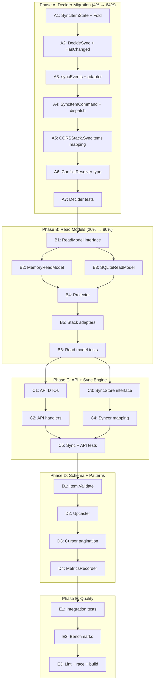

# SUPERB Data Module Sprint — Execution Plan

**Date:** 2026-06-05 05:28  
**Goal:** Transform `pkg/data/` from "good first draft" into a production-grade data layer fully integrated with the CQRS stack.

---

## Pareto Breakdown

### 1% → 51% (Foundation) — DONE

| Deliverable                                                                 | Status |
| --------------------------------------------------------------------------- | ------ |
| `pkg/data/model/` — `Item`, `Key`, `ItemView`, `StatsView`, `ProviderItem`  | Done   |
| `pkg/data/query/` — `Criterion[T]`, `Query[T]`, `Page[T]`, combinators      | Done   |
| `pkg/data/transform/` — `Mapper[From,To]`, `Compose`                        | Done   |
| `pkg/data/schema/` — `Version` type                                         | Done   |
| `pkg/data/repo/` — `Reader[T]`, `Writer[T]`, `Repository[T]`                | Done   |
| 47 tests across all 5 sub-packages, all passing                             | Done   |
| `pkg/cqrs/item_adapter.go` — bridge between `provider.Item` and `data.Item` | Done   |
| `ItemSyncedPayload.SchemaVersion` field added for forward compatibility     | Done   |

### 4% → 64% (Core CQRS Decider Migration)

**The heart of the system.** Once the decider uses `data.Item` as the domain entity, everything downstream follows naturally. This is the highest-leverage change remaining.

- Migrate `SyncItemState.Item` from `*provider.Item` → `*model.Item`
- Update `Fold`, `DecideSync`, `HasChanged`, `resolveConflict` to use `*model.Item`
- Update `SyncItemCommand` and command dispatch
- Update `CQRSStack.SyncItems` to map provider DTOs → domain entities before dispatch
- Migrate all `pkg/cqrs/` tests

### 20% → 80% (Read Models + API + Sync Engine)

- Update `ReadModel` interface + `MemoryReadModel` + `SQLiteReadModel` to use `*model.Item`
- Update `Projector` to reconstruct `*model.Item` via adapter
- Update `stack_adapters.go` (`ListItems`, `CountItems`, `GetItemTypes`)
- Create API DTOs (`ItemResponse`), update handlers to stop returning `*provider.Item`
- Update `SyncStore` interface + `Syncer` to use data types

### 80% → 100% (Polish / go-cqrs-lite v2.1.0 Patterns)

- `Item.Validate()` on domain model + use in adapter
- `schema.Upcaster` for `ItemSyncedPayload` V1→V2 replay migration
- Cursor pagination (`After` + `uint` limit) replacing offset/limit
- `MetricsRecorder` middleware for observability
- Benchmarks and integration tests

---

## Comprehensive Plan (25 Tasks, 15–60 min each)

| #   | Task                                                                              | Phase | Est. | Impact   | Effort |
| --- | --------------------------------------------------------------------------------- | ----- | ---- | -------- | ------ |
| 1   | Update `SyncItemState`, `Fold`, `foldItemSynced` to use `*model.Item`             | A     | 45m  | Critical | Medium |
| 2   | Update `DecideSync`, `HasChanged`, `resolveConflict` to use `*model.Item`         | A     | 45m  | Critical | Medium |
| 3   | Migrate `syncEvents`, delete old `itemToPayload`/`itemFromPayload`, wire adapter  | A     | 30m  | Critical | Low    |
| 4   | Update `SyncItemCommand`, validation, `handleSyncItem`                            | A     | 30m  | Critical | Low    |
| 5   | Update `CQRSStack.SyncItems` to map `provider.Item` → `data.Item` before dispatch | A     | 30m  | Critical | Low    |
| 6   | Update `CQRSConfig.ConflictResolver` type to `*model.Item`                        | A     | 15m  | Critical | Low    |
| 7   | Update all `pkg/cqrs/` tests for `*model.Item`                                    | A     | 60m  | High     | High   |
| 8   | Update `ReadModel` interface to `*model.Item`                                     | B     | 15m  | High     | Low    |
| 9   | Update `MemoryReadModel` + `matchesFilter` + `paginate` to `*model.Item`          | B     | 45m  | High     | Medium |
| 10  | Update `SQLiteReadModel` scan/upsert methods to `*model.Item`                     | B     | 45m  | High     | Medium |
| 11  | Update `Projector` to use `DataItemFromPayload` adapter                           | B     | 30m  | High     | Low    |
| 12  | Update `stack_adapters.go` (`ListItems`, `CountItems`, etc.)                      | B     | 30m  | High     | Low    |
| 13  | Update read model tests                                                           | B     | 45m  | High     | Medium |
| 14  | Create API DTO types (`ItemResponse`)                                             | C     | 30m  | Medium   | Low    |
| 15  | Update API handlers to use DTOs                                                   | C     | 45m  | Medium   | Medium |
| 16  | Update `SyncStore` interface to use data types                                    | C     | 30m  | Medium   | Low    |
| 17  | Update `Syncer` to map `provider.Item` → `data.Item`                              | C     | 30m  | Medium   | Low    |
| 18  | Update `sync/` and `api/` tests                                                   | C     | 45m  | Medium   | Medium |
| 19  | Add `Item.Validate()` to model + use in adapter                                   | D     | 30m  | Medium   | Low    |
| 20  | Implement `schema.Upcaster` for V1→V2 payload migration                           | D     | 45m  | Low-Med  | Medium |
| 21  | Add cursor pagination to read models                                              | D     | 60m  | Low      | High   |
| 22  | Add `MetricsRecorder` middleware                                                  | D     | 30m  | Low      | Low    |
| 23  | Integration tests for end-to-end data→CQRS flow                                   | E     | 60m  | Medium   | High   |
| 24  | Benchmarks for read models                                                        | E     | 30m  | Low      | Low    |
| 25  | Full test suite + lint + race verification                                        | E     | 30m  | Critical | Low    |

**Total estimated time:** ~16 hours

---

## Fine-Grained Plan (90 Tasks, Max 15 min each)

### Phase A: CQRS Decider Migration (28 tasks)

| #     | Task                                                                                      | Est. |
| ----- | ----------------------------------------------------------------------------------------- | ---- |
| A1.1  | Update `SyncItemState` struct: `Item *provider.Item` → `Item *model.Item`                 | 10m  |
| A1.2  | Update `InitialState` var                                                                 | 5m   |
| A1.3  | Update `IsNew()` method                                                                   | 5m   |
| A1.4  | Update `Fold` function signature (no change, but verify)                                  | 5m   |
| A1.5  | Update `foldItemSynced` to call `DataItemFromPayload` instead of `itemFromPayload`        | 10m  |
| A1.6  | Delete old `itemFromPayload` function                                                     | 5m   |
| A2.1  | Update `DecideSync` parameter: `item *provider.Item` → `item *model.Item`                 | 10m  |
| A2.2  | Update `HasChanged(local, remote *provider.Item)` → `*model.Item`                         | 10m  |
| A2.3  | Update `resolveConflict` signature to `*model.Item`                                       | 10m  |
| A2.4  | Update `crdt.Conflict[*provider.Item]` → `crdt.Conflict[*model.Item]`                     | 10m  |
| A2.5  | Update `syncEvents` parameter to `*model.Item`                                            | 5m   |
| A2.6  | Update `syncEvents` to call `DataItemToPayload` instead of `itemToPayload`                | 10m  |
| A2.7  | Delete old `itemToPayload` function                                                       | 5m   |
| A3.1  | Update `SyncItemCommand.Item` to `*model.Item`                                            | 5m   |
| A3.2  | Update command validation for `*model.Item`                                               | 10m  |
| A3.3  | Update `handleSyncItem` closure                                                           | 10m  |
| A3.4  | Update `wireCommandDispatcher` resolver type                                              | 5m   |
| A3.5  | Update `CQRSConfig.ConflictResolver` to `*model.Item`                                     | 5m   |
| A3.6  | Update `CQRSStack.conflictResolver` field type                                            | 5m   |
| A3.7  | Update `CQRSStack.SyncItem` method signature                                              | 5m   |
| A3.8  | Update `CQRSStack.SyncItems` to map `[]*provider.Item` → `[]*model.Item` via `ToDataItem` | 10m  |
| A3.9  | Fix imports across all modified decider files                                             | 10m  |
| A3.10 | Update `decider_test.go` fixtures to use `*model.Item`                                    | 15m  |
| A3.11 | Update `decider_resolver_test.go` for `*model.Item`                                       | 15m  |
| A3.12 | Update `stack_test.go` for new types                                                      | 15m  |
| A3.13 | Update `stack_classify_test.go`                                                           | 10m  |
| A3.14 | Update `testing_test.go` helpers                                                          | 10m  |
| A3.15 | Update `dispatch_test.go`                                                                 | 10m  |
| A3.16 | Update `correlation_test.go`                                                              | 10m  |

### Phase B: Read Models (18 tasks)

| #     | Task                                                                                      | Est. |
| ----- | ----------------------------------------------------------------------------------------- | ---- |
| B1.1  | Update `ReadModel` interface `Get` signature to `*model.Item`                             | 5m   |
| B1.2  | Update `ReadModel` interface `List` signature to `*model.Item`                            | 5m   |
| B1.3  | Update `ReadModel` interface `Count` signature                                            | 5m   |
| B1.4  | Update `ReadModel` interface `Upsert` signature to `*model.Item`                          | 5m   |
| B1.5  | Update `ReadModel` interface `Delete` signature                                           | 5m   |
| B1.6  | Update `MemoryReadModel` struct + `NewMemoryReadModel`                                    | 5m   |
| B1.7  | Update `MemoryReadModel.Get`                                                              | 10m  |
| B1.8  | Update `MemoryReadModel.List`                                                             | 10m  |
| B1.9  | Update `MemoryReadModel.Count`                                                            | 10m  |
| B1.10 | Update `MemoryReadModel.Upsert`                                                           | 10m  |
| B1.11 | Update `MemoryReadModel.Delete`                                                           | 5m   |
| B1.12 | Update `matchesFilter` to accept `*model.Item`                                            | 10m  |
| B1.13 | Update `paginate` to `[]*model.Item`                                                      | 5m   |
| B1.14 | Update `SQLiteReadModel.Get` + `scanItem` to return `*model.Item`                         | 15m  |
| B1.15 | Update `SQLiteReadModel.List` + `scanItems`                                               | 15m  |
| B1.16 | Update `SQLiteReadModel.Upsert`                                                           | 10m  |
| B1.17 | Update `Projector.handleItemSynced` to use `DataItemFromPayload`                          | 10m  |
| B1.18 | Update `readmodel_test.go`, `sqlite_readmodel_test.go`, `sqlite_readmodel_filter_test.go` | 15m  |

### Phase C: Stack Adapters + API + Sync Engine (20 tasks)

| #     | Task                                                                   | Est. |
| ----- | ---------------------------------------------------------------------- | ---- |
| C1.1  | Update `stack_adapters.go` `ListItems` signature                       | 5m   |
| C1.2  | Update `stack_adapters.go` `CountItems` signature                      | 5m   |
| C1.3  | Update `stack_adapters.go` `GetItemTypes` signature                    | 5m   |
| C1.4  | Update `stack_adapters.go` `Count` signature                           | 5m   |
| C1.5  | Create `api.ItemResponse` DTO struct                                   | 10m  |
| C1.6  | Update `ListItemsOutput.Body.Items` to `[]*api.ItemResponse`           | 5m   |
| C1.7  | Update `listItems` handler to map `*model.Item` → `*api.ItemResponse`  | 10m  |
| C1.8  | Update `getStats` handler                                              | 5m   |
| C1.9  | Update `SyncStore.SyncItems` to `[]*model.Item`                        | 5m   |
| C1.10 | Update `SyncStore.ListItems` to return `[]*model.Item`                 | 5m   |
| C1.11 | Update `SyncStore.CountItems`                                          | 5m   |
| C1.12 | Update `SyncStore.GetItemTypes`                                        | 5m   |
| C1.13 | Update `Syncer.Sync` to map `provider.Item` → `model.Item` via adapter | 10m  |
| C1.14 | Update `Syncer.SyncIncremental`                                        | 10m  |
| C1.15 | Update `Syncer.filterValidItems`                                       | 10m  |
| C1.16 | Update `ConflictAwareSyncer`                                           | 10m  |
| C1.17 | Update `sync_test.go`                                                  | 15m  |
| C1.18 | Update `api/server_test.go`                                            | 15m  |
| C1.19 | Update `cmd/examples/github-sync` if needed                            | 10m  |
| C1.20 | Fix all cross-package imports and type mismatches                      | 15m  |

### Phase D: Schema + Advanced Patterns (12 tasks)

| #    | Task                                                     | Est. |
| ---- | -------------------------------------------------------- | ---- |
| D1.1 | Add `Item.Validate()` method to `model.Item`             | 10m  |
| D1.2 | Call `Item.Validate()` in `DataItemFromPayload`          | 5m   |
| D2.1 | Create `schema.Upcaster` interface in `pkg/data/schema/` | 10m  |
| D2.2 | Implement `ItemSyncedPayloadUpcaster` V1→V2              | 15m  |
| D2.3 | Wire upcaster into `foldItemSynced` replay path          | 10m  |
| D3.1 | Add cursor pagination types (`CursorPage[T]`)            | 10m  |
| D3.2 | Update `MemoryReadModel` with cursor support             | 15m  |
| D3.3 | Update `SQLiteReadModel` with cursor support             | 15m  |
| D4.1 | Add `MetricsRecorder` decorator type                     | 10m  |
| D4.2 | Wire `MetricsRecorder` into `CQRSStack`                  | 10m  |
| D5.1 | Add query optimization indexes to SQLite schema          | 5m   |
| D5.2 | Add `BatchMapper` utility in `pkg/data/transform/`       | 10m  |

### Phase E: Quality + Verification (12 tasks)

| #    | Task                                                                            | Est. |
| ---- | ------------------------------------------------------------------------------- | ---- |
| E1.1 | Write integration test: `provider.Item` → adapter → decider → events            | 15m  |
| E1.2 | Write integration test: event → `DataItemFromPayload` → projection → read model | 15m  |
| E1.3 | Write integration test: read model → API DTO roundtrip                          | 15m  |
| E2.1 | Benchmark `MemoryReadModel.List`                                                | 10m  |
| E2.2 | Benchmark `SQLiteReadModel.List`                                                | 10m  |
| E2.3 | Benchmark adapter roundtrip (`ToDataItem` + `FromDataItem`)                     | 10m  |
| E3.1 | Run `go test ./... -count=1`                                                    | 5m   |
| E3.2 | Run `go test ./... -race`                                                       | 10m  |
| E3.3 | Run `golangci-lint run ./...`                                                   | 10m  |
| E3.4 | Fix any lint issues                                                             | 15m  |
| E3.5 | Fix any test failures                                                           | 15m  |
| E3.6 | Verify `go build ./...` passes                                                  | 5m   |

---

## Mermaid.js Execution Graph

---

## Execution Notes

1. **Phase A is the bottleneck.** Do not parallelize A1–A7 — each depends on the previous type changes.
2. **Phase B can start once A7 is done.** B2 and B3 are independent and can be done in any order.
3. **Phase C depends on B.** The API and sync engine need the read models to be stable first.
4. **Phase D is mostly additive.** Can be done incrementally without breaking existing functionality.
5. **Phase E is the gate.** Nothing ships until E3 passes.

## Definition of Done

- [ ] `go build ./...` passes with zero errors
- [ ] `go test ./... -count=1` passes with zero failures
- [ ] `go test ./... -race` passes with zero races
- [ ] `golangci-lint run ./...` reports zero issues
- [ ] `provider.Item` is only used in: provider implementations, adapter functions, and API input binding
- [ ] `data.Item` is the domain entity in: decider, events, read models, sync store
- [ ] All new code has tests
- [ ] No TODOs or FIXMEs left in modified files
