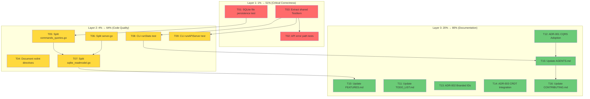

# Session 15 — Comprehensive Execution Plan

**Project:** go-localsync
**Date:** 2026-06-11
**Status:** Planning → Execution
**Tests:** 265+ passing, 11 packages | **Lint:** 0 issues (golangci-lint v2)

---

## Current State Snapshot

| Package                    | Coverage | Tests | Notes                                       |
| -------------------------- | -------- | ----- | ------------------------------------------- |
| `cmd/examples/github-sync` | 12.3%    | 14    | Lowest coverage — main flow untested        |
| `pkg/api`                  | 85.7%    | ~12   | Error paths untested                        |
| `pkg/cqrs`                 | 85.9%    | ~90   | Largest package (15 files), some >200 lines |
| `pkg/crdt`                 | 97.6%    | 52    | Excellent                                   |
| `pkg/data/model`           | 100%     | —     | Complete                                    |
| `pkg/data/schema`          | 100%     | —     | Complete                                    |
| `pkg/errors`               | 100%     | 11    | Complete                                    |
| `pkg/id`                   | 100%     | 10    | Complete                                    |
| `pkg/provider`             | 90.0%    | 2     | Healthy                                     |
| `pkg/providers/github`     | 84.4%    | 32    | Healthy                                     |
| `pkg/sync`                 | 91.0%    | 22    | Healthy                                     |

### Known Gaps

- **SQLite persistence never tested with file I/O** — only `:memory:`
- **CLI main flow has 12.3% coverage** — `runSync`, `runConflictAwareSync`, `runAPIServer` untested
- **API error paths untested** — store failures, malformed params
- **`TestItem()` helper duplicated across 4+ test files** — DRY violation
- **5 files >200 lines** — could benefit from splitting for readability
- **5 `nolint` directives without explanation** — should document why
- **FEATURES.md stale** — says "235 test functions", actual is 265+
- **TODO_LIST.md stale** — model coverage item still listed (already 100%)
- **No ADR documents** — architecture decisions undocumented

---

## Pareto Analysis

### 🔴 Layer 1: The 1% that delivers 51% of the result

These are correctness-critical items that validate the system actually works end-to-end.

| #   | Task                                  | Impact                                                     | Effort | Value                    |
| --- | ------------------------------------- | ---------------------------------------------------------- | ------ | ------------------------ |
| T01 | SQLite file-based persistence test    | **Critical** — validates real I/O, locking, crash recovery | 15min  | Proves persistence works |
| T02 | API error path tests (store failures) | **High** — catches unhandled errors in production          | 15min  | 85.7% → 90%+             |
| T03 | Extract shared `testutil.TestItem()`  | **High** — DRY, reduces maintenance burden                 | 10min  | Removes 4+ duplications  |

### 🟡 Layer 2: The 4% that delivers 64% of the result

Code quality and maintainability improvements.

| #   | Task                                                  | Impact                                         | Effort | Value               |
| --- | ----------------------------------------------------- | ---------------------------------------------- | ------ | ------------------- |
| T04 | Document all `nolint` directives (5 without comments) | **Medium** — shows intentional decisions       | 10min  | Code review clarity |
| T05 | Split `pkg/cqrs/commands_queries.go` (299 lines)      | **Medium** — readability, smaller diff context | 15min  | 3 focused files     |
| T06 | Split `pkg/api/server.go` (311 lines)                 | **Medium** — DTOs/handlers/errors separation   | 15min  | 3 focused files     |
| T07 | Split `pkg/cqrs/sqlite_readmodel.go` (337 lines)      | **Medium** — largest file in project           | 15min  | 3 focused files     |
| T08 | CLI integration test — `runStats`                     | **Medium** — CLI stats flow coverage           | 15min  | 12.3% → 20%+        |
| T09 | CLI integration test — `runAPIServer`                 | **Medium** — server startup coverage           | 15min  | Covers HTTP mode    |

### 🟢 Layer 3: The 20% that delivers 80% of the result

Documentation and polish.

| #   | Task                                                          | Impact                                               | Effort | Value      |
| --- | ------------------------------------------------------------- | ---------------------------------------------------- | ------ | ---------- |
| T10 | Update `FEATURES.md` — fix stale test counts (235→265+)       | **Medium** — honest status                           | 10min  | Accuracy   |
| T11 | Update `TODO_LIST.md` — mark model coverage done, restructure | **Medium** — honest status                           | 10min  | Accuracy   |
| T12 | Write ADR-001: CQRS Adoption                                  | **Medium** — documents the key architecture decision | 15min  | Onboarding |
| T13 | Write ADR-002: Branded IDs                                    | **Low** — documents type safety approach             | 10min  | Onboarding |
| T14 | Write ADR-003: CRDT Integration                               | **Low** — documents conflict resolution strategy     | 10min  | Onboarding |
| T15 | Update `AGENTS.md` — session 15 section                       | **Low** — session history                            | 10min  | Continuity |
| T16 | Update `CONTRIBUTING.md` — architecture guide, file limits    | **Low** — contributor onboarding                     | 15min  | Onboarding |

### ⚪ Deferred (80% effort for 20% result)

These are valuable but not worth doing now. Listed for awareness.

| #   | Task                                         | Reason to defer                      |
| --- | -------------------------------------------- | ------------------------------------ |
| D01 | Resolve go-cqrs-lite upstream WIP            | Blocked on external — cannot act     |
| D02 | OpenTelemetry instrumentation                | New dependency, significant scope    |
| D03 | API auth middleware                          | Feature addition, not quality        |
| D04 | API pagination headers                       | Feature addition                     |
| D05 | API rate limiting                            | Feature addition                     |
| D06 | API OpenAPI spec enhancement                 | Cosmetic                             |
| D07 | Real GitHub PAT smoke test                   | Requires secret management           |
| D08 | govalid struct tags                          | Minor validation improvement         |
| D09 | Adopt `UpcasterRegistry`                     | Schema evolution — not needed yet    |
| D10 | Adopt `catalog/`                             | AsyncAPI generation — not needed yet |
| D11 | Adopt `middleware.CommandRetry`              | API mismatch — blocked on upstream   |
| D12 | Extract `pkg/providers/github/convert.go`    | Only 60 lines of convert logic       |
| D13 | Unify test framework (ginkgo/testify→stdlib) | Large scope, low urgency             |

---

## Detailed Task Breakdown (max 15min each)

### T01: SQLite File-Based Persistence Test (15min)

**File:** `pkg/cqrs/sqlite_persistence_test.go`
**What:** Create temp file, write 10 items via CQRS stack, close stack, reopen, verify all items survive.
**Why:** Current tests only use `:memory:` — never validates file I/O, locking, or crash recovery.
**Steps:**

1. Create `TestSQLiteFilePersistence`
2. Use `t.TempDir()` for file path
3. Create stack with sqlite backend → sync items → close
4. Create new stack with same file → list items → assert count matches
5. Run with `-race`

### T02: API Error Path Tests (15min)

**File:** `pkg/api/server_test.go` (extend existing)
**What:** Test store failures on List/Count/GetTypes, malformed query parameters.
**Why:** Happy paths tested; error handling gaps remain. mapSyncError tested but handler error propagation is not.
**Steps:**

1. Add `TestListItems_StoreError` — mock returns error on List
2. Add `TestGetStats_StoreError` — mock returns error on Count
3. Add `TestTriggerSync_InvalidOptions` — empty source
4. Verify HTTP status codes match expectations

### T03: Extract Shared `testutil.TestItem()` (10min)

**Files:** `pkg/testutil/testutil.go`, multiple test files
**What:** Move the duplicated `TestItem()` / `newTestItem()` helper to `pkg/testutil/`.
**Why:** 4+ files have their own copy. Changes to test item factory require editing multiple files.
**Steps:**

1. Find all TestItem/newTestItem helpers across test files
2. Move canonical version to `pkg/testutil/testutil.go`
3. Replace all usages with import from testutil
4. Verify all tests still pass

### T04: Document All `nolint` Directives (10min)

**Files:** 5 files with undocumented nolint
**What:** Add explanation comments to 5 `nolint` directives missing them.
**Why:** Future maintainers need to understand why each suppression is intentional.
**Steps:**

1. `pkg/api/server.go:94` — explain exhaustruct on register
2. `pkg/api/server.go:112` — explain tagalign on ListItemsInput
3. `pkg/cqrs/decider.go:24` — explain gochecknoglobals
4. `pkg/cqrs/decider.go:53` — explain err113
5. `pkg/cqrs/item_adapter.go:94` — explain exhaustruct

### T05: Split `commands_queries.go` (299→3 files) (15min)

**Files:** `pkg/cqrs/commands_queries.go` → `pkg/cqrs/middleware.go` + `pkg/cqrs/commands.go` + `pkg/cqrs/queries.go`
**What:** Extract middleware (66 lines), command types+handlers (~130 lines), query types+handlers (~100 lines).
**Why:** 299 lines with 3 responsibilities. Middleware, commands, and queries are independent.
**Steps:**

1. Create `middleware.go` with `commandLoggingMiddleware`, `commandValidationMiddleware`, `queryLoggingMiddleware`, error sentinels
2. Create `commands.go` with command types, constants, `mustNewCommand`, `wireCommandDispatcher`, `handleSyncItem`
3. Create `queries.go` with query types, constants, `mustNewQuery`, `wireQueryDispatcher`
4. Delete old file, verify build

### T06: Split `server.go` (311→3 files) (15min)

**Files:** `pkg/api/server.go` → `pkg/api/server.go` + `pkg/api/dto.go` + `pkg/api/handlers.go`
**What:** Extract DTOs (~80 lines) and handlers (~150 lines) from server struct + routing.
**Why:** 311 lines with struct init, routing, DTOs, handlers, error mapping.
**Steps:**

1. Create `dto.go` with `ListItemsInput`, `ItemResponse`, `ListItemsOutput`, `StatsOutput`, `SyncInput`, `SyncOutput`, `HealthOutput`, `toItemResponse`
2. Create `handlers.go` with `listItems`, `getStats`, `triggerSync`, `healthCheck`, `mapSyncError`
3. Keep `server.go` with `Server` struct, `NewServer`, `ServeHTTP`, `registerRoutes`, `register`
4. Verify build

### T07: Split `sqlite_readmodel.go` (337→3 files) (15min)

**Files:** `pkg/cqrs/sqlite_readmodel.go` → `pkg/cqrs/sqlite_readmodel.go` + `pkg/cqrs/sqlite_query.go` + `pkg/cqrs/sqlite_scan.go`
**What:** Extract query builder (~80 lines) and scan helpers (~60 lines).
**Why:** Largest file in project. DDL + CRUD + query builder + scan helpers = too many responsibilities.
**Steps:**

1. Create `sqlite_scan.go` with `scannedItem`, `scanItem`, scan helper
2. Create `sqlite_query.go` with `buildFilterQuery`, `buildWhereClause`, query builder helpers
3. Keep `sqlite_readmodel.go` with struct, DDL, CRUD methods
4. Verify build

### T08: CLI `runStats` Test (15min)

**File:** `cmd/examples/github-sync/main_test.go` (extend)
**What:** Test `runStats` with mock store — verify output format and exit behavior.
**Why:** Stats is a key CLI feature with 0% coverage.
**Steps:**

1. Create a test helper that captures stdout
2. Test `runStats` with populated store → verify output contains counts
3. Test with empty store → verify clean output

### T09: CLI `runAPIServer` Test (15min)

**File:** `cmd/examples/github-sync/main_test.go` (extend)
**What:** Test that `runAPIServer` starts and responds to health check.
**Why:** Server mode is a key feature with 0% coverage.
**Steps:**

1. Start server on random port
2. Hit `/health` endpoint → verify 200
3. Verify graceful shutdown

### T10: Update `FEATURES.md` (10min)

**File:** `FEATURES.md`
**What:** Fix stale "235 test functions" → "265+ test functions, 11 packages". Update coverage numbers.
**Why:** Document says session 8 update — 4 sessions behind.

### T11: Update `TODO_LIST.md` (10min)

**File:** `TODO_LIST.md`
**What:** Mark model coverage item as done (100%). Update stale API coverage (85.7%). Add file-splitting items to completed.

### T12: Write ADR-001 — CQRS Adoption (15min)

**File:** `docs/adr/0001-cqrs-adoption.md`
**What:** Document the decision to adopt event-sourced CQRS via go-cqrs-lite.
**Sections:** Context, Decision, Status, Consequences, Alternatives Considered.

### T13: Write ADR-002 — Branded IDs (10min)

**File:** `docs/adr/0002-branded-ids.md`
**What:** Document phantom-type branded IDs via go-branded-id.

### T14: Write ADR-003 — CRDT Integration (10min)

**File:** `docs/adr/0003-crdt-integration.md`
**What:** Document pluggable conflict resolution strategy.

### T15: Update `AGENTS.md` (10min)

**File:** `AGENTS.md`
**What:** Add session 15 section. Update test counts, coverage numbers, file structure.

### T16: Update `CONTRIBUTING.md` (15min)

**File:** `CONTRIBUTING.md`
**What:** Add architecture guide, file size limits, testing requirements, file naming conventions.

---

## Execution Graph

---

## Summary

| Layer        | Tasks        | Est. Time   | Deliverable                                                |
| ------------ | ------------ | ----------- | ---------------------------------------------------------- |
| 🔴 1% → 51%  | T01-T03      | 40min       | Persistence validated, API coverage 90%+, DRY test helpers |
| 🟡 4% → 64%  | T04-T09      | 85min       | All files <250 lines, CLI coverage 20%+, nolint documented |
| 🟢 20% → 80% | T10-T16      | 75min       | All docs current, 3 ADRs, CONTRIBUTING guide               |
| **Total**    | **16 tasks** | **~200min** | **Production-quality codebase**                            |
