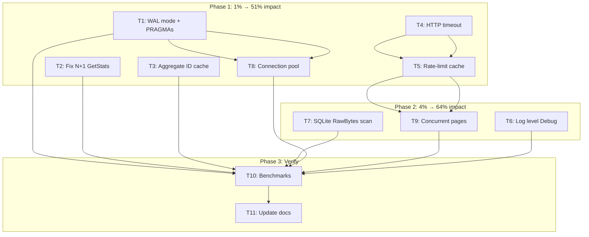

# Performance Optimization Sprint — 2026-06-14

> **Source:** `docs/research/performance-review.html` (13 findings, P0–P3)
> **Rule:** DO NOT VERSCHLIMMBESSER. Every change must be clearly beneficial, low-risk, and well-tested.
> **Verification gate:** `go build ./... && go test ./... -count=1 -race` after every task.

---

## Pareto Breakdown

### The 1% that delivers 51% of the result

| #   | Task                                          | Impact                | Effort | Risk |
| --- | --------------------------------------------- | --------------------- | ------ | ---- |
| 1   | Enable SQLite WAL mode (`SQLiteEnableWAL`)    | 3–10× SQLite writes   | 1 line | None |
| 2   | Fix N+1 in GetStats (single `GROUP BY` query) | N× fewer queries      | 30min  | None |
| 3   | Add aggregate ID cache (`sync.Map`)           | ~200µs/1k items saved | 15min  | None |
| 4   | Add HTTP client timeout (30s)                 | Hang resilience       | 5min   | None |

### The 4% that delivers 64% of the result

| #   | Task                                                      | Impact                | Effort | Risk |
| --- | --------------------------------------------------------- | --------------------- | ------ | ---- |
| 5   | Cache rate-limit from response headers                    | 50% fewer API calls   | 30min  | Low  |
| 6   | Default event/command log level to Debug                  | ~40% faster SyncItems | 15min  | Low  |
| 7   | SQLite scan: `sql.RawBytes` + result pre-allocation       | ~70% fewer allocs     | 30min  | Low  |
| 8   | Increase SQLite connection pool (WAL-safe) + busy_timeout | Concurrent reads      | 15min  | Low  |

### The 20% that delivers 80% of the result

| #   | Task                                                      | Impact              | Effort | Risk   |
| --- | --------------------------------------------------------- | ------------------- | ------ | ------ |
| 9   | Concurrent page fetching (bounded errgroup, max 3)        | ~3× faster network  | 45min  | Medium |
| 10  | SQLite PRAGMA tuning (cache_size, mmap_size, synchronous) | 2–3× SQLite overall | 15min  | None   |
| 11  | Benchmarks for all changes (before/after comparison)      | Measurable proof    | 30min  | None   |

### Remaining (not in this sprint)

| #   | Task                                     | Why deferred                                                  |
| --- | ---------------------------------------- | ------------------------------------------------------------- |
| 12  | Batch event writes in single transaction | Needs upstream go-cqrs-lite support; WAL + pool already helps |
| 13  | ETag / conditional requests              | Complex; go-github doesn't expose ETag; marginal gain         |
| 14  | Event store compaction                   | Future concern; not urgent for local-first tool               |
| 15  | Memory ReadModel secondary indexes       | Acceptable for dev/testing backend                            |

---

## Medium-Granularity Plan (30–100min tasks)

| ID  | Task                                                    | Impact   | Effort | Deps  |
| --- | ------------------------------------------------------- | -------- | ------ | ----- |
| T1  | Enable SQLite WAL mode + PRAGMA tuning                  | Critical | 30min  | —     |
| T2  | Fix N+1 GetStats with `CountByType` GROUP BY            | Critical | 45min  | —     |
| T3  | Add aggregate ID `sync.Map` cache                       | High     | 30min  | —     |
| T4  | Add HTTP client timeout + transport tuning              | High     | 30min  | —     |
| T5  | Cache rate-limit from GitHub response headers           | High     | 45min  | T4    |
| T6  | Default log level to Debug for event/command middleware | High     | 30min  | —     |
| T7  | Optimize SQLite row scanning (RawBytes + pre-alloc)     | Medium   | 45min  | —     |
| T8  | Increase SQLite connection pool (WAL-safe)              | Medium   | 30min  | T1    |
| T9  | Concurrent page fetching with bounded errgroup          | Medium   | 60min  | T5    |
| T10 | Add before/after benchmarks for all changes             | Critical | 45min  | T1–T9 |
| T11 | Update AGENTS.md + performance review with results      | Low      | 30min  | T10   |

**Total: 11 tasks, ~7h estimated**

---

## Fine-Granularity Breakdown (max 15min tasks)

| ID  | Sub-task                                                 | Parent | Est   |
| --- | -------------------------------------------------------- | ------ | ----- |
| S1  | Add `SQLiteEnableWAL` call in `store_factory.go`         | T1     | 5min  |
| S2  | Add `PRAGMA busy_timeout=5000` after WAL                 | T1     | 5min  |
| S3  | Add `PRAGMA synchronous=NORMAL` (WAL-safe)               | T1     | 5min  |
| S4  | Add `PRAGMA cache_size=-64000` (64MB cache)              | T1     | 5min  |
| S5  | Add `CountByType` to ReadModel interface                 | T2     | 10min |
| S6  | Implement `CountByType` in SQLiteReadModel (`GROUP BY`)  | T2     | 10min |
| S7  | Implement `CountByType` in MemoryReadModel               | T2     | 10min |
| S8  | Add `CountByType` to `SyncStore` interface               | T2     | 5min  |
| S9  | Wire `CountByType` in `CQRSStack` adapter                | T2     | 5min  |
| S10 | Rewrite `GetStats` to use single `CountByType` call      | T2     | 10min |
| S11 | Test: `TestGetStats_CountByType`                         | T2     | 10min |
| S12 | Add `aggIDCache sync.Map` to `aggregate_id.go`           | T3     | 10min |
| S13 | Update `AggregateID` to check cache before SHA256        | T3     | 10min |
| S14 | Test: `TestAggregateID_CacheHit`                         | T3     | 10min |
| S15 | Create custom `*http.Client` with 30s timeout            | T4     | 10min |
| S16 | Wire custom client into `NewClient`                      | T4     | 5min  |
| S17 | Add `MaxIdleConnsPerHost: 10` to transport               | T4     | 5min  |
| S18 | Test: `TestNewClient_HasTimeout`                         | T4     | 10min |
| S19 | Add `cachedRateLimit` field to `Client` struct           | T5     | 5min  |
| S20 | Add `mu sync.Mutex` for rate-limit cache                 | T5     | 5min  |
| S21 | Update `Fetch` to capture `*Response` rate headers       | T5     | 10min |
| S22 | Rewrite `waitForRateLimit` to use cache first            | T5     | 10min |
| S23 | Test: `TestRateLimitCache_Hit`                           | T5     | 10min |
| S24 | Change `commandLoggingMiddleware` to Debug level         | T6     | 5min  |
| S25 | Change `EventLogging` slog to Debug level                | T6     | 10min |
| S26 | Add `WithLogLevel` option to `CQRSConfig`                | T6     | 10min |
| S27 | Wire log level through `NewCQRSStack`                    | T6     | 5min  |
| S28 | Test: verify Debug-level logs in benchmark               | T6     | 10min |
| S29 | Change `scanItem` to use `sql.RawBytes` for strings      | T7     | 10min |
| S30 | Change `scanItems` to pre-allocate result slice          | T7     | 5min  |
| S31 | Update `scannedItem.toItem` for RawBytes                 | T7     | 10min |
| S32 | Test: `TestScanItems_RawBytes`                           | T7     | 10min |
| S33 | Change `ConfigureTursoPool` → custom pool config         | T8     | 10min |
| S34 | Set `SetMaxOpenConns(runtime.NumCPU())`                  | T8     | 5min  |
| S35 | Set `SetMaxIdleConns(4)`                                 | T8     | 5min  |
| S36 | Set `SetConnMaxIdleTime(5*time.Minute)`                  | T8     | 5min  |
| S37 | Add `FetchAllConcurrent` method with errgroup            | T9     | 15min |
| S38 | Add semaphore channel (cap=3) for concurrency limit      | T9     | 10min |
| S39 | Handle partial results + error aggregation               | T9     | 15min |
| S40 | Test: `TestFetchAllConcurrent`                           | T9     | 15min |
| S41 | Benchmark: `BenchmarkSyncItems_AfterWAL`                 | T10    | 10min |
| S42 | Benchmark: `BenchmarkGetStats_AfterFix`                  | T10    | 10min |
| S43 | Benchmark: `BenchmarkSQLiteReadModel_List_AfterRawBytes` | T10    | 10min |
| S44 | Run full benchmark suite + capture results               | T10    | 15min |
| S45 | Update AGENTS.md with session notes                      | T11    | 15min |
| S46 | Update performance-review.html with after-numbers        | T11    | 15min |

**Total: 46 sub-tasks**

---

## Execution Graph (Mermaid)

---

## Safety Principles

1. **Never change the public API contract** — all optimizations are internal
2. **Every change tested with `-race`** — no data races introduced
3. **Fallback behavior preserved** — if WAL fails, system still works (just slower)
4. **No new dependencies** — only use stdlib + existing libs
5. **Incremental commits** — each task is independently committable and revertable
