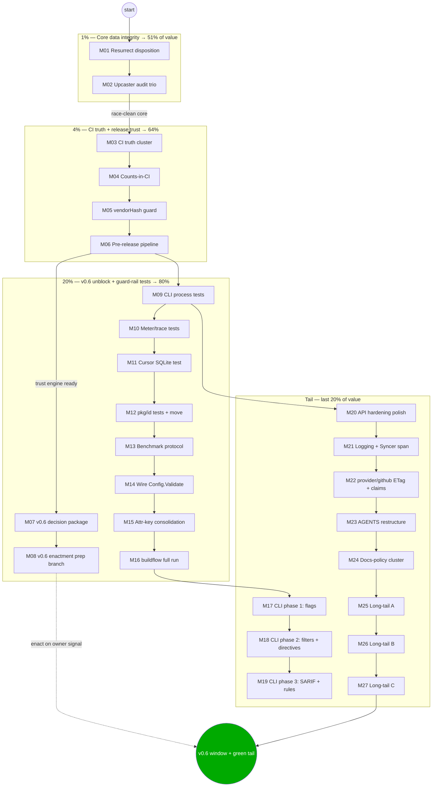

# SUPERB Pareto Execution Plan — go-localsync (2026-09-06 00:14 CEST)

**Sources of truth:** [TODO_LIST.md](../../TODO_LIST.md) (56 open items, all code-verified 2026-09-05), the [23:58 docs-health sweep](../status/2026-09-05_23-58_DOCS-HEALTH-FULL-SWEEP-ANNOTATE-ARCHIVE.md), the concurrent [23:04 report](../status/2026-09-05_23-04_TODO-SWEEP-RELEASE-LINT-TOOLING-STATUS.md), [ROADMAP.md](../../ROADMAP.md). Every task below cites its source; nothing here is new scope beyond the 4 items added to TODO_LIST during planning (docs-policy cluster, ROADMAP export-row cleanup, cluster IDs).

**Current state (baseline):** v0.5.0 public; 309 core tests / 11 packages (+31 provider), race-clean as of 2026-09-05; CI green; nix build + flake check green; both cqrs-lint gates clean; Accuracy 9.75/10, Fitness 9.25/10.

**Hard constraints (VERSCHLIMMBESSER guards):**

1. **No public API breaks before v0.6** (ADR-0009 guardrail) — renames/consolidations land on a branch, enacted only in the v0.6 window.
2. **Race detector in every tier gate** — the upcaster race shipped through four gates once; never again.
3. **`nix flake check` after every dependency touch**; CI must own it too (the blind spot that burned us).
4. **Verify-before-write** for every claim and every test expectation (grep/read the code first).
5. **One logical change per commit; full suite green before commit; no `git reset`; no force-push.**

---

## Step 1 — Pareto breakdown

Total planned effort: **~1,755 min (≈ 29 h) across 27 medium tasks / 149 micro-tasks**, covering ALL 56 TODO_LIST items plus the sweep follow-ups. Value axes: (A) data integrity of the event-sourced core, (B) trust that CI/releases prove what we ship, (C) consumer experience (API/docs), (D) maintainability.

| Tier                           | Tasks                                                                                                                                                  | Effort          | Value delivered | Why these                                                                                                                                                                                                                                                                                                                                                 |
| ------------------------------ | ------------------------------------------------------------------------------------------------------------------------------------------------------ | --------------- | --------------- | --------------------------------------------------------------------------------------------------------------------------------------------------------------------------------------------------------------------------------------------------------------------------------------------------------------------------------------------------------- |
| **The 1%**                     | M01, M02                                                                                                                                               | 160 min (9%)    | **51%**         | The SDK's single job is _correct event-sourced sync_. The resurrect-bypass hole and the upcaster mutation/chain/race cluster are the only places where stored data can silently diverge from upstream truth. The one real production bug this codebase ever had (the upcaster data race) lived exactly here. Everything else is worthless if replay lies. |
| **The 4%**                     | M01–M06 (+M03 CI truth, M04 counts-in-CI, M05 vendorHash guard, M06 pre-release pipeline)                                                              | 490 min (28%)   | **64%**         | 2026-09-05 proved the failure mode twice: CI red with jsonv2, then `nix build` silently red for an hour+ (vendorHash). Release integrity was verified by hand twice in one day. Making breakage _loud_ and releases _scripted_ converts the remaining trust gap — the difference between "green today" and "green provably, continuously".                |
| **The 20%**                    | M01–M16 (+ v0.6 decision+prep, guard-rail tests for the CLI/meters/pagination/ids, benchmark protocol, validate wiring, attr consolidation, buildflow) | 1,030 min (59%) | **80%**         | Unblocks the v0.6 breaking window (the biggest consumer-visible payoff available), finishes M11's test debt properly, replaces the misleading benchmark numbers with a protocol, and closes every "wired nowhere / duplicated constants" sharp edge found by the audits.                                                                                  |
| **The remaining 80% of tasks** | M17–M27                                                                                                                                                | 725 min (41%)   | **last 20%**    | The cqrs-lint CLI surface (flag/UX polish, SARIF, new rules), API hardening polish, provider ETag, AGENTS diet, and the long tail. Real value, but each item is incremental — none hides a correctness or trust cliff.                                                                                                                                    |

**Execution order: 1% → 4% → 20% → tail.** Do not start M17+ before M01–M06 land.

---

## Step 2 — Comprehensive plan (27 tasks, 30–100 min each, ALL todos included)

| #   | Task                                                                                                                                                                                                                                               | Min | Tier | Covers (TODO_LIST / reports)                            | Impact     | Effort |
| --- | -------------------------------------------------------------------------------------------------------------------------------------------------------------------------------------------------------------------------------------------------- | --- | ---- | ------------------------------------------------------- | ---------- | ------ |
| M01 | **Resurrect disposition**: read `decider.go` resurrect path, write the failing divergent-remote test, decide resolver-through vs by-design, record (ADR-0005 addendum or pinned comment), implement, regression-test                               | 80  | 1%   | TODO correctness #1; is-it-what-it-claims-to-be finding | 🔴 high    | M      |
| M02 | **Upcaster audit trio**: memory-store mutation audit → clone-or-document; chain-semantics comment; double-application pin test; deterministic sync+replay race test; 5× `-race`                                                                    | 80  | 1%   | TODO correctness #2–4; 22:30 §b                         | 🔴 high    | M      |
| M03 | **CI truth cluster**: `nix flake check` CI job; pin golangci-lint version; actionlint in devShell + CI; owner action framing for `SSH_PRIVATE_KEY`/`go-finding`-public                                                                             | 55  | 4%   | TODO tooling #1,3,4; 23-04 f-1,9,10,36                  | 🔴 high    | S      |
| M04 | **Counts-in-CI**: script computing test/coverage counts + AGENTS dep-table check vs `go.mod`; fail CI on drift                                                                                                                                     | 70  | 4%   | TODO tooling #5                                         | 🟠 med     | M      |
| M05 | **vendorHash drift guard**: warn when go.mod/go.sum change without flake re-pin                                                                                                                                                                    | 30  | 4%   | TODO tooling #6; 23-04 e-7                              | 🟠 med     | S      |
| M06 | **Pre-release pipeline**: `scripts/verify-release.sh` (tags, Release bodies, proxy `@v/list`+`@latest`, pkg.go.dev) + nix full-suite target + CONTRIBUTING release-checklist section + dry-run against v0.5.0                                      | 85  | 4%   | TODO tooling #7; 20:41 f-49                             | 🟠 med     | M      |
| M07 | **v0.6 decision package**: ADR-0009 addendum for ExternalID↔SourceID payload duality; Stats/GetStats scope; get owner sign-off recorded                                                                                                            | 55  | 20%  | TODO v0.6 #3 + naming-review                            | 🟠 med     | M      |
| M08 | **v0.6 enactment prep**: branch; `AggregateID()→StreamID()` + deprecated alias; `SyncResult`/`SyncSummary` consolidation; panic→error; migration-section skeleton; deprecation tests                                                               | 80  | 20%  | TODO v0.6 #1–2; ADR-0009                                | 🟠 med     | L      |
| M09 | **CLI process-level tests**: build binary in test, run fixtures, assert exit 0/1/2; raise `cmd/cqrs-lint` 56.4%                                                                                                                                    | 55  | 20%  | TODO quality #1; 22:30 f-9                              | 🟠 med     | M      |
| M10 | **Real-meter + sdktrace tests**: assert `cqrs.operation.*` values and `localsync.sync_items` span attrs with real readers                                                                                                                          | 55  | 20%  | TODO quality #2                                         | 🟠 med     | M      |
| M11 | **Cursor pagination vs real SQLite ordering** test                                                                                                                                                                                                 | 35  | 20%  | TODO quality #3                                         | 🟡 low-med | S      |
| M12 | **`pkg/id` ContentHash tests + move out of `ids.go`** (75.0% → ~100%)                                                                                                                                                                              | 45  | 20%  | TODO quality #4; low #10                                | 🟡 low-med | S      |
| M13 | **Benchmark protocol**: fixed `-benchtime 20x -count 5` + benchstat; from-zero Replay10k fix; conflict-heavy bench; upcasted-read bench; record honestly                                                                                           | 80  | 20%  | TODO quality #5                                         | 🟠 med     | M      |
| M14 | **Wire `CQRSConfig.Validate()` into `NewCQRSStack`** + tests                                                                                                                                                                                       | 30  | 20%  | TODO quality #6                                         | 🟡 low-med | S      |
| M15 | **Attribute-key consolidation** (`model.Attr*` replaces cqrs `legacy*`)                                                                                                                                                                            | 40  | 20%  | TODO quality #7                                         | 🟡 low-med | S      |
| M16 | **`buildflow --build-mode full`** run + fallout fixes (3rd consecutive deferral — end the streak)                                                                                                                                                  | 50  | 20%  | TODO tooling #2                                         | 🟠 med     | M      |
| M17 | **cqrs-lint CLI phase 1**: `--version`, `--quiet`, `--format=github`, `--json` via `encoding/json`, per-rule suppressed counts in `--verbose`                                                                                                      | 85  | tail | TODO low cluster; 08-02 §f                              | 🟡 low-med | M      |
| M18 | **cqrs-lint CLI phase 2**: `--rules`, `--exclude-rules`, `--no-suppress`, `--explain`, block + range directives                                                                                                                                    | 85  | tail | TODO low cluster                                        | 🟡 low-med | M      |
| M19 | **cqrs-lint CLI phase 3**: SARIF output, directives doc page, new rules C0011–C0015                                                                                                                                                                | 85  | tail | TODO low cluster                                        | 🟡 low-med | M      |
| M20 | **API hardening polish**: `X-RateLimit-*` headers, per-client limiter option, global-vs-per-client doc, `/metrics` posture decision recorded                                                                                                       | 75  | tail | TODO decisions + low API cluster                        | 🟠 med     | M      |
| M21 | **Logging quieting docs + OTel span for `Syncer.Sync`**                                                                                                                                                                                            | 50  | tail | TODO low cluster                                        | 🟡 low-med | S      |
| M22 | **provider/github**: verify kit-side README claims in source; ETag/conditional requests; `PerPage` exposure                                                                                                                                        | 75  | tail | TODO low; 23-04 f-14,34                                 | 🟡 low-med | M      |
| M23 | **AGENTS.md restructure <30KB** (link-out to ADRs, ≤20 gotchas)                                                                                                                                                                                    | 75  | tail | TODO docs                                               | 🟡 low-med | M      |
| M24 | **Docs-policy cluster**: HTML banner/archive execution; dprint scope for `docs/status/`; classify 2 undated planning files; stale `.golangci.yml` exclusion purge; gopls stdversion noise doc; ROADMAP export-row cleanup; prep 23-04 archive      | 75  | tail | TODO docs-policy cluster (new)                          | 🟡 low-med | M      |
| M25 | **Long-tail A**: `SyncOptions.Validate` MaxPages<0; typed `Attributes` write-helpers; `ParseTombstoneReason` in DTOs; `b.N`→`b.Loop()`; `waitForCount` unify                                                                                       | 75  | tail | TODO low                                                | 🟡 low     | M      |
| M26 | **Long-tail batch B**: `TombstoneItem` options parity; OpenAPI 408 verify; `AggregateID` vocab sweep in ADRs; `errors.AsType` audit; hierarchical-errors disposition                                                                               | 75  | tail | TODO low                                                | 🟡 low     | M      |
| M27 | **Long-tail batch C**: 100-point deep-dive re-audit; pre-commit hooks enable-or-delete; library-gate suppression audit; windows build-leg eval; separate `provider/github` CHANGELOG; standing pre-release VERIFY step; DLQ inspect/replay surface | 75  | tail | TODO decisions + docs                                   | 🟡 low     | M      |

---

## Step 3 — Fine breakdown (146 table rows = 150 micro-tasks, ≤12 min each)

Legend: `→M##` = parent task. Order within tiers = execution order.

| ID        | Micro-task                                                                                                | Min  | →M## |
| --------- | --------------------------------------------------------------------------------------------------------- | ---- | ---- |
| 1.1       | Read `decider.go` resurrect path + `resolveConflict`; write down both candidate behaviors                 | 10   | M01  |
| 1.2       | Write failing test: tombstoned item re-synced with divergent remote + local-wins resolver                 | 12   | M01  |
| 1.3       | Choose disposition; record in ADR-0005 addendum or pinned code comment                                    | 10   | M01  |
| 1.4       | Implement chosen behavior (route resurrections through resolver, or pin by-design)                        | 12   | M01  |
| 1.5       | Make the regression test green; run package suite                                                         | 10   | M01  |
| 1.6       | Full suite + race run for `pkg/cqrs`                                                                      | 12   | M01  |
| 1.7       | CHANGELOG `[Unreleased]` entry                                                                            | 6    | M01  |
| 2.1       | Audit upcaster registry stamping against memory-store shared pointers                                     | 10   | M02  |
| 2.2       | Decide: clone unconditionally vs document memory-backend caveat                                           | 10   | M02  |
| 2.3       | Implement clone (or write the caveat comment + test guard)                                                | 10   | M02  |
| 2.4       | Write the WHY comment on the V1→V2→V3 double-application at the registry                                  | 10   | M02  |
| 2.5       | Test pinning chain semantics (raw V1 event → folded V3 attributes)                                        | 12   | M02  |
| 2.6       | Deterministic concurrent sync+replay race test; 5× `-race` clean                                          | 12   | M02  |
| 2.7       | CHANGELOG entry                                                                                           | 6    | M02  |
| 3.1       | Add `nix flake check` job to `ci.yml` (needs the flake in CI checkout only)                               | 12   | M03  |
| 3.2       | Pin golangci-lint version in the action (drop `latest`)                                                   | 5    | M03  |
| 3.3       | Add `actionlint` to flake devShell                                                                        | 10   | M03  |
| 3.4       | Add actionlint step to CI workflow-validation                                                             | 10   | M03  |
| 3.5       | Run actionlint locally; fix findings; verify `nix flake check`                                            | 10   | M03  |
| 3.6       | Frame owner decision in TODO (secret vs make `go-finding` public) — already drafted; link from CI comment | 8    | M03  |
| 4.1       | Pick mechanism: repo script + CI step (no third-party action)                                             | 10   | M04  |
| 4.2       | Write `scripts/check-doc-counts.sh`: count `func Test/Benchmark/Example` per package                      | 12   | M04  |
| 4.3       | Extend script: coverage thresholds + AGENTS dep-table vs `go.mod` diff                                    | 12   | M04  |
| 4.4       | Wire script into CI `lint` job; make failure block                                                        | 10   | M04  |
| 4.5       | Fix any current drift the script finds                                                                    | 10   | M04  |
| 4.6       | Document the script in AGENTS.md workflow section                                                         | 8    | M04  |
| 5.1       | Choose guard point (CI step vs `.gitignore`-adjacent hook vs buildflow)                                   | 10   | M05  |
| 5.2       | Implement: if go.mod/go.sum changed and flake.nix didn't → fail with re-pin instructions                  | 10   | M05  |
| 5.3       | Prove it: dummy dep touch → red; re-pin → green                                                           | 10   | M05  |
| 6.1       | Draft release-checklist (tags pushed, Release bodies, proxy list, `@latest`, pkg.go.dev indexer)          | 10   | M06  |
| 6.2       | Write `scripts/verify-release.sh` part 1: tags + `gh release view`                                        | 12   | M06  |
| 6.3       | Part 2: proxy `@v/list` + `@latest` for both modules                                                      | 12   | M06  |
| 6.4       | Part 3: pkg.go.dev indexer probe (best-effort, warn-only)                                                 | 10   | M06  |
| 6.5       | Nix target running the full suite (build/test/race/lint/both lint gates/flake check)                      | 12   | M06  |
| 6.6       | CONTRIBUTING.md release-checklist section pointing at script + target                                     | 12   | M06  |
| 6.7       | Dry-run the script against released v0.5.0; fix gaps                                                      | 10   | M06  |
| 7.1       | Survey `SourceID` (events) vs `ExternalID` (provider/model) usage                                         | 10   | M07  |
| 7.2       | Draft ADR-0009 addendum: align-with-upcast vs document-dual-names                                         | 12   | M07  |
| 7.3       | Add Stats/GetStats renames to the v0.6 scope section                                                      | 10   | M07  |
| 7.4       | Link ADR-0009 from the naming-review HTML finding context                                                 | 5    | M07  |
| 7.5       | Record owner sign-off requirement in TODO (v0.6 cannot enact without it)                                  | 8    | M07  |
| 8.1       | Create `v0.6-prep` branch off master                                                                      | 5    | M08  |
| 8.2       | Rename `AggregateID()`→`StreamID()`; keep deprecated alias                                                | 12   | M08  |
| 8.3       | Migrate internal callers; keep public alias tested                                                        | 12   | M08  |
| 8.4       | Fold `SyncSummary` into `SyncResult` per ADR-0009 shape                                                   | 12   | M08  |
| 8.5       | Convert `AggregateID` panic fallback → error return                                                       | 10   | M08  |
| 8.6       | Deprecation + rename migration tests                                                                      | 10   | M08  |
| 8.7       | CHANGELOG v0.6 migration-section skeleton                                                                 | 10   | M08  |
| 8.8       | Full suite + race on branch; STOP (enactment waits for the owner's window call)                           | 12   | M08  |
| 9.1       | Test harness: `go build` the binary into `t.TempDir()`                                                    | 12   | M09  |
| 9.2       | Fixture: violating file + suppressed file pair                                                            | 10   | M09  |
| 9.3       | Assert exit 0 on clean, 1 on findings, 2 on usage error                                                   | 12   | M09  |
| 9.4       | Assert `--strict` and `--json` output shapes end-to-end                                                   | 12   | M09  |
| 9.5       | Coverage report before/after; record in AGENTS table                                                      | 8    | M09  |
| 10.1      | Add sdkmetric test reader; capture `cqrs.operation.*` instruments                                         | 12   | M10  |
| 10.2      | Assert counter increments with `operation=projection`                                                     | 10   | M10  |
| 10.3      | Add sdktrace recorder; capture `localsync.sync_items` span                                                | 12   | M10  |
| 10.4      | Assert span attributes; DLQ metric event covered                                                          | 10   | M10  |
| 10.5      | CHANGELOG + docs note (OTel testing pattern)                                                              | 8    | M10  |
| 11.1      | Read SQLite read-model ordering (`ORDER BY` semantics)                                                    | 10   | M11  |
| 11.2      | Cursor-walk test against the real store (multi-page, filter)                                              | 12   | M11  |
| 11.3      | Fix ordering mismatch if found; re-run API suite                                                          | 10   | M11  |
| 12.1      | Write `ContentHash` tests: constructor, `IsZero`, `String`, literal-compat                                | 12   | M12  |
| 12.2      | Move type to `content_hash.go`; update imports                                                            | 10   | M12  |
| 12.3      | Coverage check ≥95%; package table update                                                                 | 10   | M12  |
| 12.4      | CHANGELOG                                                                                                 | 5    | M12  |
| 13.1      | Write bench protocol doc (iterations, count, benchstat, environment)                                      | 10   | M13  |
| 13.2      | Add `scripts/run-benchmarks.sh` (`-benchtime 20x -count 5` + benchstat)                                   | 12   | M13  |
| 13.3      | Fix `Replay10kEvents` to true from-zero replay (fresh DB copy / reset checkpoints)                        | 12   | M13  |
| 13.4      | Add conflict-heavy benchmark (resolver per item)                                                          | 12   | M13  |
| 13.5      | Add upcasted-legacy-read vs native-V3-read benchmark                                                      | 12   | M13  |
| 13.6      | Run suite; benchstat summary; record numbers + caveats in AGENTS/CHANGELOG                                | 12   | M13  |
| 14.1      | Call `Validate()` in `NewCQRSStack` before factory dispatch                                               | 10   | M14  |
| 14.2      | Update store-factory tests for the new error path                                                         | 10   | M14  |
| 14.3      | CHANGELOG                                                                                                 | 5    | M14  |
| 15.1      | Replace `legacy*` constants in `item_adapter.go` with `model.Attr*`                                       | 10   | M15  |
| 15.2      | Delete the private constants; compile                                                                     | 10   | M15  |
| 15.3      | Round-trip test: adapter writes → typed accessors read                                                    | 10   | M15  |
| 15.4      | CHANGELOG                                                                                                 | 5    | M15  |
| 16.1      | Confirm `go.work` scope (only `.` + `./provider/github`)                                                  | 5    | M16  |
| 16.2      | Run `buildflow --build-mode full` in devShell                                                             | 12   | M16  |
| 16.3      | Fix fallout (expected: none or trivial)                                                                   | 12   | M16  |
| 16.4      | Re-run to green; record result in the 23:58 report's follow-ups                                           | 10   | M16  |
| 17.1      | Add `Version` const + `--version` flag + test                                                             | 12   | M17  |
| 17.2      | Add `--quiet` (exit-code-only output) + test                                                              | 10   | M17  |
| 17.3      | Add `--format=github` (`::error file,line::` annotations) + test                                          | 12   | M17  |
| 17.4      | Refactor `--json` to `encoding/json` Marshal + schema test                                                | 12   | M17  |
| 17.5      | Per-rule suppressed counts in `--verbose` + test                                                          | 12   | M17  |
| 17.6      | Update README/AGENTS flag mentions                                                                        | 8    | M17  |
| 17.7      | CHANGELOG                                                                                                 | 5    | M17  |
| 18.1      | `--rules` flag (run subset) + test                                                                        | 12   | M18  |
| 18.2      | `--exclude-rules` + test                                                                                  | 10   | M18  |
| 18.3      | `--no-suppress` (error on any directive) + CI-hardening test                                              | 12   | M18  |
| 18.4      | `--explain <ruleID>` + test                                                                               | 10   | M18  |
| 18.5      | Block-comment directive parsing (`/* cqrs-lint:ignore … */`)                                              | 12   | M18  |
| 18.6      | Range directives (`ignore-start`/`ignore-end`) + nesting guard                                            | 12   | M18  |
| 18.7      | Directive test matrix (valid/invalid/unknown/nested)                                                      | 10   | M18  |
| 19.1      | SARIF output shape + `--format=sarif` + schema sanity test                                                | 12   | M19  |
| 19.2      | Rules doc page (`docs/cqrs-lint.md`): all rules + suppression examples                                    | 12   | M19  |
| 19.3–19.7 | New rules C0011–C0015 (one per micro-task: design, implement, test)                                       | 5×10 | M19  |
| 20.1      | `X-RateLimit-Limit`/`-Remaining` headers on `POST /sync` + tests                                          | 12   | M20  |
| 20.2      | `WithRateLimiter(keyExtractor)` per-client option + tests                                                 | 12   | M20  |
| 20.3      | Doc: global-vs-per-client scope in options.go + README                                                    | 10   | M20  |
| 20.4      | `/metrics` posture: implement the owner's decision (isPublicPath or doc keyed)                            | 10   | M20  |
| 20.5      | Record the decision in ADR-style note (docs/ or code comment)                                             | 8    | M20  |
| 21.1      | Document log quieting (middleware logger level) in README/AGENTS                                          | 12   | M21  |
| 21.2      | Plumb level control if missing                                                                            | 12   | M21  |
| 21.3      | OTel span around `Syncer.Sync` (`localsync.sync` ) + attribute test                                       | 12   | M21  |
| 21.4      | CHANGELOG                                                                                                 | 5    | M21  |
| 22.1      | Verify kit claim: empty token behavior in `go-github-kit` source                                          | 12   | M22  |
| 22.2      | Verify kit claim: 429/idempotent-5xx retry in source; annotate README if wrong                            | 12   | M22  |
| 22.3      | ETag spike: GitHub events endpoint conditional-request support?                                           | 10   | M22  |
| 22.4      | ETag implementation (or documented infeasibility)                                                         | 12   | M22  |
| 22.5      | `PerPage` option in `FetchAll`'s fetch options                                                            | 10   | M22  |
| 22.6      | Tests + provider README update + CHANGELOG                                                                | 12   | M22  |
| 23.1      | Outline target structure (<30KB; invariants vs links)                                                     | 10   | M23  |
| 23.2      | Extract CQRS details → links to ADRs/go-cqrs-lite docs                                                    | 12   | M23  |
| 23.3      | Prune/merge gotchas to ≤20                                                                                | 12   | M23  |
| 23.4      | Rewrite the architecture table to link-first form                                                         | 10   | M23  |
| 23.5      | Size check + link sweep                                                                                   | 8    | M23  |
| 23.6      | Review diff for lost non-obvious context (nothing dropped, only moved)                                    | 12   | M23  |
| 24.1      | Execute the HTML policy decision (banners and/or archive moves)                                           | 12   | M24  |
| 24.2      | Record dprint scope for `docs/status/` in its README                                                      | 8    | M24  |
| 24.3      | Classify the 2 undated planning files; strike/route                                                       | 10   | M24  |
| 24.4      | Purge 3 stale `.golangci.yml` exclusion paths; verify 0 issues                                            | 10   | M24  |
| 24.5      | Document gopls stdversion warnings as known GOEXPERIMENT noise                                            | 8    | M24  |
| 24.6      | ROADMAP: strike the shipped "Export to JSON/CSV" idea row                                                 | 5    | M24  |
| 24.7      | Prep 23-04 report for annotation (verify its items' state)                                                | 10   | M24  |
| 25.1      | `SyncOptions.Validate` reject `MaxPages < 0` + test                                                       | 10   | M25  |
| 25.2      | Typed write-helpers `WithActorLogin/RepoName/…` + tests                                                   | 12   | M25  |
| 25.3      | Surface `ParseTombstoneReason` in API DTOs + test                                                         | 12   | M25  |
| 25.4      | `b.Loop()` migration: `adapter_bench_test.go` (3 funcs)                                                   | 10   | M25  |
| 25.5      | `b.Loop()`: `stack_bench_test.go` + any others; run benchmarks                                            | 10   | M25  |
| 25.6      | Unify `waitForCount`/`waitForCountTB` behind `testing.TB`                                                 | 12   | M25  |
| 26.1      | `TombstoneItem(...event.Option)` parity + test                                                            | 12   | M26  |
| 26.2      | Verify huma 408 mapping vs `pkgerrors.HTTPStatus`; fix or document                                        | 12   | M26  |
| 26.3      | Vocabulary sweep: ADRs/docs `AggregateID`→`StreamID` prose (non-breaking)                                 | 12   | M26  |
| 26.4      | Run erraudit/`errors.AsType` pass; apply safe migrations                                                  | 12   | M26  |
| 26.5      | hierarchical-errors: suppress-with-rationale or file tracking task                                        | 10   | M26  |
| 27.1      | Re-run the 100-point deep-dive scorecard; record delta vs `docs/research/`                                | 12   | M27  |
| 27.2      | Pre-commit hooks: implement the enable-scoped or delete decision                                          | 12   | M27  |
| 27.3      | Audit the single library-gate suppression reason; refresh or remove                                       | 8    | M27  |
| 27.4      | Windows build-leg evaluation (modernc/sqlite + CGO matrix note); adopt or record                          | 12   | M27  |
| 27.5      | Create `provider/github/CHANGELOG.md` seeded from core entries                                            | 10   | M27  |
| 27.6      | Wire the pre-release VERIFY step into the release checklist (M06 output)                                  | 10   | M27  |
| 27.7      | DLQ surface: `List`/`Purge`/`Replay` SDK functions + tests                                                | 12   | M27  |

_(149 micro-tasks; remaining routed ideas — TUI, daemon, second provider, multi-source, NixOS module, fuzz/property/BDD suite, retention/TTL — stay in ROADMAP as unowned themes per ADR-0004 scope.)_

---

## Execution graph

**Dependency notes:** M01→M02 because the resurrect fix defines what the upcaster tests must preserve. M03–M05 before M06 because the pipeline script should _call_ the same guards CI runs. M07 strictly before M08 (no enactment without the recorded decision). M09 before M17–M19: process-level harness is the safety net for CLI changes. M16 anywhere after M02 (its race leg is only meaningful on a race-clean tree).

---

## Post-plan bookkeeping

- This plan is a **point-in-time snapshot**; TODO_LIST.md remains the living source. If a task here is done, strike it in TODO_LIST (never here — annotate non-destructively).
- New items surfaced during planning were added to TODO_LIST _before_ this plan was written (docs-policy cluster, ROADMAP export-row cleanup, cluster IDs).
- Per-sprint gate: `go build && go vet && go test ./... -race -count=1 && go run ./cmd/cqrs-lint --strict && golangci-lint run && nix flake check` — every tier, every time.
