# Comprehensive Execution Plan — go-localsync

**Date:** 2026-05-28 06:25\
**Status:** ~~Planning Phase~~ Executed — see Resolution below.\
**Goal:** Systematic improvement of go-localsync, one small task at a time

---

## Decision: Fate of `pkg/localsync`

**Verdict: DELETE**

Reasoning:

- `pkg/localsync` is NOT imported by any production code in the project
- `pkg/sync` already has working conflict detection with simple timestamps
- Adding VectorClocks + LWWResolver would add complexity without user demand
- The sync primitives are better kept in `go-cqrs-lite/sync` (the upstream module)
- Deleting dead code is always better than maintaining it "just in case"

**Action:** Delete `pkg/localsync/` entirely. If needed later, use `go-cqrs-lite/sync`.

---

## Scoring System

Each task scored on:

- **Impact** (1-10): How much it improves the project
- **Effort** (1-10): Estimated minutes / 10
- **Customer Value** (1-10): Direct user benefit
- **Score** = (Impact × Customer Value) / Effort

---

## The Plan — 47 Tasks, Max 12 Minutes Each

### Phase 1: Cleanup (Delete Dead Code)

| # | Task                         | File(s)           | Impact | Effort | Customer Value | Score | Est. Time |
| - | ---------------------------- | ----------------- | ------ | ------ | -------------- | ----- | --------- |
| 1 | **Delete `pkg/localsync/`**  | `pkg/localsync/*` | 8      | 2      | 3              | 12.0  | 8 min     |
| 2 | Remove localsync from go.mod | `go.mod`          | 5      | 1      | 1              | 5.0   | 2 min     |
| 3 | Verify build after deletion  | All               | 10     | 1      | 10             | 100.0 | 2 min     |
| 4 | Run tests after deletion     | All               | 10     | 2      | 10             | 50.0  | 4 min     |
| 5 | Run lint after deletion      | All               | 10     | 2      | 10             | 50.0  | 4 min     |
| 6 | Document deletion in ROADMAP | `ROADMAP.md`      | 3      | 1      | 2              | 6.0   | 3 min     |

**Phase 1 Total: 6 tasks, ~23 minutes**

---

### Phase 2: Testing — CLI Coverage

| #  | Task                                | File(s)        | Impact | Effort | Customer Value | Score | Est. Time |
| -- | ----------------------------------- | -------------- | ------ | ------ | -------------- | ----- | --------- |
| 7  | Add `TestExitCodeForError`          | `main_test.go` | 8      | 2      | 7              | 28.0  | 8 min     |
| 8  | Add `TestLoadConfig_Defaults`       | `main_test.go` | 8      | 2      | 7              | 28.0  | 8 min     |
| 9  | Add `TestLoadConfig_EnvOverride`    | `main_test.go` | 8      | 2      | 7              | 28.0  | 8 min     |
| 10 | Add `TestLoadConfig_InvalidBackend` | `main_test.go` | 7      | 2      | 6              | 21.0  | 8 min     |
| 11 | Add `TestFlagParsing`               | `main_test.go` | 7      | 2      | 6              | 21.0  | 8 min     |
| 12 | Add `TestNewSyncer_Validation`      | `main_test.go` | 6      | 2      | 5              | 15.0  | 8 min     |
| 13 | Run CLI tests, verify coverage      | All            | 10     | 1      | 10             | 100.0 | 3 min     |

**Phase 2 Total: 7 tasks, ~51 minutes**

---

### Phase 3: Testing — pkg/sync Coverage

| #  | Task                                          | File(s)        | Impact | Effort | Customer Value | Score | Est. Time |
| -- | --------------------------------------------- | -------------- | ------ | ------ | -------------- | ----- | --------- |
| 14 | Add `TestSyncIncremental_FallbackToFull`      | `sync_test.go` | 8      | 2      | 7              | 28.0  | 8 min     |
| 15 | Add `TestSyncIncremental_WithExistingItems`   | `sync_test.go` | 8      | 2      | 7              | 28.0  | 8 min     |
| 16 | Add `TestSyncIncremental_CutoffFiltering`     | `sync_test.go` | 7      | 2      | 6              | 21.0  | 8 min     |
| 17 | Add `TestSyncIncremental_EmptyAfterFilter`    | `sync_test.go` | 6      | 2      | 5              | 15.0  | 8 min     |
| 18 | Add `TestGetStats_Success`                    | `sync_test.go` | 7      | 2      | 6              | 21.0  | 8 min     |
| 19 | Add `TestGetStats_TypeCountError`             | `sync_test.go` | 6      | 2      | 5              | 15.0  | 8 min     |
| 20 | Add `TestSyncer_Close`                        | `sync_test.go` | 5      | 1      | 4              | 20.0  | 5 min     |
| 21 | Add `TestSyncWithConflictDetection_NoItems`   | `sync_test.go` | 7      | 2      | 6              | 21.0  | 8 min     |
| 22 | Add `TestSyncWithConflictDetection_AllErrors` | `sync_test.go` | 6      | 2      | 5              | 15.0  | 8 min     |
| 23 | Run sync tests, verify coverage               | All            | 10     | 1      | 10             | 100.0 | 3 min     |

**Phase 3 Total: 10 tasks, ~77 minutes**

---

### Phase 4: Code Quality

| #  | Task                                       | File(s)                | Impact | Effort | Customer Value | Score | Est. Time |
| -- | ------------------------------------------ | ---------------------- | ------ | ------ | -------------- | ----- | --------- |
| 24 | Document `newSlogLogger()` purpose         | `stack.go`             | 5      | 1      | 2              | 10.0  | 5 min     |
| 25 | Add `ItemFilter` builder pattern           | `item_filter.go` + new | 7      | 3      | 6              | 14.0  | 10 min    |
| 26 | Add `WithType()`, `WithLimit()` options    | `item_filter.go`       | 6      | 2      | 5              | 15.0  | 8 min     |
| 27 | Migrate one `ItemFilter{}` to builder      | `sync.go:144`          | 5      | 1      | 4              | 20.0  | 5 min     |
| 28 | Migrate remaining `ItemFilter{}` calls     | `sync.go`, `stack.go`  | 5      | 2      | 4              | 10.0  | 8 min     |
| 29 | Add error wrapping helper in `pkg/errors`  | `errors.go`            | 6      | 2      | 4              | 12.0  | 8 min     |
| 30 | Replace 10 `fmt.Errorf` with helper        | Various                | 5      | 2      | 3              | 7.5   | 8 min     |
| 31 | Replace 10 more `fmt.Errorf` with helper   | Various                | 5      | 2      | 3              | 7.5   | 8 min     |
| 32 | Replace remaining `fmt.Errorf` with helper | Various                | 5      | 2      | 3              | 7.5   | 8 min     |
| 33 | Run lint after quality changes             | All                    | 10     | 2      | 10             | 50.0  | 4 min     |

**Phase 4 Total: 10 tasks, ~82 minutes**

---

### Phase 5: Features

| #  | Task                                 | File(s)        | Impact | Effort | Customer Value | Score | Est. Time |
| -- | ------------------------------------ | -------------- | ------ | ------ | -------------- | ----- | --------- |
| 34 | Add `-json` flag to CLI              | `main.go`      | 7      | 2      | 8              | 28.0  | 8 min     |
| 35 | Add `printJSONStats()` function      | `main.go`      | 6      | 2      | 7              | 21.0  | 8 min     |
| 36 | Add `printJSONSyncResult()` function | `main.go`      | 6      | 2      | 7              | 21.0  | 8 min     |
| 37 | Wire JSON output in main loop        | `main.go`      | 5      | 1      | 6              | 30.0  | 5 min     |
| 38 | Add JSON output tests                | `main_test.go` | 6      | 2      | 6              | 18.0  | 8 min     |
| 39 | Add `-daemon` flag stub              | `main.go`      | 4      | 1      | 5              | 20.0  | 5 min     |
| 40 | Add daemon interval config           | `config.go`    | 4      | 1      | 4              | 16.0  | 5 min     |

**Phase 5 Total: 7 tasks, ~47 minutes**

---

### Phase 6: Documentation & Polish

| #  | Task                                 | File(s)          | Impact | Effort | Customer Value | Score | Est. Time |
| -- | ------------------------------------ | ---------------- | ------ | ------ | -------------- | ----- | --------- |
| 41 | Update FEATURES.md coverage numbers  | `FEATURES.md`    | 4      | 1      | 3              | 12.0  | 5 min     |
| 42 | Update AGENTS.md with recent changes | `AGENTS.md`      | 5      | 1      | 3              | 15.0  | 5 min     |
| 43 | Update TODO_LIST.md — mark completed | `TODO_LIST.md`   | 4      | 1      | 2              | 8.0   | 3 min     |
| 44 | Add mermaid diagram to planning doc  | `docs/planning/` | 3      | 1      | 2              | 6.0   | 5 min     |
| 45 | Final test run                       | All              | 10     | 2      | 10             | 50.0  | 4 min     |
| 46 | Final lint run                       | All              | 10     | 2      | 10             | 50.0  | 4 min     |
| 47 | Final build verification             | All              | 10     | 1      | 10             | 100.0 | 2 min     |

**Phase 6 Total: 7 tasks, ~28 minutes**

---

## Summary

| Phase         | Tasks  | Est. Time            | Focus                     |
| ------------- | ------ | -------------------- | ------------------------- |
| 1: Cleanup    | 6      | 23 min               | Delete dead code          |
| 2: CLI Tests  | 7      | 51 min               | Boost coverage from 10.5% |
| 3: Sync Tests | 10     | 77 min               | Boost coverage from 77.8% |
| 4: Quality    | 10     | 82 min               | Error handling, builders  |
| 5: Features   | 7      | 47 min               | JSON output, daemon stub  |
| 6: Polish     | 7      | 28 min               | Docs, final verification  |
| **Total**     | **47** | **~308 min (~5.1h)** | —                         |

---

## Execution Graph (Mermaid)

```mermaid
flowchart TD
    subgraph P1["Phase 1: Cleanup"]
        T1["1. Delete pkg/localsync"]
        T2["2. Fix go.mod"]
        T3["3-5. Verify build/tests/lint"]
        T6["6. Update ROADMAP"]
    end

    subgraph P2["Phase 2: CLI Tests"]
        T7["7. TestExitCodeForError"]
        T8["8. TestLoadConfig_Defaults"]
        T9["9. TestLoadConfig_EnvOverride"]
        T10["10. TestLoadConfig_InvalidBackend"]
        T11["11. TestFlagParsing"]
        T12["12. TestNewSyncer_Validation"]
        T13["13. Verify coverage"]
    end

    subgraph P3["Phase 3: Sync Tests"]
        T14["14-17. SyncIncremental tests"]
        T18["18-20. GetStats & Close tests"]
        T21["21-23. ConflictAware tests"]
    end

    subgraph P4["Phase 4: Quality"]
        T24["24. Document slog bridge"]
        T25["25-28. ItemFilter builder"]
        T29["29-32. Error helper + migrate"]
        T33["33. Verify lint"]
    end

    subgraph P5["Phase 5: Features"]
        T34["34. Add -json flag"]
        T35["35-37. JSON print functions"]
        T38["38. JSON output tests"]
        T39["39-40. Daemon stub"]
    end

    subgraph P6["Phase 6: Polish"]
        T41["41-44. Update docs"]
        T45["45-47. Final verification"]
    end

    P1 --> P2 --> P3 --> P4 --> P5 --> P6
```

---

## Commit Strategy

Each phase = one commit with detailed message.
If any task breaks build/tests, fix immediately before proceeding.

---

## Risk Assessment

| Risk                                                 | Mitigation                                  |
| ---------------------------------------------------- | ------------------------------------------- |
| Deleting `pkg/localsync` breaks something unexpected | Verify build + tests before committing      |
| ItemFilter builder conflicts with existing code      | Migrate one call at a time, test after each |
| CLI tests fail on CI                                 | Use only stdlib testing (no external deps)  |
| Error helper doesn't cover all cases                 | Keep `fmt.Errorf` fallback for edge cases   |

---

## Success Criteria

- [ ] `pkg/localsync` deleted, build still passes
- [ ] CLI coverage ≥ 50% (from 10.5%)
- [ ] `pkg/sync` coverage ≥ 85% (from 77.8%)
- [ ] Zero lint issues
- [ ] All tests pass
- [ ] `-json` flag works
- [ ] Documentation updated

---

## Resolution (2026-09-05)

Executed: `pkg/localsync` was deleted and CRDT wired as `pkg/crdt` on 2026-05-29 (`docs/status/2026-05-29_03-19_CRDT-INTEGRATION-COMPLETE.md`); the `-json` output flag and the `ItemFilter` builder shipped in the same sprint; the daemon/CLI items are moot — the example CLI was removed from the SDK in v0.2.0. No live items remain.
