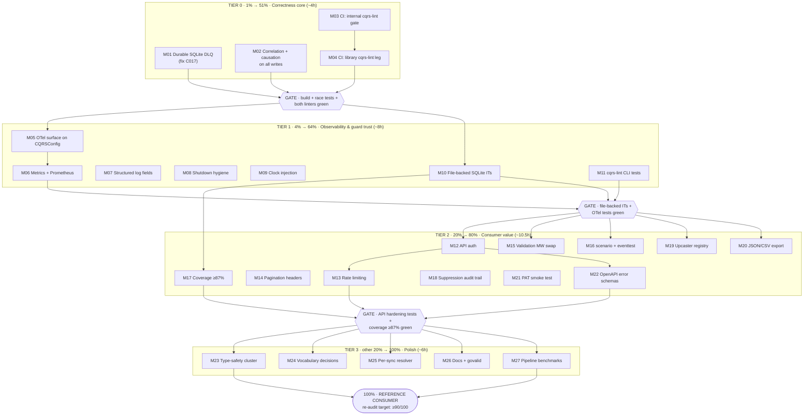

# OPERATION: SUPERB REFERENCE CONSUMER — Pareto Execution Plan

> **STATUS: FULLY EXECUTED + ARCHIVED (2026-09-06 docs-health sweep).** 27/27 medium tasks complete per the [Execution Record](#execution-record-2026-09-05-full-run) below; the session snapshot lives at [docs/status/archive/2026-09-05_22-30_SUPERB-REFERENCE-CONSUMER-EXECUTION.md](../../status/archive/2026-09-05_22-30_SUPERB-REFERENCE-CONSUMER-EXECUTION.md). Superseding work (v0.6 enactment, M-plan) is tracked in TODO_LIST/CHANGELOG. Preserved as written.

**Project:** go-localsync
**Created:** 2026-09-05 20:42
**Inputs:** [go-cqrs-lite deep-dive audit](../../research/2026-09-05_go-cqrs-lite-deep-dive.html) (adoption 78/100, 11 opportunities + 1 defect) · [TODO_LIST.md](../../../TODO_LIST.md) (23 open items) · [ROADMAP.md](../../../ROADMAP.md) (raw ideas + open questions) · [FEATURES.md](../../../FEATURES.md) (known-gaps table)
**Goal:** Close every actionable gap from the audit + the full TODO inventory — turning go-localsync from "very good consumer" (78/100) into go-cqrs-lite's **reference consumer** — without breaking the public API, the test suite, or the ADR-0004 scope boundary.

---

## Context (why this plan exists)

The 2026-09-05 library deep-dive found the event-sourced core **textbook-quality** but surfaced:

1. **One real defect (C017):** the projection dead-letter queue is in-memory while the SQLite backend persists everything else — captured poison events vanish on restart (`pkg/cqrs/runner.go:42`).
2. **Observability gaps:** correlation IDs only on the batch path (`stack.go:193` vs `:282`), no causation IDs ever, no OTel/metrics surface for SDK consumers.
3. **Unadopted tooling:** the library's own 203-rule `cqrs-lint`, its `scenario`/`eventtest` testing DSL, and `middleware.CommandValidation` are all unused.
4. **Hygiene:** 8 ignored `Close()` errors, `time.Now()` inside the decider, a `panic` fallback, and a hand-rolled validation middleware the library now ships.

These merge with the pre-existing TODO inventory (cqrs-lint CLI tests, API auth/rate-limit/pagination, coverage, upcasters, type-safety polish, docs, benchmarks) into one prioritized, fully-decomposed plan below.

**Guardrails (anti-verschlimmbesserung):**

- `go build ./... && go test ./... -count=1` green after **every** task; `golangci-lint run ./...` + `go run ./cmd/cqrs-lint --strict` green before every commit.
- No public API breaks inside this plan (the `AggregateID`→`StreamID` rename is a **decision note** for v0.6, not a change now).
- No ADR-0004 scope widening: no multi-aggregate, no push ingestion, no second read-model tier. Parked ideas stay parked.
- Deprecation discipline from the audit is preserved: no `stack/*` presets, no `transport/*`, no query dispatcher.

---

## Pareto Breakdown

### The 1% that delivers 51% — Correctness core (4 tasks, ~4h)

The only known **defect** in the system plus the gates that make regressions impossible. After this tier, the engine is provably correct and guarded: durable DLQ, fully traceable writes, and two linter gates running on every push.

| # | Task                                                | Why it is 1%                                                                         |
| - | --------------------------------------------------- | ------------------------------------------------------------------------------------ |
| 1 | SQLite DLQ for the SQLite backend (C017 fix)        | The audit's only ERROR; durability hole in the core resilience story (ADR-0006)      |
| 2 | Correlation + causation metadata on ALL write paths | Every event becomes attributable to a run and a command — debugging transforms       |
| 3 | CI gate: internal `cqrs-lint --strict`              | The ADR-0004 enforcer currently runs only in nix environments                        |
| 4 | CI leg: library `cqrs-lint` (error-gated, pinned)   | 203 domain rules; found the C017 error in 101 ms — that class of bug can never merge |

### The 4% that delivers 64% — Observability & guard trust (7 tasks, ~8h)

Production operability for SDK consumers plus test depth for the guards themselves.

| #  | Task                                                                | Why it compounds                                                                |
| -- | ------------------------------------------------------------------- | ------------------------------------------------------------------------------- |
| 5  | OTel opt-in surface on `CQRSConfig` (bundle middleware + spans)     | Consumers can finally observe sync latency/conflict rates without forking       |
| 6  | Projection metrics + optional Prometheus `/metrics`                 | DLQ depth + projection lag become visible                                       |
| 7  | Structured logging fields (`source`, `page`, `event_id`)            | Kills log spelunking (FEATURES known gap)                                       |
| 8  | Shutdown hygiene: log 8 swallowed `Close()` errors; panic→error     | Real close failures stop disappearing (C023/C009)                               |
| 9  | Clock injection for tombstone timestamps                            | Deterministic decider (C007); unlocks exact event assertions                    |
| 10 | SQLite **file-backed** integration tests incl. restart-replay + DLQ | `:memory:` hides WAL/concurrency/restart behavior; also verifies task 1         |
| 11 | `cmd/cqrs-lint` CLI test coverage                                   | The gate from task 3 is the least-tested code in the repo (~250 untested lines) |

### The 20% that delivers 80% — Consumer value & hardening (11 tasks, ~10h)

What downstream users of the SDK/HTTP API actually feel.

| #  | Task                                                         | Customer value                                                           |
| -- | ------------------------------------------------------------ | ------------------------------------------------------------------------ |
| 12 | API authentication middleware (API key)                      | API becomes safe to expose (FEATURES known gap)                          |
| 13 | API rate limiting (`POST /sync` guard, 429 + Retry-After)    | Abuse protection                                                         |
| 14 | API pagination headers (`X-Total-Count`, cursor)             | Real API ergonomics                                                      |
| 15 | Swap hand-rolled validation → `middleware.CommandValidation` | −25 lines, gains failure logging                                         |
| 16 | Adopt `scenario` DSL + `eventtest` for new tests             | Library-native BDD (replaces the parked Ginkgo idea — no new dependency) |
| 17 | `pkg/cqrs` error-path coverage 82.4% → ≥87%                  | Failure paths are where mirrors break                                    |
| 18 | cqrs-lint suppression audit trail + unknown-rule warning     | Silenced findings stop being invisible                                   |
| 19 | Upcaster registry adoption (V1/V2→V3 formalized)             | Schema evolution gets the library-blessed pipeline                       |
| 20 | Export stored events to JSON/CSV                             | FEATURES known gap; analysis in external tools                           |
| 21 | `provider/github` live PAT smoke test                        | Proves the released provider module against the real API once            |
| 22 | OpenAPI error-response schemas per endpoint                  | Consumable API contract for error handling                               |

### The other 20% to reach 100% — Polish & parked (5 tasks + parking lot)

| #  | Task                                                                                                     | Note                                                        |
| -- | -------------------------------------------------------------------------------------------------------- | ----------------------------------------------------------- |
| 23 | Type-safety cluster: branded `ContentHash`, typed `Attributes` accessors, `ItemFilter.Validate()`        | data-model-review findings                                  |
| 24 | Vocabulary decisions: `AggregateID`→`StreamID` rename note (v0.6) + `SyncResult`/`SyncSummary` alignment | naming-review findings; decision docs, not immediate breaks |
| 25 | `SyncOptions.ConflictResolver` per-sync override                                                         | Per-sync strategy without re-stacking                       |
| 26 | Docs & tags: expand CONTRIBUTING.md, add `govalid` tags                                                  | Contributor experience                                      |
| 27 | Full-pipeline benchmarks (10k-event replay, SQLite growth)                                               | Performance evidence for the README/website                 |

**Parked (explicitly NOT scheduled — revisit only per ADR-0004 / ROADMAP):** TUI (consumer app), multi-source sync, daemon mode, second provider (GitLab/Jira), real-time multi-node protocol, WebSocket/SSE live updates, config-file support + provider auto-detection, NixOS module, event retention/TTL, multi-aggregate generalisation.

---

## Comprehensive Plan — Medium Granularity (30–100 min per task)

Sorted by tier (importance), then impact/effort/customer-value. **I**=impact 1-5, **E**=effort (min), **CV**=customer value 1-5.

| ID  | Task                                                                              | Tier | Source               | I | E   | CV | Depends on |
| --- | --------------------------------------------------------------------------------- | ---- | -------------------- | - | --- | -- | ---------- |
| M01 | Fix DLQ volatility: `NewSQLiteDeadLetterStore` for sqlite backend                 | P0   | Audit #1 (C017)      | 5 | 60  | 4  | —          |
| M02 | Correlation + causation on all write paths (`Options` everywhere, `WithEnricher`) | P0   | Audit #2             | 4 | 90  | 3  | —          |
| M03 | CI gate: `go run ./cmd/cqrs-lint --strict -pkg pkg/cqrs` step                     | P0   | TODO high            | 4 | 30  | 3  | —          |
| M04 | CI leg: library cqrs-lint, error-gated, version-pinned                            | P0   | Audit #3             | 4 | 45  | 3  | M03        |
| M05 | OTel opt-in surface: `CQRSConfig.OTel` bundle + command/event MW                  | P1   | Audit #4 + TODO      | 4 | 100 | 4  | —          |
| M06 | `projectionhost.WithMetrics` + optional Prometheus bridge                         | P1   | Audit #4 + ROADMAP   | 3 | 60  | 4  | M05        |
| M07 | Structured logging fields across `pkg/sync`                                       | P1   | TODO                 | 3 | 45  | 3  | —          |
| M08 | Shutdown hygiene: log 8 `Close()` errors; panic→error path                        | P1   | Audit #7/#12         | 2 | 45  | 2  | —          |
| M09 | Clock injection for tombstone decider path                                        | P1   | Audit #8 (C007)      | 2 | 45  | 2  | —          |
| M10 | SQLite file-backed integration tests (restart-replay, WAL, DLQ)                   | P1   | TODO + validates M01 | 4 | 90  | 3  | M01        |
| M11 | `cmd/cqrs-lint` CLI test coverage (exit codes, summary, --json)                   | P1   | TODO high            | 4 | 100 | 3  | M03        |
| M12 | API authentication middleware (API key, 401, OpenAPI scheme)                      | P2   | TODO + FEATURES      | 4 | 100 | 5  | —          |
| M13 | API rate limiting middleware (token bucket, 429 + Retry-After)                    | P2   | TODO                 | 3 | 60  | 4  | M12        |
| M14 | API pagination headers (`X-Total-Count` + cursor)                                 | P2   | TODO                 | 3 | 60  | 4  | —          |
| M15 | Swap to `middleware.CommandValidation` + failure logging                          | P2   | Audit #5             | 2 | 45  | 2  | —          |
| M16 | Adopt `scenario` DSL + `eventtest` fakes for new tests                            | P2   | Audit #6             | 3 | 90  | 3  | —          |
| M17 | `pkg/cqrs` error-path coverage → ≥87%                                             | P2   | TODO                 | 3 | 100 | 3  | M10        |
| M18 | cqrs-lint suppression audit trail (`SuppressedBy/Reason`, unknown-rule warn)      | P2   | TODO high            | 3 | 90  | 2  | M11        |
| M19 | Upcaster registry adoption (V1/V2→V3 at store boundary)                           | P2   | Audit #11 + TODO     | 3 | 100 | 3  | —          |
| M20 | Export stored events to JSON/CSV                                                  | P2   | ROADMAP + FEATURES   | 3 | 90  | 4  | —          |
| M21 | `provider/github` live PAT smoke test (env-gated)                                 | P2   | TODO                 | 3 | 60  | 3  | —          |
| M22 | OpenAPI error-response schemas per endpoint                                       | P2   | TODO                 | 2 | 60  | 3  | M12        |
| M23 | Type-safety cluster (branded ContentHash, accessors, Filter.Validate)             | P3   | TODO low             | 2 | 90  | 2  | —          |
| M24 | Vocabulary decisions (rename note for v0.6, SyncResult naming)                    | P3   | TODO low + Audit #10 | 2 | 60  | 2  | —          |
| M25 | `SyncOptions.ConflictResolver` per-sync override                                  | P3   | TODO low             | 2 | 60  | 3  | —          |
| M26 | CONTRIBUTING.md expansion + `govalid` tags                                        | P3   | TODO low             | 1 | 60  | 2  | —          |
| M27 | Full-pipeline benchmarks (replay 10k, SQLite growth)                              | P3   | TODO low + ROADMAP   | 2 | 90  | 3  | M10        |

**Totals:** 27 tasks · ~29.5 h · P0 ≈ 4h · P1 ≈ 8h · P2 ≈ 10.5h · P3 ≈ 6h.

---

## Detailed Breakdown — Fine Granularity (≤12 min per task)

Every medium task decomposed. Sort order = execution order within tier (importance → impact/effort → customer value). Verification convention: after each task ending in ✅, run `go build ./... && go test ./... -count=1` (≤12 min tasks assume the relevant package tests only; full suite at each medium-task boundary).

### P0 — Correctness core

| ID   | Task                                                                         | Parent | Min |
| ---- | ---------------------------------------------------------------------------- | ------ | --- |
| F001 | Thread optional persistent DLQ through `storeResult` (field + factory param) | M01    | 12  |
| F002 | Wire `projectionhost.NewSQLiteDeadLetterStore(ctx, db)` in sqlite branch     | M01    | 12  |
| F003 | Test: DLQ entry survives store close/reopen (file DB)                        | M01    | 12  |
| F004 | Update ADR-0006 addendum + FEATURES projection row; full suite ✅            | M01    | 10  |
| F005 | Add `Options []event.Option` to `TombstoneItemCommand`                       | M02    | 12  |
| F006 | Default fresh `cqrsid.NewCorrelationID()` in `SyncItem` + `TombstoneItem`    | M02    | 12  |
| F007 | Register `decider.WithEnricher(event.CommandCausalityEnricher)` at repo      | M02    | 12  |
| F008 | Extend `correlation_test.go`: single-item + tombstone + causation assert     | M02    | 12  |
| F009 | Update FEATURES #38 row + CHANGELOG entry; full suite ✅                     | M02    | 10  |
| F010 | Add CI step `go run ./cmd/cqrs-lint --strict -pkg pkg/cqrs`                  | M03    | 10  |
| F011 | Verify gate fails on injected violation (local scratch), then revert ✅      | M03    | 12  |
| F012 | Add pinned library-lint step: `cmd/cqrs-lint/v4@v4.8.1 --min-severity error` | M04    | 12  |
| F013 | Trial run; record false positives (E005×2, E014) as PR comment               | M04    | 12  |
| F014 | Document both gates in AGENTS.md CI section; full suite ✅                   | M04    | 10  |

### P1 — Observability & guard trust

| ID   | Task                                                                        | Parent | Min |
| ---- | --------------------------------------------------------------------------- | ------ | --- |
| F015 | Add `CQRSConfig.OTel *middleware.OTelBundle` (nil = off, zero behavior Δ)   | M05    | 12  |
| F016 | Apply `bundle.Command()` / `bundle.Event()` middleware when set             | M05    | 12  |
| F017 | Spans for `Syncer.Sync` + `SyncItems` via bundle tracer                     | M05    | 12  |
| F018 | Test: noop bundle attaches middleware; nil stays silent                     | M05    | 12  |
| F019 | Docs: FEATURES observability row + example snippet ✅                       | M05    | 10  |
| F020 | Pass bundle metrics recorder to `projectionhost.WithMetrics`                | M06    | 12  |
| F021 | Optional `/metrics` endpoint via `prometheus.Setup()` bridge                | M06    | 12  |
| F022 | Test + FEATURES row ✅                                                      | M06    | 12  |
| F023 | Audit log statements in `pkg/sync` for missing context                      | M07    | 8   |
| F024 | Add `source`/`page`/`event_id` fields consistently                          | M07    | 12  |
| F025 | Capture-assert logs via slog test handler ✅                                | M07    | 12  |
| F026 | Replace 8 `_ = Close()` with logged errors (stack.go, store_factory.go)     | M08    | 12  |
| F027 | Convert `AggregateID` panic to error return (or keep + nolint rationale)    | M08    | 12  |
| F028 | Tests for close-failure logging ✅                                          | M08    | 12  |
| F029 | Inject clock into tombstone decide path (replace `time.Now()`)              | M09    | 12  |
| F030 | Deterministic tombstone test with fake clock ✅                             | M09    | 12  |
| F031 | `t.TempDir()` file-DB harness + basic roundtrip test                        | M10    | 12  |
| F032 | Restart-replay test: close/reopen, checkpoint bounds, read-model catches up | M10    | 12  |
| F033 | WAL concurrency smoke: parallel per-source syncs                            | M10    | 12  |
| F034 | DLQ persistence across restart test (validates M01) ✅                      | M10    | 12  |
| F035 | Fixture packages: clean / violating / unknown-rule                          | M11    | 12  |
| F036 | Integration test: exit codes 0 / 1 / 2                                      | M11    | 12  |
| F037 | Unit tests: `emitSummary`, `countFindings`, flag parsing                    | M11    | 12  |
| F038 | `--json` output schema test ✅                                              | M11    | 12  |

### P2 — Consumer value & hardening

| ID   | Task                                                                 | Parent | Min |
| ---- | -------------------------------------------------------------------- | ------ | --- |
| F039 | API-key middleware + `APIConfig` knob                                | M12    | 12  |
| F040 | 401 mapping via `pkgerrors.HTTPStatus` + tests                       | M12    | 12  |
| F041 | OpenAPI security scheme declaration ✅                               | M12    | 12  |
| F042 | Token-bucket middleware for `POST /sync`                             | M13    | 12  |
| F043 | 429 + `Retry-After` header + tests ✅                                | M13    | 12  |
| F044 | `X-Total-Count` header on `GET /items`                               | M14    | 12  |
| F045 | Opaque cursor param mapped onto `ItemFilter` ✅                      | M14    | 12  |
| F046 | Extract `validateSyncCommands` as plain func (same behavior)         | M15    | 12  |
| F047 | Swap to `middleware.CommandValidation` + `WithLogger` ✅             | M15    | 10  |
| F048 | Add `scenario` dep; port resurrection decider spec                   | M16    | 12  |
| F049 | Conflict-winner + tombstone scenario specs                           | M16    | 12  |
| F050 | Use `eventtest` store fake in one stack test                         | M16    | 12  |
| F051 | Convention note in AGENTS.md (new decider tests use scenario) ✅     | M16    | 8   |
| F052 | Coverage report; list uncovered error paths                          | M17    | 12  |
| F053 | Tests: store_factory error branches                                  | M17    | 12  |
| F054 | Tests: readmodel db-error wrap paths                                 | M17    | 12  |
| F055 | Tests: API error-mapping paths ✅                                    | M17    | 12  |
| F056 | Write decision note: upcaster pipeline vs fat-payload (ADR addendum) | M19    | 12  |
| F057 | Implement V1/V2→V3 upcaster + registry                               | M19    | 12  |
| F058 | Wire `UpcastSourceTransform` at store construction                   | M19    | 12  |
| F059 | Replay test: stored V1/V2 events decode + upcast ✅                  | M19    | 12  |
| F060 | JSON export writer + tests                                           | M20    | 12  |
| F061 | CSV export writer + tests                                            | M20    | 12  |
| F062 | SDK function + (optional) API endpoint ✅                            | M20    | 12  |
| F063 | Env-gated live test skeleton (`GITHUB_PAT` skip-if-unset)            | M21    | 12  |
| F064 | Document PAT env var in provider README ✅                           | M21    | 12  |
| F065 | Error-response schemas for 4xx on all endpoints ✅                   | M22    | 12  |
| F066 | `SuppressedBy`/`SuppressedReason` fields on findings                 | M18    | 12  |
| F067 | Unknown-rule directive warning                                       | M18    | 12  |
| F068 | JSON output includes provenance ✅                                   | M18    | 12  |

### P3 — Polish to 100%

| ID   | Task                                                                     | Parent | Min |
| ---- | ------------------------------------------------------------------------ | ------ | --- |
| F069 | Branded `ContentHash` type + migration of `model.Item`                   | M23    | 12  |
| F070 | Typed `Attributes` accessors (`ActorLogin()`, `RepoName()`, …)           | M23    | 12  |
| F071 | `ItemFilter.Validate()` + tests ✅                                       | M23    | 12  |
| F072 | v0.6 decision note: `AggregateID`→`StreamID` rename + DeriveStreamID doc | M24    | 12  |
| F073 | `SyncResult`/`SyncSummary` alignment decision + rename ✅                | M24    | 12  |
| F074 | `SyncOptions.ConflictResolver` field + precedence plumbing               | M25    | 12  |
| F075 | Precedence test: options override config ✅                              | M25    | 12  |
| F076 | CONTRIBUTING.md: architecture, file-split, testing conventions           | M26    | 12  |
| F077 | `govalid` tags on `SyncOptions`, `CQRSConfig` ✅                         | M26    | 12  |
| F078 | Full-pipeline benchmark harness (`pkg/cqrs` bench)                       | M27    | 12  |
| F079 | 10k-event replay benchmark                                               | M27    | 12  |
| F080 | SQLite growth-curve benchmark; record numbers ✅                         | M27    | 12  |

**Totals:** 80 fine tasks · ~14.5 h of leaf work (remainder of the ~29.5 h medium total is verification loops, review, and full-suite runs at task boundaries).

---

## Execution Graph

**Parallelization:** within each tier, tasks without an edge are independent — e.g. M01 ∥ M02 ∥ M03 (P0), and M05 ∥ M07 ∥ M08 ∥ M09 ∥ M11 (P1) can run as parallel work streams. Gates are the only synchronization points.

---

## Verification Checklist (run at every gate)

1. `go build ./...`
2. `go test ./... -count=1` (devShell active; go.work removed if buildflow is used)
3. `golangci-lint run ./... --timeout=5m`
4. `go run ./cmd/cqrs-lint --strict --verbose`
5. After P0 also: both CI lint legs green on a pushed branch
6. After M10/M17: coverage report reviewed, no red packages
7. Public API surface unchanged (`go doc` diff) except additive config fields

## Living-doc sync

- New tasks introduced by this plan have been added to `TODO_LIST.md` (this plan is the snapshot; the TODO list is the source of truth).
- Completed work → `CHANGELOG.md`; feature status → `FEATURES.md`; on completion of P0, re-run the deep-dive scorecard and record the delta here.

---

## Execution Record (2026-09-05, full run)

**Status: 27/27 medium tasks complete. All four tiers executed in one session.**

### Verification results (final gate)

- `go build ./...` ✅
- `go test ./... -count=1 -race` ✅ 11/11 packages × 3 consecutive runs (a real data race in the initial upcaster wiring — the library registry's in-place version stamping mutating events shared with bus readers — was found by the race detector and fixed by stamping new events `WithSchemaVersion(3)` at creation; see CHANGELOG)
- `golangci-lint run ./...` ✅ 0 issues
- `go run ./cmd/cqrs-lint --strict` ✅ clean
- library `cqrs-lint@v4.8.1 ./pkg --min-severity error` ✅ clean (1 annotated suppression: the memory-backend DLQ branch)
- `provider/github` standalone (`GOWORK=off`) ✅

### Delta vs the audit baseline

| Metric                                   | Audit (pre-plan) | After execution                                                                                                    |
| ---------------------------------------- | ---------------- | ------------------------------------------------------------------------------------------------------------------ |
| Library modules adopted (scorecard USED) | 5                | 8 (middleware-OTel, schema/upcasters, go-codec added; scenario adopted in tests but counted as test-only)          |
| Defects (C017 DLQ volatility)            | 1 ERROR          | 0                                                                                                                  |
| Correlation/causation coverage           | batch path only  | all write paths + causation on every stored event                                                                  |
| CI lint gates                            | 0                | 2 (internal strict + library error-gated, pinned) — CI itself was red (missing `GOEXPERIMENT=jsonv2`) and is fixed |
| pkg/cqrs coverage                        | 82.4%            | 87.7% (target ≥87)                                                                                                 |
| Test functions                           | 232              | ~~~437~~ corrected 2026-09-05 evening sweep: 309 test functions / 11 packages (+31 standalone provider/github)     |
| API hardening                            | none             | auth + rate limit + pagination headers + per-endpoint error schemas                                                |
| Benchmarks                               | micro only       | full pipeline: ~62µs/item (memory 10k batch), ~2.8ms checkpoint-bounded replay reopen, ~250µs/item SQLite growth   |

### Deviations from plan (recorded honestly)

- **M16/F050 (`eventtest`)**: module has no released version — not adoptable; the scenario DSL carries the BDD convention.
- **M26/F077 (govalid tags)**: govalid is a buildflow-internal generator, not a proxy-resolvable module — pivoted to real `Validate()` methods (SyncOptions/CQRSConfig/ItemFilter).
- **M06 Prometheus endpoint**: implemented as `WithMetricsHandler` (consumer-supplied handler) instead of importing a metrics backend into the SDK — exporter-agnostic by design.
- **M20 API endpoint for export**: SDK functions only (`ExportEvents`/`ExportEventsCSV`); an HTTP endpoint would need auth/rate decisions better made by consumers.
- **NEW bug found & fixed during execution**: schema-version stamping on new events (see race note above) — the kind of defect tier-P0 gates exist to catch.

### Remaining open work (transferred to TODO_LIST)

Release-integrity verification (owner action), v0.6 vocabulary window (ADR-0009), exhaustruct_v5 migration, provider README re-verify, dprint in devShell.
